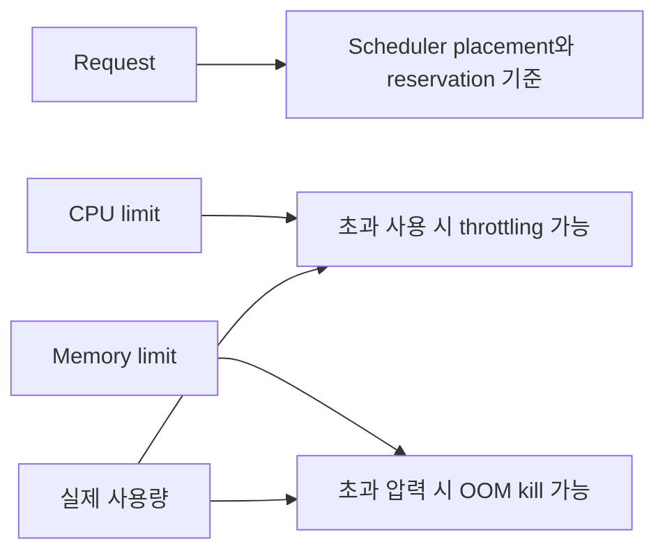
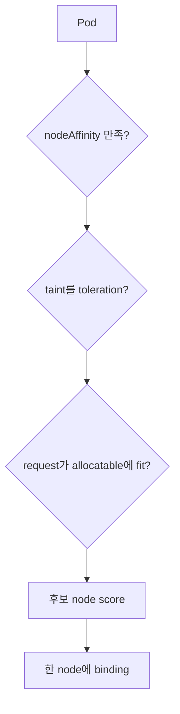

# 08. 자원과 스케줄링

[이 책 목차](README.md) · [이전: Config와 Secret](07-config-secrets.md) · [다음: Health check와 rollout](09-health-and-rollouts.md)

Scheduler는 실제 순간 사용량이 아니라 주로 resource **request**를 보고 Pod를 배치한다. Runtime은 **limit**과 node pressure를 통해 사용을 제한한다. 두 숫자를 같다고 생각하면 Pending, throttling, OOM을 해석하기 어렵다.


## 1. CPU 단위

Kubernetes CPU `1`은 vCPU/core 하나에 해당하는 계산 단위다. `1000m`은 `1`, `250m`은 `0.25` CPU다.

```text
Node allocatable CPU = 8 cores = 8000m
이미 배치된 request 합 = 6200m
새 Pod request = 2000m
6200m + 2000m > 8000m → 이 node에는 fit하지 않음
```

실제 CPU 사용이 지금 1 core뿐이어도 request 합으로 fit을 판단할 수 있다. `capacity`에서 system 예약 등을 뺀 scheduler 사용 가능 값이 **allocatable**이다.

## 2. Memory 단위

`Mi`, `Gi`는 binary 단위다. `400m` memory는 0.4 byte를 뜻하는 실수이므로 CPU milli와 혼동하지 않는다.

```yaml
resources:
  requests:
    cpu: 500m
    memory: 512Mi
  limits:
    cpu: "2"
    memory: 1Gi
```

이 조각은 container spec 안의 실행 가능한 예시이며 단독 manifest가 아니다. `lab13/resource-lab` 격리 실습에서만 사용하고 여기서는 적용하지 않는다. 공식 [Resource Management](https://kubernetes.io/docs/concepts/configuration/manage-resources-containers/)를 참고한다.

## 3. Request와 limit



CPU는 compressible resource라 limit에 닿으면 process가 느려질 수 있다. Memory는 압축해 시간을 나누기 어려워 cgroup limit이나 node pressure에서 process가 OOM kill될 수 있다. Limit을 높였다고 request도 자동으로 같아지는지 여부는 namespace LimitRange와 defaulting을 확인한다.

## 4. 실제 숫자 예시

API Pod 6개가 각각 request `500m`, `512Mi`라면 scheduler 관점 합은 CPU 3 cores, memory 3Gi다. Limit이 각각 2 CPU, 1Gi여도 scheduler가 12 CPU를 예약하는 것은 아니다.

```text
requests: 6 × 500m = 3000m, 6 × 512Mi = 3072Mi
limits:   6 × 2 = 12 CPU, 6 × 1Gi = 6Gi
```

여러 Pod가 limit까지 동시에 burst하면 node에 pressure가 생길 수 있다. Request를 지나치게 낮춰 overcommit하면 scheduler는 fit으로 판단해도 runtime 안정성이 나빠진다.

## 5. QoS class

| QoS | 대표 조건 | Pressure 시 의미 |
| --- | --- | --- |
| Guaranteed | 모든 container CPU·memory request=limit | 상대적으로 강한 보호 |
| Burstable | request/limit 일부 설정, Guaranteed 아님 | 사용량과 request 등을 고려 |
| BestEffort | CPU·memory request/limit 없음 | 먼저 eviction될 가능성이 큼 |

QoS만으로 절대 eviction 순서를 단정하지 않는다. Node pressure 종류, 실제 사용, priority도 관여한다. [Pod Quality of Service](https://kubernetes.io/docs/concepts/workloads/pods/pod-qos/)를 참고한다.

## 6. Affinity와 node 선택

**nodeSelector/node affinity**는 Pod가 어떤 node label에 배치될 수 있는지 표현한다. **Pod affinity/anti-affinity**는 다른 Pod label과 topology 관계를 표현한다.



Preferred affinity는 선호이며 보장이 아니다. Required affinity는 후보를 제거해 Pending을 만들 수 있다. Label이 실제 hardware와 맞게 유지되는지도 별도 관리한다.

## 7. Taint와 toleration

Taint는 node가 특정 Pod를 밀어내는 조건이고 toleration은 Pod가 그 taint를 **견딜 수 있음**을 나타낸다.

```yaml
tolerations:
  - key: dedicated
    operator: Equal
    value: research
    effect: NoSchedule
```

이 조각도 Pod spec 예시이며 적용하지 않는다. Toleration은 해당 node로 반드시 배치한다는 placement 지시가 아니다. 전용 node에 보내려면 node affinity와 함께 사용한다. [Taints and Tolerations](https://kubernetes.io/docs/concepts/scheduling-eviction/taint-and-toleration/)을 본다.

## 8. Priority와 preemption

PriorityClass가 높은 Pending Pod를 배치하기 위해 scheduler가 낮은 priority Pod를 preempt할 수 있다. 이는 application data를 안전하게 이동하거나 PDB를 모든 상황에서 지켜 준다는 뜻이 아니다. Priority를 모든 workload에 과도하게 높이면 우선순위 의미가 사라진다.

## 9. 읽기 전용 진단

```text
kubectl get nodes
kubectl describe node worker-a
kubectl get pods -n resource-lab -o wide
kubectl describe pod api-0 -n resource-lab
kubectl top pods -n resource-lab
```

위 명령은 `lab13/resource-lab` 예시이며 실행하지 않았다. `kubectl top`은 metrics API가 있어야 한다. Pending event에서 `Insufficient cpu`, affinity, taint 이유를 확인하고 limit만 임의로 올리지 않는다.

## 10. 문제와 해설

1. `250m` CPU는 몇 core인가? **0.25 core**다.
2. Scheduler는 보통 순간 CPU usage와 request 중 무엇을 fit에 쓰는가? **Request**다.
3. CPU limit 초과와 memory limit 초과의 대표 결과는? **CPU throttling, memory OOM kill**이다.
4. Toleration이 있으면 해당 node에 반드시 배치되는가? **아니다.** 배제 조건 하나를 견딜 뿐이다.

다음 장에서는 배치된 Pod가 실제 요청을 받을 준비가 되었는지 probe와 rollout으로 판단한다.
