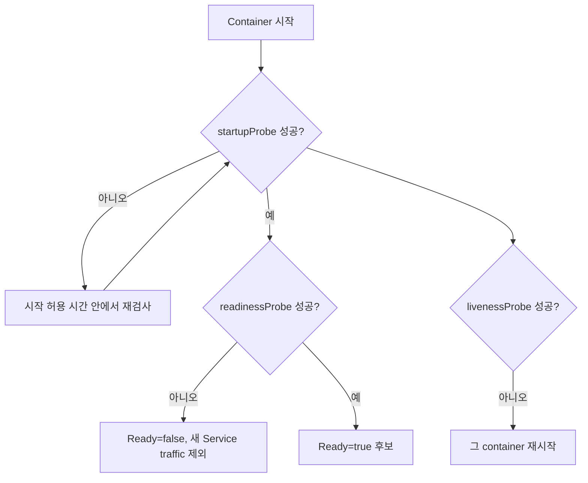
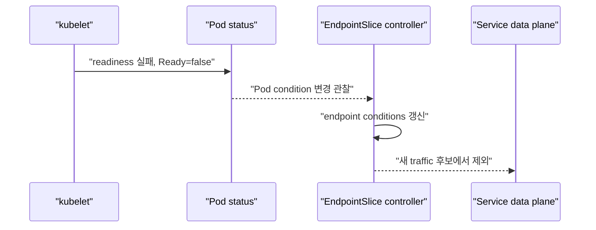
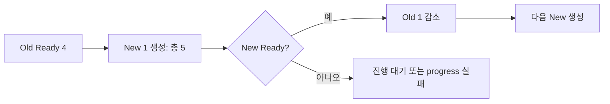

# 09. Health check와 안전한 rollout

[이 책 목차](README.md) · [이전: 자원과 스케줄링](08-resources-scheduling.md) · [다음: 보안과 RBAC](10-security-rbac.md)

프로세스가 실행 중이라는 사실과 요청을 안전하게 처리할 수 있다는 사실은 다르다. Kubernetes는 probe, rollout, disruption budget, autoscaling을 제공하지만 애플리케이션의 업무 상태를 대신 정의하지 않는다. 이 장에서는 각 신호가 무엇을 바꾸는지부터 구분한다.


## 1. 세 probe의 질문

| Probe | 질문 | 실패했을 때 주된 효과 |
| --- | --- | --- |
| startup | 애플리케이션 시작이 끝났는가? | 성공 전까지 liveness·readiness probe를 시작하지 않음 |
| readiness | 지금 새 요청을 받아도 되는가? | Pod의 Ready condition이 false가 되고 Service endpoint에서 제외될 수 있음 |
| liveness | 프로세스가 복구 불가능하게 멈췄는가? | kubelet이 해당 container를 재시작 |

Liveness 실패는 Pod object를 새 Pod로 교체하는 명령이 아니다. 같은 Pod UID 안에서 container가 재시작되고 restart count가 증가할 수 있다. Pod 교체는 Deployment rollout, eviction, node 장애 같은 다른 경로에서 일어난다. 공식 동작은 [Liveness, Readiness and Startup Probes](https://kubernetes.io/docs/concepts/configuration/liveness-readiness-startup-probes/)를 따른다.



## 2. 실행 가능한 probe 예시

아래 manifest는 실행 가능한 교육 예시지만 이 문서에서는 적용하지 않는다. `lab13` context의 `health-lab` namespace처럼 외부 운영과 분리된 실습 환경에서 image와 endpoint를 검증한 뒤 사용한다.

```yaml
apiVersion: apps/v1
kind: Deployment
metadata:
  name: research-api
  namespace: health-lab
  labels:
    app.kubernetes.io/name: research-api
spec:
  replicas: 3
  selector:
    matchLabels:
      app.kubernetes.io/name: research-api
  template:
    metadata:
      labels:
        app.kubernetes.io/name: research-api
    spec:
      terminationGracePeriodSeconds: 45
      containers:
        - name: api
          image: registry.example/research-api:1.4.0
          ports:
            - name: http
              containerPort: 8080
          startupProbe:
            httpGet:
              path: /health/startup
              port: http
            periodSeconds: 5
            failureThreshold: 24
          readinessProbe:
            httpGet:
              path: /health/ready
              port: http
            periodSeconds: 5
            failureThreshold: 2
          livenessProbe:
            httpGet:
              path: /health/live
              port: http
            periodSeconds: 10
            failureThreshold: 3
          lifecycle:
            preStop:
              exec:
                command: ["sh", "-c", "sleep 5"]
```

Startup의 최대 실패 시간은 이 예시에서 대략 `5초 × 24회 = 120초`다. HTTP timeout 기본값을 그대로 의존하지 말고 실제 지연과 실패 유형에 맞춰 `timeoutSeconds`도 검토한다. Liveness endpoint가 database 같은 외부 dependency 하나의 짧은 장애 때문에 실패하면 정상 process를 반복 재시작할 수 있다.

## 3. Readiness와 EndpointSlice

Service controller는 selector에 맞는 Pod를 찾아 EndpointSlice를 관리한다. Pod readiness 결과는 endpoint의 `conditions.ready` 같은 상태에 반영되어 traffic 후보를 정하는 데 사용된다.



Ready false가 기존 TCP connection을 강제로 즉시 끊는다는 뜻은 아니다. Endpoint 변경 전파에도 시간이 걸릴 수 있다. Application과 proxy가 connection draining, keep-alive, retry를 어떻게 다루는지 함께 설계한다. EndpointSlice 조건은 [EndpointSlices](https://kubernetes.io/docs/concepts/services-networking/endpoint-slices/)에서 확인한다.

## 4. Probe 설계 원칙

- Startup은 느린 초기화의 정상 범위를 liveness와 분리한다.
- Readiness는 새 요청 처리 가능성을 답하고, 일시적 dependency 장애를 traffic 제어에 반영한다.
- Liveness는 재시작해야만 회복되는 deadlock 같은 상태를 좁게 감지한다.
- Probe endpoint는 인증 우회나 내부 정보 노출 경로가 되지 않게 한다.
- 너무 짧은 timeout과 낮은 threshold는 부하 순간에 restart storm을 만들 수 있다.

“모든 dependency가 완벽해야 live”로 만들지 않는다. Database가 10초 느리다는 이유로 API container 수십 개를 동시에 재시작하면 장애를 확대할 수 있다.

## 5. RollingUpdate의 두 숫자

Deployment의 기본 전략인 RollingUpdate는 새 ReplicaSet을 늘리면서 옛 ReplicaSet을 줄인다.

- `maxSurge`: desired replica보다 추가로 만들 수 있는 Pod 수
- `maxUnavailable`: rollout 중 unavailable이어도 되는 Pod 수

```yaml
strategy:
  type: RollingUpdate
  rollingUpdate:
    maxSurge: 1
    maxUnavailable: 0
```

이 조각은 Deployment `spec` 안에 넣는 실행 가능한 설정 예시이며 단독 manifest는 아니다. 이 문서에서는 적용하지 않는다.

Replica가 4개이고 `maxSurge: 1`, `maxUnavailable: 0`이면 rollout 중 총 Pod는 최대 5개가 될 수 있고 available Pod는 4개 아래로 내리지 않으려 한다. 새 Pod가 Ready가 되지 않으면 rollout이 진행되지 않을 수 있으므로 quota와 추가 CPU·memory 여유도 필요하다.

Percentage는 정수 변환 규칙이 다르다. `maxSurge` percentage는 올림하고 `maxUnavailable` percentage는 내림한다. 둘을 동시에 0으로 둘 수 없다. 자세한 계산은 [Deployments](https://kubernetes.io/docs/concepts/workloads/controllers/deployment/)를 확인한다.



## 6. Graceful termination

Pod 종료가 시작되면 endpoint 제외, `preStop` hook, `SIGTERM`, grace period, 강제 종료가 관련된다. 여러 component가 비동기로 움직이므로 모든 network 경로의 정확한 순서를 하나로 가정하지 않는다.

1. Application은 `SIGTERM`을 받아 새 요청 수락을 멈춘다.
2. 이미 처리 중인 요청과 background 작업을 제한 시간 안에 마친다.
3. `preStop`이 필요하다면 종료 준비에 사용하되 전체 grace time을 소비한다는 점을 고려한다.
4. `terminationGracePeriodSeconds`가 지나면 남은 process는 강제 종료될 수 있다.

`preStop: sleep`은 교육용 완충 예시일 뿐 보편 해법이 아니다. Load balancer와 Service 전파 시간, application connection draining, message consumer lease, Spark executor 종료 규칙을 실제로 측정한다. 세부 종료 흐름은 [Pod termination](https://kubernetes.io/docs/concepts/workloads/pods/pod-lifecycle/#pod-termination)을 따른다.

## 7. Rollout 관찰과 undo

다음은 `lab13` context와 `health-lab` namespace만을 전제로 한 예시 절차다. 이 문서에서는 실행하지 않았고 외부 운영 cluster에 적용하지 않는다.

```text
1. kubectl config current-context
   예상: lab13
2. kubectl rollout status deployment/research-api -n health-lab --timeout=3m
3. kubectl rollout history deployment/research-api -n health-lab
4. kubectl get replicasets,pods -n health-lab -l app.kubernetes.io/name=research-api
5. kubectl rollout undo deployment/research-api -n health-lab --to-revision=2
```

`rollout undo`는 Deployment의 이전 Pod template revision으로 되돌린다. Database migration, 외부 API 변경, 이미 발행한 message, 삭제된 데이터까지 되돌리지 않는다. Image rollback과 schema rollback을 한 작업으로 오해하지 않는다. Expand/contract schema, backward compatibility, backup·restore를 별도로 설계한다.

## 8. PodDisruptionBudget의 범위

**PDB(PodDisruptionBudget)**는 node drain 같은 자발적 disruption에서 동시에 줄어들 수 있는 healthy Pod 수를 제한한다.

```yaml
apiVersion: policy/v1
kind: PodDisruptionBudget
metadata:
  name: research-api
  namespace: health-lab
spec:
  minAvailable: 2
  selector:
    matchLabels:
      app.kubernetes.io/name: research-api
```

이 manifest도 격리된 `lab13/health-lab` 실습용 예시이며 여기서는 적용하지 않는다. PDB는 node crash, kernel panic, network partition, application bug 같은 모든 비자발적 장애를 막지 않는다. Replica 자체를 만드는 controller도 아니다. 공식 범위는 [Disruptions](https://kubernetes.io/docs/concepts/workloads/pods/disruptions/)에서 확인한다.

## 9. HPA와 VPA

**HPA(HorizontalPodAutoscaler)**는 metric을 보고 replica 수를 가로로 늘리거나 줄이는 Kubernetes API와 controller다. CPU utilization target을 사용하면 container resource request가 계산 기준에 필요하다. Metrics Server 같은 resource metrics pipeline 또는 custom/external metrics adapter도 필요할 수 있다.

**VPA(Vertical Pod Autoscaler)**는 request 권고·조정을 위한 별도 component이며 Kubernetes core에 기본 내장되어 있다고 가정하지 않는다. 이 교재에서는 설치하지 않는다.

| 기능 | 바꾸는 것 | 주요 의존성 |
| --- | --- | --- |
| HPA | replica 수 | metrics API, 올바른 requests, scale target |
| VPA | Pod resource requests 권고·변경 | 별도 VPA controller와 recommender |

HPA가 늘어도 database connection 한도와 queue partition 수가 그대로면 처리량이 늘지 않을 수 있다. Autoscaling은 application dependency capacity와 함께 검증한다. 공식 [Horizontal Pod Autoscaling](https://kubernetes.io/docs/tasks/run-application/horizontal-pod-autoscale/)을 참고한다.

## 10. 확인 문제

1. Readiness 실패와 liveness 실패는 각각 무엇을 바꾸는가?
2. Replica 4, `maxSurge=1`, `maxUnavailable=0`이면 rollout 중 최대 Pod 수는 얼마인가?
3. Deployment undo가 database migration도 되돌리는가?
4. PDB가 node의 갑작스러운 전원 장애를 막는가?

## 11. 해설

1. Readiness 실패는 Ready condition과 Service endpoint 후보에 영향을 준다. Liveness 실패는 kubelet이 해당 container를 재시작하게 한다.
2. 최대 5개다. 새 Pod가 available이 된 뒤 옛 Pod를 줄이는 방향으로 진행한다.
3. 아니다. 이전 Pod template과 image로 되돌릴 뿐 외부 데이터 변경에는 별도 migration·복구 전략이 필요하다.
4. 아니다. PDB는 eviction API를 통한 자발적 disruption을 제한하며 모든 outage를 예방하지 않는다.

다음 장에서는 누가 API에 로그인하고 어떤 동작을 허가받으며 admission이 object를 어떻게 검사하는지 살펴본다.
