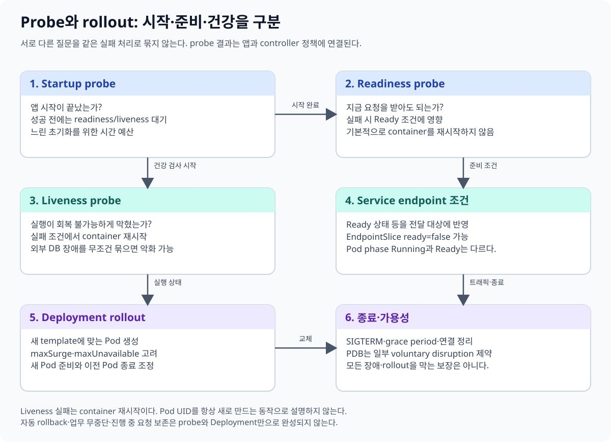
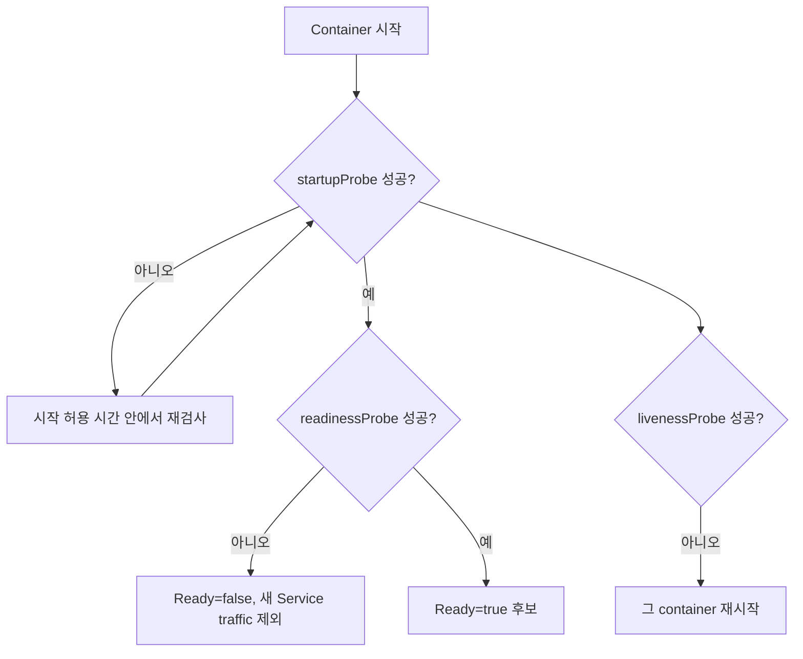
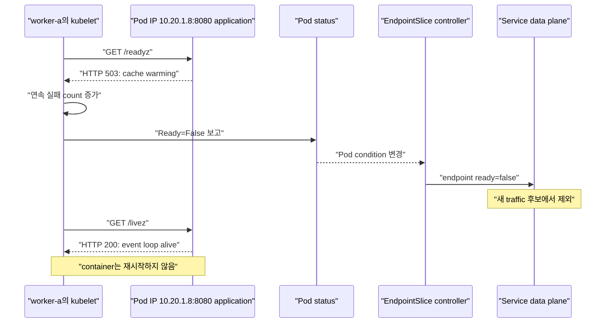
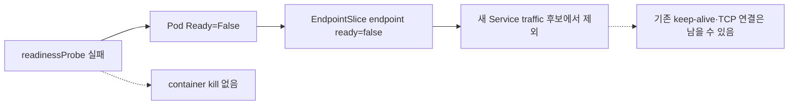
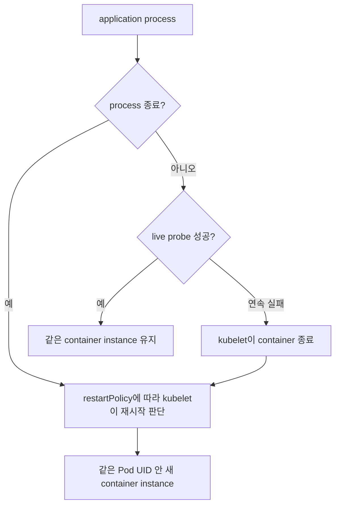
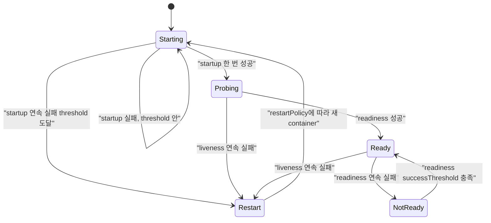
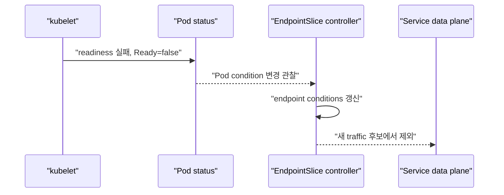
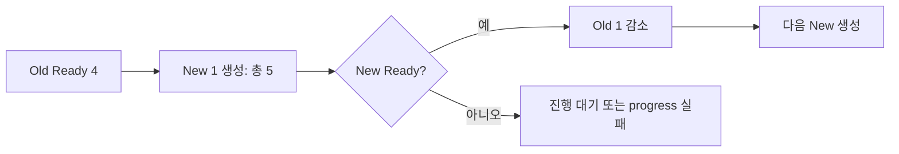
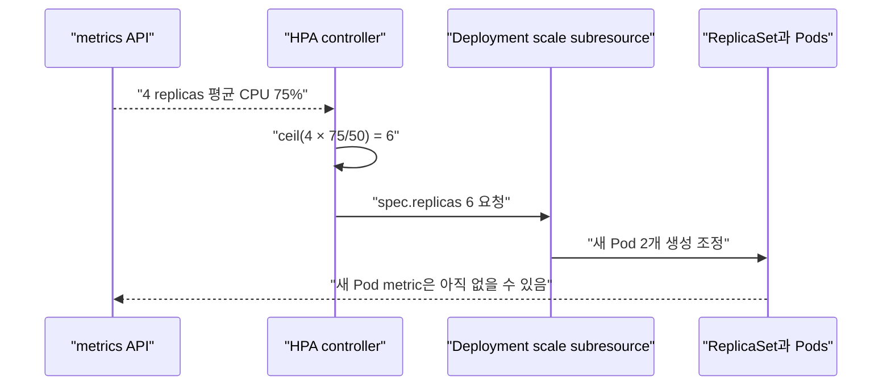

# 09. Health check와 안전한 rollout

[이 책 목차](README.md) · [이전: 자원과 스케줄링](08-resources-scheduling.md) · [다음: 보안과 RBAC](10-security-rbac.md)

프로세스가 실행 중이라는 사실과 요청을 안전하게 처리할 수 있다는 사실은 다르다. Kubernetes는 probe, rollout, disruption budget, autoscaling을 제공하지만 애플리케이션의 업무 상태를 대신 정의하지 않는다. 이 장에서는 각 신호가 무엇을 바꾸는지부터 구분한다.



## 1. 세 probe의 질문

| Probe | 질문 | 실패했을 때 주된 효과 |
| --- | --- | --- |
| startup | 애플리케이션 시작이 끝났는가? | 성공 전까지 liveness·readiness probe를 시작하지 않음 |
| readiness | 지금 새 요청을 받아도 되는가? | Pod의 Ready condition이 false가 되고 Service endpoint에서 제외될 수 있음 |
| liveness | 프로세스가 복구 불가능하게 멈췄는가? | kubelet이 해당 container를 재시작 |

Liveness 실패는 Pod object를 새 Pod로 교체하는 명령이 아니다. 같은 Pod UID 안에서 container가 재시작되고 restart count가 증가할 수 있다. Pod 교체는 Deployment rollout, eviction, node 장애 같은 다른 경로에서 일어난다. 공식 동작은 [Liveness, Readiness and Startup Probes](https://kubernetes.io/docs/concepts/configuration/liveness-readiness-startup-probes/)를 따른다.



### 1.1 누가 무엇을 검사하는가

Probe를 실행하는 주체는 control plane의 Deployment controller나 Service가 아니라 **그 Pod가 배치된 node의 kubelet**이다. HTTP probe라면 kubelet이 Pod IP와 container port로 HTTP 요청을 보낸다. Application이 `/readyz`, `/livez` 같은 endpoint를 직접 구현하고 자기 상태를 HTTP status code로 답해야 한다. Kubernetes가 application 안에 endpoint를 자동 생성하지 않는다.



HTTP probe는 응답 body의 JSON 의미를 해석하지 않는다. 현재 공식 문서 기준 HTTP status가 **200 이상 400 미만이면 성공**이다. 따라서 다음 응답은 body가 모순되어도 probe 관점에서는 성공이다.

```text
HTTP/1.1 200 OK
Content-Type: application/json

{"ready": false, "reason": "database unavailable"}
```

Application은 실패 상태라면 `503 Service Unavailable`처럼 200–399 밖의 status를 반환해야 한다. Redirect 응답도 성공 범위에 들어갈 수 있으므로 login redirect나 잘못된 route가 probe 성공으로 보이지 않게 health path의 인증·redirect 동작을 별도로 확인한다.

`containerPort: 8080`을 선언했다고 web server가 자동으로 시작되거나 `/readyz`가 생기지 않는다. Application process가 Pod IP에서 접근 가능한 address와 port에 실제 listen해야 한다. `127.0.0.1`에만 bind한 구현은 kubelet이 Pod IP로 접근할 때 실패할 수 있다.

### 1.2 Readiness가 바꾸는 상태

Readiness는 “이 process를 죽일까?”가 아니라 “이 Pod를 새 요청의 backend 후보로 둘까?”를 묻는다. Kubelet이 readiness 결과를 Pod `Ready` condition에 반영하고, EndpointSlice controller가 Service endpoint condition에 반영한다.



EndpointSlice 변경은 여러 component와 data plane을 거쳐 전파된다. Ready false가 되는 순간 이미 성립된 TCP connection을 전부 강제로 끊는 계약은 아니다. Client가 keep-alive connection을 계속 쓰거나 외부 load balancer가 늦게 반영할 수 있다. Application은 readiness 전환과 함께 새 업무 수락을 멈추고, 기존 요청을 drain할 방법도 가져야 한다.

Readiness에 넣기 좋은 상태는 다음과 같다.

- Startup 뒤 model·cache·configuration을 아직 준비하는 중이다.
- 필수 database가 끊겨 새 요청을 처리할 수 없지만 process는 살아 있다.
- Consumer가 partition assignment 또는 leader lease를 아직 얻지 못했다.
- 일시적인 과부하로 새 요청을 받으면 장애가 커진다.

반대로 readiness가 실패했다고 Pod를 삭제하는 자동화를 붙이면 일시적 dependency 장애가 모든 replica 재생성으로 번질 수 있다. Readiness 자체는 process를 살려 두고 회복할 시간을 준다.

### 1.3 Liveness가 필요한 이유

Process가 종료되면 container runtime과 kubelet은 `restartPolicy`에 따라 재시작을 판단할 수 있다. 그러나 PID는 살아 있으면서 event loop가 deadlock되거나 worker pool이 영구 정지한 process는 자연 종료하지 않는다. Liveness는 이런 “재시작해야만 회복되는 상태”를 application endpoint나 command로 드러낸다.



Liveness에는 외부 database, object storage, downstream API처럼 이 process를 재시작해도 고쳐지지 않는 dependency를 보통 넣지 않는다. Database가 10초 느릴 때 API replica 30개의 `/livez`가 모두 500을 내면 kubelet이 정상 process 30개를 차례로 죽일 수 있다. 새 process가 다시 database에 connection을 몰아 restart storm을 키운다.

Liveness endpoint는 event loop 진행 여부, 내부 worker heartbeat, 복구 불가능한 mutex·queue 상태처럼 process 자체의 생존성을 좁게 검사한다. 외부 dependency 때문에 요청 처리가 불가능한 상태는 readiness와 application retry·circuit breaker가 더 알맞다.

### 1.4 Startup probe가 여는 gate

Startup probe가 설정되면 성공할 때까지 liveness와 readiness 검사를 시작하지 않는다. 느린 JVM warm-up, model loading, database migration 확인 같은 정상 boot 시간을 liveness 실패로 오해하지 않게 하는 gate다.



Startup probe는 시작이 느린 application을 영원히 기다려 주는 장치가 아니다. `failureThreshold × periodSeconds`로 허용 구간을 설계한다. 끝까지 성공하지 않으면 kubelet이 container를 종료하고 Pod의 restart policy를 적용한다.

### 1.5 세 endpoint를 구현하는 application 계약

Application이 제공할 endpoint의 개념 계약은 다음처럼 쓸 수 있다. 이는 특정 framework에 묶인 실행 코드가 아니라 server 구현 요구 사항이다.

```text
GET /startupz
  boot sequence가 끝나고 main request handler가 초기화되었으면 HTTP 204
  model/config/cache를 읽는 중이면 HTTP 503

GET /readyz
  새 요청을 처리하는 데 필수인 local state가 준비되고
  필수 dependency에 합리적인 짧은 확인이 통과하면 HTTP 204
  cache warming, DB circuit open, consumer lease 없음이면 HTTP 503

GET /livez
  event loop와 핵심 worker heartbeat가 최근 임계 시간 안에 진행됐으면 HTTP 204
  process가 스스로 회복할 수 없는 deadlock 상태이면 HTTP 500

공통
  응답은 빠르고 bounded되어야 함
  credential·stack trace·내부 topology를 body에 노출하지 않음
  readiness=false를 HTTP 200 JSON body로만 표현하지 않음
```

Startup 완료 여부와 readiness는 다를 수 있다. Boot는 끝났지만 database가 끊기면 `/startupz`는 계속 성공하고 `/readyz`만 실패할 수 있다. Database 단절을 `/livez`에도 연결하면 정상 process를 재시작시키므로 세 질문을 같은 handler로 무조건 합치지 않는다.

### 1.6 완성된 교육용 Deployment

다음 manifest는 위 endpoint가 `8080`에서 실제 구현되어 있다고 가정하는 완성된 교육 예시다. Image와 registry는 존재를 보장하지 않으며 현재 cluster에 적용하거나 실행하지 않았다.

```yaml
apiVersion: apps/v1
kind: Deployment
metadata:
  name: probe-demo
  namespace: health-lab
spec:
  replicas: 3
  selector:
    matchLabels:
      app: probe-demo
  template:
    metadata:
      labels:
        app: probe-demo
    spec:
      restartPolicy: Always
      containers:
        - name: api
          image: registry.example/probe-demo:1.0
          ports:
            - name: http
              containerPort: 8080
          startupProbe:
            httpGet:
              path: /startupz
              port: http
            timeoutSeconds: 2
            periodSeconds: 5
            failureThreshold: 24
            successThreshold: 1
          readinessProbe:
            httpGet:
              path: /readyz
              port: http
            timeoutSeconds: 2
            periodSeconds: 5
            failureThreshold: 2
            successThreshold: 2
          livenessProbe:
            httpGet:
              path: /livez
              port: http
            timeoutSeconds: 2
            periodSeconds: 10
            failureThreshold: 3
            successThreshold: 1
```

Liveness와 startup probe의 `successThreshold`는 1이어야 한다. Readiness는 2로 두어 일시적인 한 번의 성공 뒤 바로 traffic을 받지 않게 했다. 그 대신 회복 판정이 늦어진다. 수치는 application SLO와 실제 지연 분포로 조정한다.

### 1.7 `periodSeconds`, `timeoutSeconds`, threshold 시간표

위 readiness는 `periodSeconds: 5`, `timeoutSeconds: 2`, `failureThreshold: 2`, `successThreshold: 2`다. 아래 시각은 이해를 위한 근사 예이며 kubelet scheduling, 응답 시간, node 부하 때문에 최초 probe가 정확히 t=0에 실행된다는 보장이 아니다.

| 근사 시각 | `/readyz` 결과 | 연속 count | Pod Ready 변화 |
| --- | --- | --- | --- |
| t=0 | HTTP 204 | success 1/2 | 아직 false |
| t=5 | HTTP 204 | success 2/2 | true로 전환 가능 |
| t=10 | 2초 안 응답 없음 | failure 1/2 | 아직 true |
| t=15 | HTTP 503 | failure 2/2 | false로 전환 |
| t=20 | HTTP 204 | success 1/2 | 아직 false |
| t=25 | HTTP 204 | success 2/2 | true로 회복 |

`timeoutSeconds: 2`는 handler가 2초를 넘겨도 계속 기다린다는 뜻이 아니다. Probe는 timeout 실패로 계산될 수 있다. `periodSeconds: 5`는 wall-clock 정각의 완벽한 scheduler가 아니라 대략 반복 주기를 정하는 field다.

Liveness는 다음처럼 진행될 수 있다.

```text
t≈0   /livez 500 → failure 1/3, container 유지
t≈10  /livez timeout → failure 2/3, container 유지
t≈20  /livez 500 → failure 3/3, kubelet이 container restart 시작
t≈21  같은 Pod UID, 새 container instance, restartCount 증가
```

중간에 성공하면 연속 실패 count가 다시 시작된다. “3번 실패”를 하루 동안 누적 세 번으로 해석하지 않는다. Restart 시점에는 termination grace와 runtime 동작도 있어 정확히 t=20에 새 process가 준비된다고 보장하지 않는다.

Startup probe가 `periodSeconds: 5`, `failureThreshold: 24`이면 설명상 약 120초의 시작 구간을 준다. 각 probe가 timeout까지 사용하거나 scheduling이 지연될 수 있어 단순 곱을 정확한 kill timestamp 계약으로 사용하지 않는다. 공식 문서의 곱은 설정 의도를 설명하는 상한 구간 계산으로 읽는다.

### 1.8 HTTP, TCP, exec 검사의 차이

| Handler | kubelet이 하는 일 | 확인할 수 있는 것 | 확인하지 못하는 반례 |
| --- | --- | --- | --- |
| HTTP GET | Pod IP·port·path로 요청하고 200–399 판정 | Application이 표현한 세밀한 상태 | HTTP 200 body가 `ready:false`여도 성공, redirect도 성공 범위 |
| TCP socket | 지정 port에 connection을 열 수 있는지 확인 | Listener 존재와 TCP accept 가능성 | Handler deadlock이나 DB 단절이어도 port만 열리면 성공 |
| exec | Container 안에서 command 실행, exit code 판정 | Local file·process·custom command 결과 | Command 자체가 느리거나 resource를 쓰고 image에 tool이 없을 수 있음 |

HTTP probe는 Service ClusterIP를 거치지 않고 일반적으로 kubelet이 Pod IP에 직접 접근한다. 따라서 Service selector나 external load balancer를 end-to-end 검증하지 않는다. TCP probe는 protocol handshake 이후의 application correctness를 알지 못한다. Exec probe는 shell이 자동 제공된다고 가정하지 말고 command array와 image 내용을 확인한다.

어떤 handler든 무거운 query, 큰 filesystem scan, 외부 API fan-out을 매 몇 초마다 실행하면 probe 자체가 부하가 된다. 빠르고 bounded된 신호를 만들고, 상세 진단은 metric·log·별도 synthetic check로 분리한다.

### 1.9 같은 Pod 재시작과 새 Pod 교체

Liveness 실패는 kubelet이 **같은 Pod UID 안의 container를 재시작**하게 한다. Deployment controller가 새 Pod object를 만드는 rollout·replica 복구와 구분한다.

| 사건 | Pod UID | Pod 이름 | container restartCount | 주 행동자 |
| --- | --- | --- | --- | --- |
| Liveness 연속 실패 | 유지 | 유지 | 증가 | kubelet |
| Main process exit, `restartPolicy: Always` | 유지 | 유지 | 증가 | kubelet |
| 사용자가 Pod 삭제 | 새 UID | 대개 새 이름 | 새 Pod에서 0부터 | ReplicaSet controller가 부족분 생성 |
| Deployment template 변경 | 새 UID의 Pod들 | 새 ReplicaSet hash | 각 Pod에서 0부터 | Deployment·ReplicaSet controller |
| Node drain/eviction | 대체 Pod는 새 UID | 새 이름 가능 | 새 Pod에서 0부터 | eviction과 workload controller |

`kubectl get pods`에서 이름 prefix가 비슷하다는 이유로 같은 Pod가 살아났다고 설명하지 않는다. Liveness 재시작은 Pod-local writable volume 중 `emptyDir`를 유지할 수 있지만 container writable layer와 in-memory state는 새 container에서 복원되지 않는다. Pod 교체는 `emptyDir`도 새로 생긴다.

### 1.10 예상 관찰과 실제 운영 상태를 구분하기

이 절의 시간표, IP, HTTP 응답, restartCount는 설명용 예상값이다. 현재 cluster에서 관찰했다는 기록이 아니다. 실제 환경에서는 다음 읽기 명령으로 각 층을 분리한다.

```text
kubectl get pod probe-demo-abc -n health-lab -o wide
kubectl describe pod probe-demo-abc -n health-lab
kubectl get endpointslices -n health-lab -l kubernetes.io/service-name=probe-demo
kubectl logs probe-demo-abc -n health-lab -c api --previous --timestamps
```

Probe 실패 event가 있어도 원인은 endpoint 구현, port, bind address, timeout, node-to-Pod network 중 하나일 수 있다. Application access log에 kubelet 요청이 도착했는지, 응답 status와 latency가 무엇인지 확인한다. EndpointSlice에서 제외되었어도 기존 connection이 남는지 client와 proxy metric으로 검증한다.

공식 동작과 최신 field의 기준은 [Configure Liveness, Readiness and Startup Probes](https://kubernetes.io/docs/tasks/configure-pod-container/configure-liveness-readiness-startup-probes/)에서 확인한다.

## 2. 실행 가능한 probe 예시

아래 manifest는 실행 가능한 교육 예시지만 이 문서에서는 적용하지 않는다. `lab13` context의 `health-lab` namespace처럼 외부 운영과 분리된 실습 환경에서 image와 endpoint를 검증한 뒤 사용한다.

```yaml
apiVersion: apps/v1
kind: Deployment
metadata:
  name: research-api
  namespace: health-lab
  labels:
    app.kubernetes.io/name: research-api
spec:
  replicas: 3
  selector:
    matchLabels:
      app.kubernetes.io/name: research-api
  template:
    metadata:
      labels:
        app.kubernetes.io/name: research-api
    spec:
      terminationGracePeriodSeconds: 45
      containers:
        - name: api
          image: registry.example/research-api:1.4.0
          ports:
            - name: http
              containerPort: 8080
          startupProbe:
            httpGet:
              path: /health/startup
              port: http
            periodSeconds: 5
            failureThreshold: 24
          readinessProbe:
            httpGet:
              path: /health/ready
              port: http
            periodSeconds: 5
            failureThreshold: 2
          livenessProbe:
            httpGet:
              path: /health/live
              port: http
            periodSeconds: 10
            failureThreshold: 3
          lifecycle:
            preStop:
              exec:
                command: ["sh", "-c", "sleep 5"]
```

Startup의 최대 실패 시간은 이 예시에서 대략 `5초 × 24회 = 120초`다. HTTP timeout 기본값을 그대로 의존하지 말고 실제 지연과 실패 유형에 맞춰 `timeoutSeconds`도 검토한다. Liveness endpoint가 database 같은 외부 dependency 하나의 짧은 장애 때문에 실패하면 정상 process를 반복 재시작할 수 있다.

## 3. Readiness와 EndpointSlice

Service controller는 selector에 맞는 Pod를 찾아 EndpointSlice를 관리한다. Pod readiness 결과는 endpoint의 `conditions.ready` 같은 상태에 반영되어 traffic 후보를 정하는 데 사용된다.



Ready false가 기존 TCP connection을 강제로 즉시 끊는다는 뜻은 아니다. Endpoint 변경 전파에도 시간이 걸릴 수 있다. Application과 proxy가 connection draining, keep-alive, retry를 어떻게 다루는지 함께 설계한다. EndpointSlice 조건은 [EndpointSlices](https://kubernetes.io/docs/concepts/services-networking/endpoint-slices/)에서 확인한다.

## 4. Probe 설계 원칙

- Startup은 느린 초기화의 정상 범위를 liveness와 분리한다.
- Readiness는 새 요청 처리 가능성을 답하고, 일시적 dependency 장애를 traffic 제어에 반영한다.
- Liveness는 재시작해야만 회복되는 deadlock 같은 상태를 좁게 감지한다.
- Probe endpoint는 인증 우회나 내부 정보 노출 경로가 되지 않게 한다.
- 너무 짧은 timeout과 낮은 threshold는 부하 순간에 restart storm을 만들 수 있다.

“모든 dependency가 완벽해야 live”로 만들지 않는다. Database가 10초 느리다는 이유로 API container 수십 개를 동시에 재시작하면 장애를 확대할 수 있다.

## 5. RollingUpdate의 두 숫자

Deployment의 기본 전략인 RollingUpdate는 새 ReplicaSet을 늘리면서 옛 ReplicaSet을 줄인다.

- `maxSurge`: desired replica보다 추가로 만들 수 있는 Pod 수
- `maxUnavailable`: rollout 중 unavailable이어도 되는 Pod 수

```yaml
strategy:
  type: RollingUpdate
  rollingUpdate:
    maxSurge: 1
    maxUnavailable: 0
```

이 조각은 Deployment `spec` 안에 넣는 실행 가능한 설정 예시이며 단독 manifest는 아니다. 이 문서에서는 적용하지 않는다.

Replica가 4개이고 `maxSurge: 1`, `maxUnavailable: 0`이면 종료 중인 Pod를 제외한 기본 계산은 5개이며, controller는 available Pod를 4개 아래로 내리지 않으려 한다. 종료 유예 중인 옛 Pod까지 세면 전체 Pod 수와 자원 사용은 5개분을 넘을 수 있다. 새 Pod가 Ready가 되지 않으면 rollout이 진행되지 않을 수 있으므로 quota와 추가 CPU·memory 여유도 필요하다.

Percentage는 정수 변환 규칙이 다르다. `maxSurge` percentage는 올림하고 `maxUnavailable` percentage는 내림한다. 둘을 동시에 0으로 둘 수 없다. 자세한 계산은 [Deployments](https://kubernetes.io/docs/concepts/workloads/controllers/deployment/)를 확인한다.



## 6. Graceful termination

Pod 종료가 시작되면 endpoint 제외, `preStop` hook, `SIGTERM`, grace period, 강제 종료가 관련된다. 여러 component가 비동기로 움직이므로 모든 network 경로의 정확한 순서를 하나로 가정하지 않는다.

1. Application은 `SIGTERM`을 받아 새 요청 수락을 멈춘다.
2. 이미 처리 중인 요청과 background 작업을 제한 시간 안에 마친다.
3. `preStop`이 필요하다면 종료 준비에 사용하되 전체 grace time을 소비한다는 점을 고려한다.
4. `terminationGracePeriodSeconds`가 지나면 남은 process는 강제 종료될 수 있다.

`preStop: sleep`은 교육용 완충 예시일 뿐 보편 해법이 아니다. Load balancer와 Service 전파 시간, application connection draining, message consumer lease, Spark executor 종료 규칙을 실제로 측정한다. 세부 종료 흐름은 [Pod termination](https://kubernetes.io/docs/concepts/workloads/pods/pod-lifecycle/#pod-termination)을 따른다.

## 7. Rollout 관찰과 undo

다음은 `lab13` context와 `health-lab` namespace만을 전제로 한 예시 절차다. 이 문서에서는 실행하지 않았고 외부 운영 cluster에 적용하지 않는다.

```text
1. kubectl config current-context
   예상: lab13
2. kubectl rollout status deployment/research-api -n health-lab --timeout=3m
3. kubectl rollout history deployment/research-api -n health-lab
4. kubectl get replicasets,pods -n health-lab -l app.kubernetes.io/name=research-api
5. kubectl rollout undo deployment/research-api -n health-lab --to-revision=2
```

`rollout undo`는 Deployment의 이전 Pod template revision으로 되돌린다. Database migration, 외부 API 변경, 이미 발행한 message, 삭제된 데이터까지 되돌리지 않는다. Image rollback과 schema rollback을 한 작업으로 오해하지 않는다. Expand/contract schema, backward compatibility, backup·restore를 별도로 설계한다.

## 8. PodDisruptionBudget의 범위

**PDB(PodDisruptionBudget)**는 node drain 같은 자발적 disruption에서 동시에 줄어들 수 있는 healthy Pod 수를 제한한다.

```yaml
apiVersion: policy/v1
kind: PodDisruptionBudget
metadata:
  name: research-api
  namespace: health-lab
spec:
  minAvailable: 2
  selector:
    matchLabels:
      app.kubernetes.io/name: research-api
```

이 manifest도 격리된 `lab13/health-lab` 실습용 예시이며 여기서는 적용하지 않는다. PDB는 node crash, kernel panic, network partition, application bug 같은 모든 비자발적 장애를 막지 않는다. Replica 자체를 만드는 controller도 아니다. 공식 범위는 [Disruptions](https://kubernetes.io/docs/concepts/workloads/pods/disruptions/)에서 확인한다.

## 9. HPA와 VPA

**HPA(HorizontalPodAutoscaler)**는 metric을 보고 replica 수를 가로로 늘리거나 줄이는 Kubernetes API와 controller다. CPU utilization target을 사용하면 container resource request가 계산 기준에 필요하다. Metrics Server 같은 resource metrics pipeline 또는 custom/external metrics adapter도 필요할 수 있다.

**VPA(Vertical Pod Autoscaler)**는 request 권고·조정을 위한 별도 component이며 Kubernetes core에 기본 내장되어 있다고 가정하지 않는다. 이 교재에서는 설치하지 않는다.

| 기능 | 바꾸는 것 | 주요 의존성 |
| --- | --- | --- |
| HPA | replica 수 | metrics API, 올바른 requests, scale target |
| VPA | Pod resource requests 권고·변경 | 별도 VPA controller와 recommender |

HPA가 늘어도 database connection 한도와 queue partition 수가 그대로면 처리량이 늘지 않을 수 있다. Autoscaling은 application dependency capacity와 함께 검증한다. 공식 [Horizontal Pod Autoscaling](https://kubernetes.io/docs/tasks/run-application/horizontal-pod-autoscale/)을 참고한다.

## 10. HPA 계산을 숫자로 읽기

HPA의 기본 비율 계산은 개념적으로 다음과 같다.

```text
desiredReplicas = ceil(currentReplicas × currentMetricValue / desiredMetricValue)
```

CPU utilization target은 보통 관찰된 CPU 사용량을 container CPU request로 나눈 비율이다. Replica 4개, 평균 CPU utilization 75%, target 50%라면 다음과 같다.

```text
ceil(4 × 75 / 50) = ceil(6) = 6 replicas
```

Replica 6개가 된 뒤 평균이 25%, target이 50%라고 해서 즉시 3개로 줄어드는 것은 아니다. 비율 계산값은 3이지만 tolerance, stabilization window, scale policy가 급격한 변화를 제한할 수 있다. HPA는 순간 값 하나를 그대로 actuator에 전달하는 단순 script가 아니다.



다음 HPA는 구조를 보여 주는 교육용 manifest이며 metrics pipeline과 target Deployment를 갖춘 격리 환경에서만 사용할 수 있다. 여기서는 적용하지 않는다.

```yaml
apiVersion: autoscaling/v2
kind: HorizontalPodAutoscaler
metadata:
  name: research-api
  namespace: health-lab
spec:
  scaleTargetRef:
    apiVersion: apps/v1
    kind: Deployment
    name: research-api
  minReplicas: 3
  maxReplicas: 12
  metrics:
    - type: Resource
      resource:
        name: cpu
        target:
          type: Utilization
          averageUtilization: 50
  behavior:
    scaleDown:
      stabilizationWindowSeconds: 300
```

## 11. Missing metrics와 request 부재의 한계

새 Pod가 시작 중이거나 metrics adapter가 일부 Pod를 수집하지 못하면 HPA는 완전한 평균을 갖지 못한다. Controller는 scale 방향에 따라 보수적으로 누락 Pod를 가정해 결정을 완화할 수 있다. 따라서 “현재 Pod 4개 중 두 개가 90%이니 평균 90%”라고 단순 계산하지 않는다.

CPU utilization target인데 container에 CPU request가 없으면 그 container의 utilization 비율을 정의할 분모가 없다. 관련 Pod metric을 사용해 replica 수를 결정하지 못할 수 있다. HPA object가 존재하고 condition이 `AbleToScale=True`인지만 보지 말고 `ScalingActive`, event, target Pod의 request와 metrics API 응답을 확인한다.

| 관찰 | 가능한 의미 | 다음 확인 |
| --- | --- | --- |
| `<unknown>/50%` | metric을 계산하지 못함 | metrics API, request 누락, adapter error |
| 현재 75%인데 replica 유지 | tolerance·stabilization·policy 범위 | HPA conditions와 behavior |
| scale-up 뒤 사용률이 잠시 더 높음 | 새 Pod가 Ready·metric 수집 전 | startup/readiness와 metric 지연 |
| replica는 늘었지만 queue가 그대로 | 병목이 partition·DB·external limit | application throughput과 dependency capacity |

여러 metric을 지정하면 HPA는 각 metric이 제안한 replica 수 가운데 큰 값을 택하는 방향으로 동작한다. 일부 metric을 가져오지 못하고 다른 metric이 scale-down을 제안하면 안전을 위해 scale-down을 건너뛸 수 있다. Autoscaler가 보수적으로 멈춘 것을 controller 장애와 구분한다.

## 12. Startup과 HPA가 만나는 지점

Java·Spark gateway처럼 시작 직후 CPU가 높고 아직 요청을 처리하지 못하는 Pod를 일반 평균에 바로 넣으면 불필요한 scale-up이 생길 수 있다. Startup probe와 readiness를 올바르게 두고 HPA controller의 CPU initialization 동작을 이해한다. 그렇다고 startup 시간을 감추려고 readiness를 영원히 false로 두면 rollout과 endpoint가 멈춘다.

시간표 예시는 다음과 같다. 실제 controller 주기와 metric 수집 시각은 환경에 따라 달라진다.

```text
10:00:00 replicas 4, 평균 75% → desired 6
10:00:15 새 Pod 두 개 Pending/Starting, usable metric 없음
10:00:45 새 Pod Ready, metric 수집 시작
10:01:00 평균 48% → target 근처라 replicas 6 유지
10:03:00 평균 25% → 계산상 3, scaleDown stabilization 때문에 유지
10:06:00 낮은 사용이 지속 → policy 범위에서 점진 축소
```

이 흐름에서 Pod가 Ready가 되기 전에 평균이 높다는 이유만으로 maxReplicas를 계속 올리면 image pull, startup, dependency가 진짜 병목인지 놓친다. HPA condition, Deployment available replicas, Pending event, application queue를 같은 시간축에서 본다.

## 13. 확인 문제

1. Readiness 실패와 liveness 실패는 각각 무엇을 바꾸는가?
2. Replica 4, `maxSurge=1`, `maxUnavailable=0`인 rollout에서 기본 Pod 수를 어떻게 계산하며, 종료 중인 Pod까지 세면 무엇이 달라지는가?
3. Deployment undo가 database migration도 되돌리는가?
4. PDB가 node의 갑작스러운 전원 장애를 막는가?

## 14. 해설

1. Readiness 실패는 Ready condition과 Service endpoint 후보에 영향을 준다. Liveness 실패는 kubelet이 해당 container를 재시작하게 한다.
2. 종료 중인 Pod를 제외한 rollout의 기본 계산은 `4+1=5`다. 새 Pod가 available이 된 뒤 옛 Pod를 줄이는 방향으로 진행한다. 종료 유예 시간 동안 옛 Pod가 남아 있으면 관측되는 전체 Pod 수와 자원 사용량은 5개분을 넘을 수 있다. [Deployment의 terminating Pod 설명](https://kubernetes.io/docs/concepts/workloads/controllers/deployment/#terminating-pods)처럼 surge 계산과 종료 대기를 구별한다.
3. 아니다. 이전 Pod template과 image로 되돌릴 뿐 외부 데이터 변경에는 별도 migration·복구 전략이 필요하다.
4. 아니다. PDB는 eviction API를 통한 자발적 disruption을 제한하며 모든 outage를 예방하지 않는다.

다음 장에서는 누가 API에 로그인하고 어떤 동작을 허가받으며 admission이 object를 어떻게 검사하는지 살펴본다.
