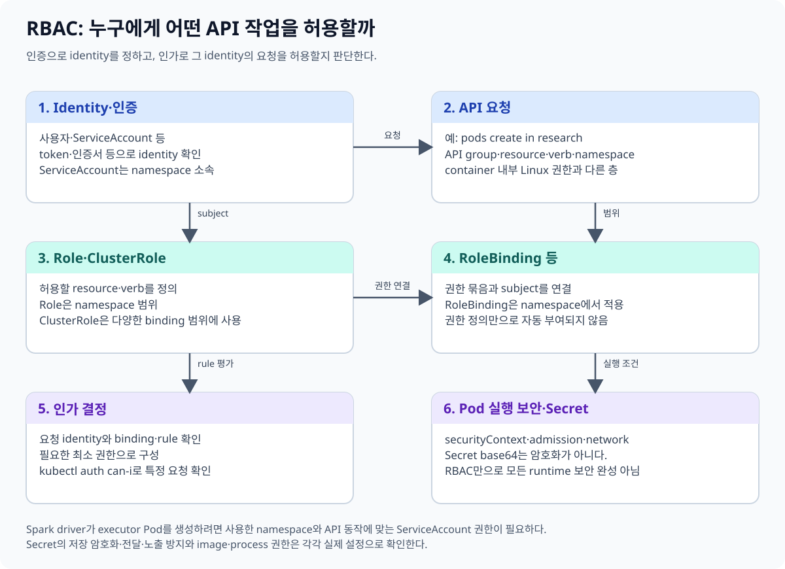
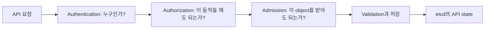
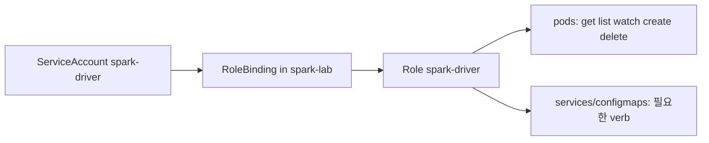
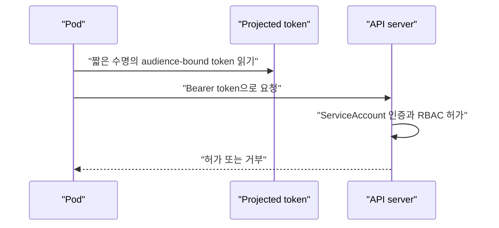

# 10. 보안 경계와 RBAC

[이 책 목차](README.md) · [이전: Health check와 rollout](09-health-and-rollouts.md) · [다음: Helm, Kustomize와 GitOps](11-delivery-helm-gitops.md)

Kubernetes 보안은 “로그인했는가?” 하나로 끝나지 않는다. 요청한 주체를 확인하고, 그 동작을 허가하며, object가 정책에 맞는지 검사하고, 실행 중 process 권한과 secret 경계를 제한해야 한다. 이 장의 모든 identity와 secret 값은 가짜 예시이며 실제 credential을 포함하지 않는다.



## 1. API 요청의 세 관문



| 단계 | 질문 | 예시 |
| --- | --- | --- |
| Authentication | 요청 주체는 누구인가? | client certificate, OIDC token, ServiceAccount token |
| Authorization | 그 주체가 이 resource에 이 verb를 수행해도 되는가? | RBAC Role과 binding |
| Admission | 허가된 요청 내용이 cluster 정책에 맞는가? | Pod Security Admission, validating webhook |

Authentication에 성공해도 모든 작업이 허용되는 것은 아니다. Authorization을 통과해도 admission policy가 privileged Pod를 거부할 수 있다. API 접근 제어의 전체 순서는 [Controlling Access](https://kubernetes.io/docs/concepts/security/controlling-access/)를 참고한다.

## 2. RBAC의 네 object

**RBAC(Role-Based Access Control)**은 role에 permission을 정의하고 user, group, ServiceAccount에 연결하는 authorization 방식이다.

| Object | 범위 | 역할 |
| --- | --- | --- |
| Role | 한 namespace | resource와 verb permission 정의 |
| ClusterRole | cluster 전체 또는 재사용 가능한 rule | cluster-scoped permission 또는 공통 role |
| RoleBinding | 한 namespace | Role/ClusterRole을 그 namespace에서 subject에 연결 |
| ClusterRoleBinding | cluster 전체 | ClusterRole을 모든 namespace 범위로 연결 |



RoleBinding이 다른 namespace의 Role을 참조할 수는 없다. ClusterRole을 참조하더라도 RoleBinding이 있는 namespace 범위에서 권한을 부여한다. 자세한 규칙은 [RBAC authorization](https://kubernetes.io/docs/reference/access-authn-authz/rbac/)에 있다.

## 3. Resource와 verb

RBAC rule은 API group, resource, verb 조합으로 읽는다.

```yaml
rules:
  - apiGroups: [""]
    resources: ["pods"]
    verbs: ["get", "list", "watch"]
```

이 조각은 Role의 `rules`에 넣을 수 있는 실행 가능한 schema 예시지만 단독 manifest가 아니며 여기서는 적용하지 않는다. 빈 API group은 core API를 뜻한다. `get`은 object 하나 읽기, `list`는 collection 조회, `watch`는 변경 stream 관찰이다.

`*` verb나 `*` resource는 미래에 추가되는 동작까지 넓게 허용할 수 있다. 운영 편의만으로 wildcard를 사용하지 않는다.

## 4. Least privilege

**최소 권한(least privilege)**은 주체가 업무에 필요한 resource와 verb만 갖게 하는 원칙이다.

1. 작업이 사용하는 API 호출을 먼저 목록화한다.
2. namespace-scoped Role로 가능한지 확인한다.
3. read와 write verb를 구분한다.
4. `secrets`, `pods/exec`, role binding 변경처럼 권한 확대 가능성이 큰 동작을 따로 검토한다.
5. 감사 log와 실제 거부를 보고 rule을 좁게 보정한다.

Secret 읽기 권한은 namespace 안의 credential 전체를 노출할 수 있다. Pod 생성 권한도 임의 image, volume, ServiceAccount를 이용해 권한을 확대할 수 있으므로 “개발 namespace니까 안전”이라고 가정하지 않는다.

## 5. ServiceAccount는 workload identity다

**ServiceAccount**는 namespace에 속하는 Kubernetes workload identity다. Pod의 `spec.serviceAccountName`으로 선택한다. 지정하지 않으면 그 namespace의 `default` ServiceAccount가 사용된다.



현대 Kubernetes는 TokenRequest API와 projected volume을 통해 만료되고 회전 가능한 ServiceAccount token을 Pod에 제공한다. 장기 token Secret이 모든 ServiceAccount에 자동 생성된다고 가정하지 않는다. 필요한 경우 `automountServiceAccountToken: false`로 API token mount 자체를 끈다. 공식 [Service Accounts](https://kubernetes.io/docs/concepts/security/service-accounts/)를 참고한다.

## 6. Spark driver에 cluster-admin을 주지 않는다

Kubernetes에서 Spark driver는 executor Pod를 만들고 관찰·정리할 API 권한이 필요하다. 그렇다고 `cluster-admin`이 필요한 것은 아니다. 전용 namespace와 ServiceAccount를 만들고 사용하는 Spark 버전·기능에 필요한 resource만 허용한다.

아래는 교육용 baseline이다. 실행 가능한 manifest지만 이 문서에서는 적용하지 않는다. `lab13` context의 격리된 `spark-lab` namespace에서 Spark 공식 문서와 실제 API audit를 기준으로 verb를 보정해야 한다.

```yaml
apiVersion: v1
kind: ServiceAccount
metadata:
  name: spark-driver
  namespace: spark-lab
automountServiceAccountToken: true
---
apiVersion: rbac.authorization.k8s.io/v1
kind: Role
metadata:
  name: spark-driver
  namespace: spark-lab
rules:
  - apiGroups: [""]
    resources: ["pods"]
    verbs: ["create", "get", "list", "watch", "delete"]
  - apiGroups: [""]
    resources: ["services", "configmaps"]
    verbs: ["create", "get", "delete"]
---
apiVersion: rbac.authorization.k8s.io/v1
kind: RoleBinding
metadata:
  name: spark-driver
  namespace: spark-lab
subjects:
  - kind: ServiceAccount
    name: spark-driver
    namespace: spark-lab
roleRef:
  apiGroup: rbac.authorization.k8s.io
  kind: Role
  name: spark-driver
```

PVC, executor allocation 방식, shuffle plugin, log 수집에 따라 권한이 추가될 수 있다. Spark의 현재 [Kubernetes security](https://spark.apache.org/docs/4.0.4/running-on-kubernetes.html#security)와 실제 기능을 대조한다.

## 7. 권한을 읽기 전용으로 확인한다

다음 절차는 `lab13` context와 `spark-lab` namespace를 전제로 한 읽기 전용 예시다. 여기서는 실행하지 않았다.

```text
1. kubectl config current-context
   예상: lab13
2. kubectl auth can-i create pods \
     --as=system:serviceaccount:spark-lab:spark-driver -n spark-lab
   예상: yes
3. kubectl auth can-i create pods \
     --as=system:serviceaccount:spark-lab:spark-driver -n default
   예상: no
4. kubectl auth can-i get secrets \
     --as=system:serviceaccount:spark-lab:spark-driver -n spark-lab
   예상: no
```

`--as` impersonation 자체에는 호출자의 impersonate 권한이 필요하다. 권한이 없으면 테스트가 거부될 수 있으며, 그 실패를 대상 ServiceAccount의 권한 결과로 오해하지 않는다.

## 8. Group과 namespace 경계

사용자 identity는 OIDC provider 등 외부 인증 시스템의 group claim을 가질 수 있다. RoleBinding subject에 `kind: Group`을 사용해 팀을 namespace role에 연결할 수 있다.

```yaml
subjects:
  - kind: Group
    name: research-readers
    apiGroup: rbac.authorization.k8s.io
```

이 조각은 fake group 이름을 사용한 binding 일부이며 적용하지 않는다. Group membership 수명과 퇴사·팀 이동 처리는 identity provider에서 관리하고 Kubernetes binding을 정기 검토한다.

## 9. Secret은 base64일 뿐 암호화가 아니다

Kubernetes Secret의 `data` field는 base64로 표현된다. Base64는 binary를 text로 인코딩하는 방식이며 암호화가 아니다. API 읽기 권한이 있는 주체는 원문으로 복원할 수 있다.

```yaml
apiVersion: v1
kind: Secret
metadata:
  name: fake-example-only
  namespace: security-lab
type: Opaque
stringData:
  username: fake-user
  password: fake-password-not-for-use
```

이 값은 설명용 가짜이며 어디에도 사용하지 않는다. 실제 secret을 Git, issue, terminal history, manifest 예시에 넣지 않는다.

보호에는 여러 층이 필요하다.

- Client와 API server, component 사이에 TLS를 사용한다.
- etcd의 Secret을 위한 at-rest encryption을 구성하고 key를 회전한다.
- RBAC으로 Secret read를 최소화한다.
- 외부 secret manager와 rotation 정책을 검토한다.
- Application log, event, metric label, error response에 secret을 출력하지 않는다.

TLS는 전송 중 보호이고 at-rest encryption은 저장 상태 보호다. 둘은 base64와 다른 개념이다. 공식 [Secrets good practices](https://kubernetes.io/docs/concepts/security/secrets-good-practices/)와 [Encrypting Confidential Data at Rest](https://kubernetes.io/docs/tasks/administer-cluster/encrypt-data/)를 따른다.

## 10. Admission과 Pod Security Standards

Admission controller는 인증·허가 뒤 object 생성·수정을 검사하거나 허용된 범위에서 mutation할 수 있다. Built-in controller와 webhook이 있으며 webhook 장애 정책도 availability에 영향을 준다.

**Pod Security Standards**는 세 profile을 정의한다.

| Profile | 의도 |
| --- | --- |
| Privileged | 제한이 거의 없는 신뢰 workload |
| Baseline | 알려진 privilege escalation을 막는 최소 기준 |
| Restricted | 현재 Pod hardening best practice를 강하게 적용 |

Pod Security Admission은 namespace label로 profile을 enforce, audit, warn 모드에 적용할 수 있다. 정책을 켰다고 기존 image 취약점, RBAC, NetworkPolicy, secret rotation까지 해결되는 것은 아니다. 공식 [Pod Security Standards](https://kubernetes.io/docs/concepts/security/pod-security-standards/)를 확인한다.

## 11. Container hardening은 명시한다

```yaml
securityContext:
  runAsNonRoot: true
  seccompProfile:
    type: RuntimeDefault
containers:
  - name: api
    securityContext:
      allowPrivilegeEscalation: false
      readOnlyRootFilesystem: true
      capabilities:
        drop: ["ALL"]
```

이 조각은 Pod spec의 실행 가능한 schema 예시이며 단독 manifest가 아니다. 여기서는 적용하지 않는다. `readOnlyRootFilesystem`은 자동 기본값이 아니므로 명시하고, application이 쓰는 `/tmp`, cache, log 경로에는 필요한 Volume을 따로 mount한다. Image가 non-root와 read-only filesystem을 실제로 지원하는지도 test한다.

## 12. 확인 문제

1. Authentication, authorization, admission은 각각 무엇을 묻는가?
2. RoleBinding으로 ClusterRole을 연결하면 자동으로 모든 namespace 권한이 생기는가?
3. Secret `data`의 base64가 암호화인가?
4. Spark driver에 cluster-admin 대신 무엇을 해야 하는가?

## 13. 해설

1. 주체 확인, 동작 허가, 요청 내용 정책 검사를 차례로 수행한다.
2. 아니다. RoleBinding이 존재하는 namespace 범위에서 그 rule을 부여한다.
3. 아니다. 누구나 쉽게 복원 가능한 encoding이며 TLS, at-rest encryption, RBAC가 별도로 필요하다.
4. 전용 namespace와 ServiceAccount를 만들고 필요한 resource·verb만 Role로 허용하며 실제 기능과 audit로 보정한다.

다음 장에서는 같은 manifest를 환경마다 관리하는 Helm·Kustomize와 Git을 desired state로 삼는 GitOps 흐름을 구분한다.
