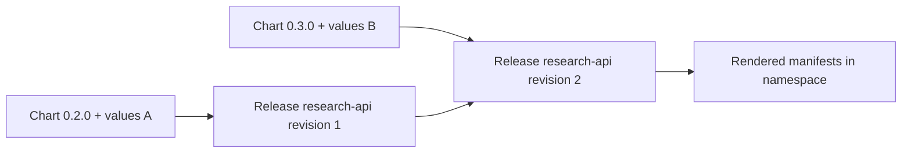
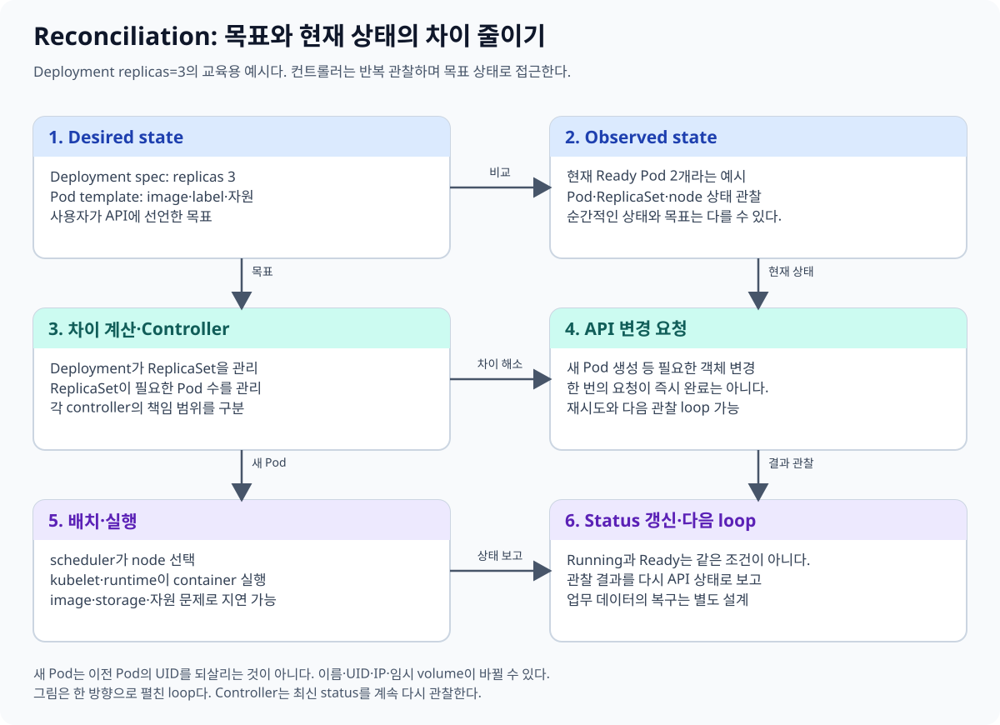
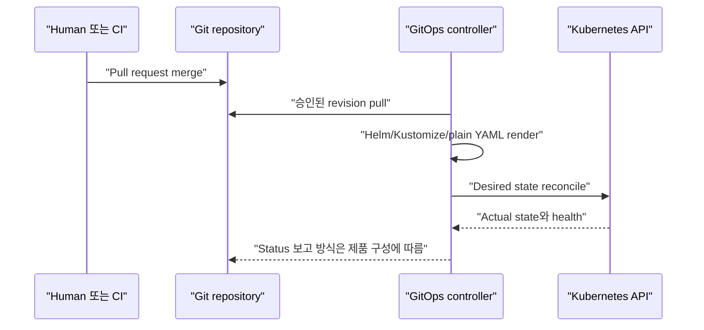
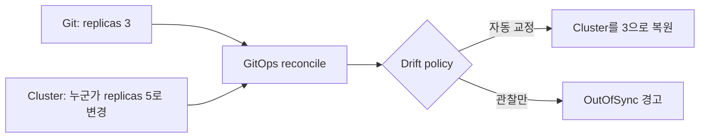

# 11. Helm, Kustomize와 GitOps

[이 책 목차](README.md) · [이전: 보안과 RBAC](10-security-rbac.md) · [다음: 관찰성과 문제 해결](12-observability-troubleshooting.md)

Manifest가 몇 개일 때는 YAML을 직접 관리할 수 있다. 환경과 application이 늘어나면 같은 구조를 반복하면서도 image, replica, hostname처럼 일부 값만 바꾸어야 한다. Helm과 Kustomize는 manifest를 만드는 방법이고, GitOps controller는 원하는 상태를 cluster와 계속 맞추는 운영 방식이다. 세 개념을 한 도구로 뭉뚱그리지 않는다.

## 1. 세 층을 구분한다

| 층 | 질문 | 대표 수단 |
| --- | --- | --- |
| Authoring | 재사용 가능한 manifest를 어떻게 만들까? | Helm template, Kustomize overlay |
| Packaging·release | chart version과 설치 instance를 어떻게 관리할까? | Helm chart와 release |
| Reconciliation | Git의 desired state와 cluster drift를 누가 맞출까? | Argo CD, Flux 같은 controller |

Helm이나 Kustomize로 YAML을 render했다고 cluster에 자동 적용되는 것은 아니다. 반대로 GitOps controller는 plain YAML, Helm, Kustomize 중 지원하는 source를 render하여 조정할 수 있다.

## 2. Helm chart의 구조

**Helm chart**는 Kubernetes manifest template, 기본 values, chart metadata를 묶은 package다.

```text
research-api/
├── Chart.yaml
├── values.yaml
└── templates/
    ├── deployment.yaml
    └── service.yaml
```

`Chart.yaml`의 `version`은 chart package의 version이고 `appVersion`은 포함된 application version을 설명하는 값이다. `appVersion`이 image tag를 자동으로 바꾸는 강제 규칙은 아니며 template 작성에 달려 있다.

```yaml
apiVersion: v2
name: research-api
description: Training-only API chart
type: application
version: 0.3.0
appVersion: "1.4.0"
```

이 파일은 유효한 chart metadata 예시지만 완성 chart가 아니며 여기서는 설치하지 않는다. Chart 구조는 Helm 공식 [Charts](https://helm.sh/docs/topics/charts/)를 따른다.

## 3. Template과 values

Template은 Go template 표현식으로 values를 manifest에 넣는다.

```yaml
# templates/deployment.yaml 일부
apiVersion: apps/v1
kind: Deployment
metadata:
  name: {{ include "research-api.fullname" . }}
  labels:
    app.kubernetes.io/name: research-api
spec:
  replicas: {{ .Values.replicaCount }}
  selector:
    matchLabels:
      app.kubernetes.io/name: research-api
  template:
    metadata:
      labels:
        app.kubernetes.io/name: research-api
    spec:
      containers:
        - name: api
          image: "{{ .Values.image.repository }}@{{ .Values.image.digest }}"
```

```yaml
# values.yaml 일부
replicaCount: 2
image:
  repository: registry.example/research-api
  digest: sha256:0123456789abcdef0123456789abcdef0123456789abcdef0123456789abcdef
```

두 조각은 helper template까지 갖춘 chart 안에서 render되는 예시이며 단독으로 적용하지 않는다. Secret 원문을 values file에 commit하지 않는다. Template 기능은 [Helm Chart Template Guide](https://helm.sh/docs/chart_template_guide/)에서 확인한다.

## 4. Release와 revision

**Helm release**는 chart를 특정 cluster·namespace에 설치한 instance다. 같은 chart를 `research-a`, `research-b`라는 서로 다른 release로 설치할 수 있다. Upgrade가 성공할 때 release revision이 쌓이며 Helm history와 rollback의 기준이 된다.



Release revision은 database migration revision과 다르다. `helm rollback`이 외부 database와 message side effect를 되돌리지 않는다.

## 5. Render와 차이를 먼저 본다

다음은 `lab13` context와 `delivery-lab` namespace만을 전제로 한 예시 절차다. Tool 설치나 cluster 변경을 이 문서에서 실행하지 않았고 외부 운영에 적용하지 않는다.

```text
1. kubectl config current-context
   예상: lab13
2. helm lint ./research-api
3. helm template research-api ./research-api \
     --namespace delivery-lab -f values-lab.yaml > /tmp/research-api-rendered.yaml
4. kubectl diff --server-side=false -n delivery-lab \
     -f /tmp/research-api-rendered.yaml
5. helm upgrade --install research-api ./research-api \
     --namespace delivery-lab --dry-run=server -f values-lab.yaml
```

`helm lint`는 chart convention과 일부 template 문제를 검사한다. `helm template`은 client에서 render한다. `kubectl diff`는 live object와 제출할 manifest의 차이를 보여 주며 API 접근이 필요할 수 있다. `--dry-run=server`도 server admission과 lookup 동작 때문에 cluster에 연결할 수 있지만 object를 영구 저장하는 실제 install은 아니다. Command 의미는 [helm template](https://helm.sh/docs/helm/helm_template/), [helm upgrade](https://helm.sh/docs/helm/helm_upgrade/), Kubernetes [kubectl diff](https://kubernetes.io/docs/reference/kubectl/generated/kubectl_diff/)를 확인한다.

`helm diff`는 Helm core command가 아니라 별도 plugin으로 쓰이는 경우가 있으므로 설치되어 있다고 가정하지 않는다.

## 6. Kustomize는 base와 overlay를 합성한다

Kustomize는 YAML을 template string으로 바꾸지 않고 resource와 patch를 합성한다. `kubectl kustomize`에 통합된 사용 경로가 있다.

Base의 같은 Deployment를 두 환경에서 재사용한다.

```yaml
# base/deployment.yaml
apiVersion: apps/v1
kind: Deployment
metadata:
  name: research-api
  labels:
    app.kubernetes.io/name: research-api
spec:
  replicas: 2
  selector:
    matchLabels:
      app.kubernetes.io/name: research-api
  template:
    metadata:
      labels:
        app.kubernetes.io/name: research-api
    spec:
      containers:
        - name: api
          image: registry.example/research-api:1.4.0
```

```yaml
# overlays/lab/kustomization.yaml
apiVersion: kustomize.config.k8s.io/v1beta1
kind: Kustomization
namespace: delivery-lab
resources:
  - ../../base
labels:
  - pairs:
      environment: lab
    includeSelectors: false
replicas:
  - name: research-api
    count: 1
images:
  - name: registry.example/research-api
    newTag: 1.4.1-lab
```

두 파일은 전체 base의 `kustomization.yaml`까지 준비되면 실행 가능한 격리 실습 예시다. 여기서는 build하거나 apply하지 않는다. Selector label은 안정적으로 유지하고 환경 label을 무심코 selector에 넣어 immutable selector 변경을 만들지 않는다. 공식 [Declarative Management Using Kustomize](https://kubernetes.io/docs/tasks/manage-kubernetes-objects/kustomization/)를 참고한다.

## 7. Kustomize render 절차

다음도 `lab13/delivery-lab` 전용 예시이며 실행하지 않았다.

```text
1. kubectl config current-context
   예상: lab13
2. kubectl kustomize deploy/overlays/lab > /tmp/research-api-lab.yaml
3. kubectl diff --server-side=false -n delivery-lab \
     -f /tmp/research-api-lab.yaml
```

Render output을 review하면 overlay가 base의 같은 Deployment에 어떤 label, replica, image 변경을 만들었는지 볼 수 있다. 환경마다 base를 복사해 따로 고치면 drift가 커지므로 공통 부분은 base에 남긴다.

## 8. GitOps의 pull reconciliation

**GitOps** 흐름에서는 선언형 desired state를 Git에 review 가능한 형태로 두고 cluster 안 또는 관리 경계의 controller가 repository를 pull·관찰하여 실제 상태와 맞춘다.





외부 CI가 credential로 매번 `kubectl apply`하는 push 방식과 달리, pull controller는 cluster 쪽에서 허용된 source와 path를 지속 관찰한다. 그렇다고 Git 접근권한·controller ServiceAccount·signing·secret 관리가 자동으로 안전해지는 것은 아니다.

## 9. Drift와 self-heal

**Drift**는 Git desired state와 cluster actual configuration이 달라진 상태다. 사람이 live Deployment image를 직접 바꾸면 controller가 이를 감지하고 Git 값으로 되돌릴 수 있다. 제품과 설정에 따라 자동 수정, 경고만, 수동 승인 방식이 다르다.



Self-heal은 application business rollback이 아니다. 잘못된 release가 database schema를 변경하거나 외부 message를 발행했다면 Git commit을 되돌려도 side effect가 남는다. Health check, migration 호환성, backup·restore, data repair 절차가 별도로 필요하다.

## 10. Argo CD와 Flux를 이해하는 범위

Argo CD와 Flux는 GitOps controller 범주의 공개 source 프로젝트다. 둘 다 Kubernetes desired state reconciliation을 제공하지만 resource model, multi-tenancy, promotion, image automation, UI와 운영 방식이 다르다.

- [Argo CD 공식 문서](https://argo-cd.readthedocs.io/en/stable/)
- [Flux 공식 문서](https://fluxcd.io/flux/)
- [Argo CD source repository](https://github.com/argoproj/argo-cd)
- [Flux source repositories](https://github.com/fluxcd)

이 교재는 어느 controller가 현재 연구 cluster에 설치되었다고 주장하지 않으며 설치도 수행하지 않는다. 도입 전 CRD, controller 권한, source credential, failure mode, upgrade와 복구 절차를 비교한다.

## 11. 안전한 delivery 흐름

1. Image를 immutable digest로 build하고 provenance·취약점을 검사한다.
2. Chart version 또는 overlay 변경을 pull request로 review한다.
3. Render 결과와 API schema, policy, diff를 확인한다.
4. 격리 환경에서 startup, readiness, migration, rollback 한계를 시험한다.
5. 승인된 Git revision을 controller가 reconcile하게 한다.
6. Rollout health와 application SLO를 관찰한다.
7. 실패 시 manifest rollback과 data recovery를 각각 판단한다.

## 12. 확인 문제

1. Helm chart와 release의 차이는 무엇인가?
2. Kustomize overlay는 base Deployment를 왜 복사하지 않는가?
3. GitOps controller의 self-heal이 database rollback도 수행하는가?
4. `helm diff`를 Helm built-in command로 가정해도 되는가?

## 13. 해설

1. Chart는 template과 values를 담은 package이고 release는 chart를 cluster·namespace에 설치한 instance와 revision history다.
2. 공통 구조를 한 base에서 유지하고 환경별 차이만 합성하여 복사본 drift를 줄이기 위해서다.
3. 아니다. Kubernetes configuration을 desired state와 맞출 뿐 application data side effect는 별도 복구가 필요하다.
4. 아니다. 널리 쓰이는 별도 plugin일 수 있으며 기본 명령으로는 render와 `kubectl diff`, server dry-run 등을 조합할 수 있다.

다음 장에서는 event, log, metric, trace를 연결해 rollout과 runtime 문제를 진단한다.
