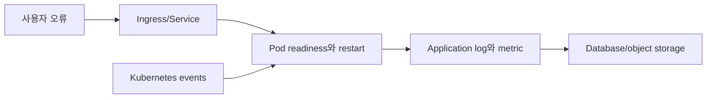
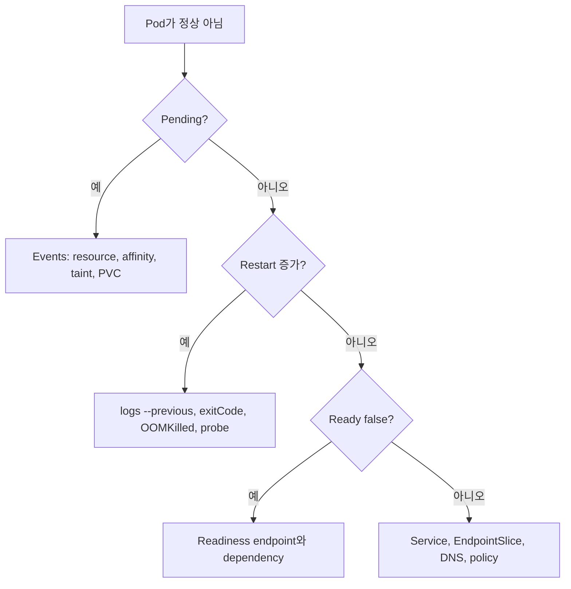
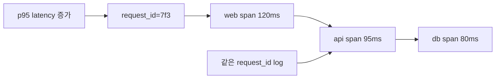
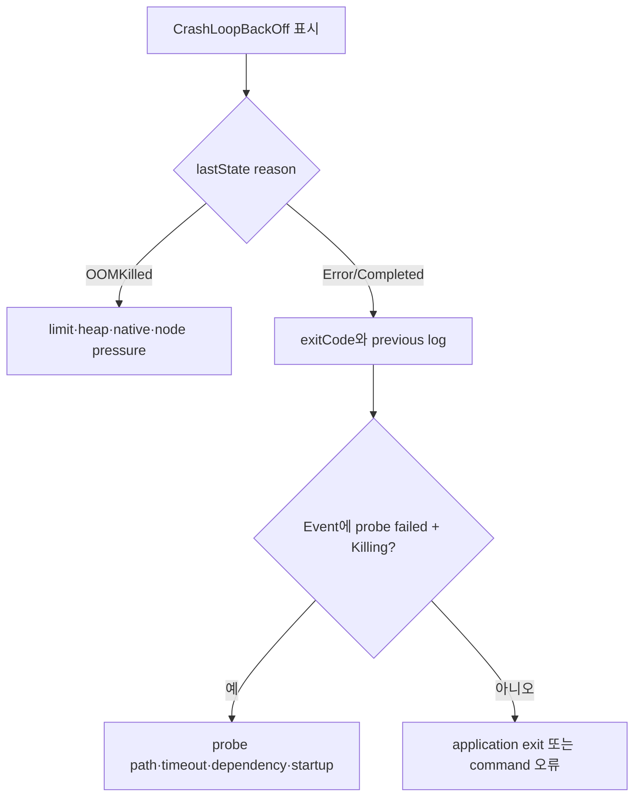

# 12. 관찰성과 문제 해결

[이 책 목차](README.md) · [이전: Helm, Kustomize와 GitOps](11-delivery-helm-gitops.md) · [다음: 로컬 실습](13-local-labs.md)

문제 해결은 명령을 많이 실행하는 일이 아니라 증상을 어느 계층에서 관찰했는지 구분하는 일이다. Kubernetes object status, event, container log, metric, application trace를 같은 시간축으로 연결한다.

## 1. 네 가지 신호

| 신호 | 답하는 질문 | 한계 |
| --- | --- | --- |
| Status·condition | Control plane이 어떤 상태를 관찰했나? | 업무 성공을 직접 증명하지 않음 |
| Event | 최근 어떤 결정·실패 이유가 있었나? | 보존 기간이 짧고 중복 집계 가능 |
| Log | Process가 무엇을 기록했나? | 기록하지 않은 사실은 알 수 없음 |
| Metric·trace | 시간이 지나며 얼마나, 어디서 느린가? | 수집·label·sampling 설계 필요 |



## 2. Pod phase와 Ready

Pod phase는 `Pending`, `Running`, `Succeeded`, `Failed`, `Unknown`의 큰 수명 상태다. `Running`은 적어도 하나의 container가 실행 중이거나 시작·재시작 중이라는 뜻이며 모든 container가 Ready이거나 application이 정상이라는 뜻이 아니다.

```text
PHASE=Running
Ready condition=False
ContainersReady=False
→ process는 있지만 새 traffic을 받지 못할 수 있음
```

`CrashLoopBackOff`는 `kubectl`이 container가 반복 실패하고 backoff 중임을 보여 주는 status/reason 표현이지 Pod phase 이름이 아니다. 실제 Pod phase는 `Running`일 수 있다. [Pod lifecycle](https://kubernetes.io/docs/concepts/workloads/pods/pod-lifecycle/)을 참고한다.

## 3. 읽기 전용 첫 절차

다음은 `lab13` context와 `observe-lab` namespace 전용 읽기 예시다. 여기서는 실행하지 않았다.

```text
1. kubectl config current-context
   예상: lab13
2. kubectl get pods -n observe-lab -o wide
3. kubectl describe pod api-abc -n observe-lab
4. kubectl get events -n observe-lab --sort-by=.metadata.creationTimestamp
5. kubectl logs api-abc -n observe-lab -c api --tail=200 --timestamps
6. kubectl logs api-abc -n observe-lab -c api --previous --tail=200 --timestamps
```

`--previous`는 같은 Pod의 해당 container에서 바로 전에 종료된 instance log를 요청한다. 새 Pod로 교체되었거나 node log가 사라졌다면 중앙 log storage가 필요하다. 공식 [kubectl logs](https://kubernetes.io/docs/reference/kubectl/generated/kubectl_logs/)를 본다.

## 4. 증상별 순서



### Pending

Scheduler event의 `Insufficient cpu`, untolerated taint, affinity mismatch를 본다. PVC Pending이면 provisioner·StorageClass event를 본다.

### ImagePullBackOff

Image 이름과 digest, registry DNS/TLS, pull secret, node egress를 확인한다. Backoff는 원인보다 재시도 상태다.

### OOMKilled

`lastState.terminated.reason`, exit code, memory limit, application heap/native 사용을 본다. Limit만 올리기 전에 leak과 request/limit 관계를 측정한다.

### Ready false

Probe path·port·timeout, startup 시간, dependency 상태를 본다. Liveness를 느슨하게 바꾸어 장애를 숨기지 않는다.

## 5. Event의 성격

Event는 scheduler, kubelet, controller가 남기는 관찰 기록이다. 동일 event는 count로 합쳐질 수 있고 영구 audit log가 아니다.

```text
Warning  FailedScheduling  0/3 nodes available: 3 Insufficient cpu
Warning  BackOff           Back-off restarting failed container api
Normal   Pulled            Container image already present on machine
```

Message 문자열 parsing을 장기 API 계약처럼 사용하지 않는다. Alert는 metric·condition과 함께 설계한다. [Events](https://kubernetes.io/docs/reference/kubernetes-api/cluster-resources/event-v1/)를 참고한다.

## 6. Log 안전성

- Credential, token, Authorization header를 출력하지 않는다.
- Request ID, Pod name, application version을 구조화 field로 남긴다.
- High-cardinality 사용자 값을 metric label에 넣지 않는다.
- Node-local log rotation과 중앙 수집 보존 기간을 구분한다.
- 여러 replica의 clock과 timezone을 맞춘다.

`kubectl logs`는 시작점이며 여러 Pod·과거 Pod·장기 추세에는 중앙 수집이 필요하다.

## 7. Metric과 trace

Resource metric은 CPU·memory 사용을, application metric은 request rate·latency·error를 보여 준다. Distributed trace는 Service 경계를 지난 한 요청 경로를 연결한다. Metric이 정상인데 사용자가 느리면 sampling되지 않은 dependency나 queue 대기를 trace와 log로 좁힌다.



## 8. OOMKilled와 CrashLoopBackOff를 한 사건으로 진단하기

다음 사례는 실제 cluster 실행 기록이 아니라 각 관찰이 어떻게 연결되는지를 보여 주는 완전한 예상 진단 이야기다. 교육용 Pod `api-7d9f`의 memory request는 256Mi, limit은 512Mi라고 가정한다.

```text
09:14:00 새 image rollout, Pod api-7d9f 시작
09:16:21 traffic 증가, container RSS 505Mi
09:16:24 kernel/cgroup이 process 종료
09:16:25 kubelet status: lastState.terminated.reason=OOMKilled, exitCode=137
09:16:26 restartCount=1, 새 container 시작
09:16:40 같은 입력을 읽고 다시 memory 증가
09:17:10 반복 실패 뒤 restart backoff 증가
09:17:11 kubectl get 표시: Running, 0/1, CrashLoopBackOff
```

여기에는 서로 다른 상태 표현이 동시에 참일 수 있다.

| 관찰 위치 | 값 | 뜻 |
| --- | --- | --- |
| Pod `status.phase` | `Running` | Pod가 node에 bind되어 container를 실행·재시작하는 큰 수명 단계 |
| 현재 container state | `waiting.reason=CrashLoopBackOff` | 지금은 반복 실패 뒤 다음 재시작을 기다림 |
| 직전 container state | `terminated.reason=OOMKilled` | 바로 전 process가 memory 관련 kill로 종료됨 |
| `restartCount` | 증가 | 같은 Pod UID 안에서 container instance가 교체됨 |
| kubectl `STATUS` 열 | `CrashLoopBackOff` | 사람이 보기 쉽게 고른 container 상태 요약이며 Pod phase가 아님 |

따라서 `STATUS=CrashLoopBackOff`만 보고 application exception이라고 단정하지 않고 `lastState`의 reason·exitCode와 event를 확인한다. 반대로 `phase=Running`만 보고 건강하다고 결론 내리지 않는다.

## 9. 같은 사례의 읽기 순서와 예상 증거

다음 명령은 `lab13/observe-lab`의 읽기 전용 교육 절차이며 여기서는 실행하지 않았다.

```text
kubectl get pod api-7d9f -n observe-lab -o wide
kubectl get pod api-7d9f -n observe-lab \
  -o jsonpath='{.status.phase}{"\n"}{.status.containerStatuses[0].state}{"\n"}{.status.containerStatuses[0].lastState}{"\n"}'
kubectl describe pod api-7d9f -n observe-lab
kubectl logs api-7d9f -n observe-lab -c api --previous --timestamps --tail=200
kubectl logs api-7d9f -n observe-lab -c api --timestamps --tail=200
kubectl get events -n observe-lab --sort-by=.metadata.creationTimestamp
```

예상되는 핵심 증거는 다음과 같다.

```text
phase: Running
state.waiting.reason: CrashLoopBackOff
lastState.terminated.reason: OOMKilled
lastState.terminated.exitCode: 137
restartCount: 4
event: Back-off restarting failed container api
previous log: loading partition=2026-10-10, estimated rows=4800000
```

Event의 `BackOff`는 재시작을 늦추고 있다는 결과이지 memory 원인 자체가 아니다. `--previous` log는 죽은 instance가 마지막으로 무엇을 하던 중이었는지 보여 준다. 현재 log만 보면 막 시작한 process의 banner만 있어 원인을 놓칠 수 있다.

## 10. OOM이라고 limit만 올리지 않는 이유

`OOMKilled` 뒤에는 여러 다른 원인이 있다.

- Container cgroup limit보다 heap+native+page cache 사용이 커졌다.
- Application leak 때문에 시간에 따라 계속 증가한다.
- 한 요청이나 partition 크기가 정상 범위를 벗어났다.
- Sidecar와 app의 limit을 혼동해 다른 container를 보고 있다.
- Node 전체 memory pressure에서 eviction과 kernel OOM이 관여했다.

먼저 container 이름, limit, working set/RSS 추세, application heap, native allocation, input cardinality를 같은 시간축으로 본다. Limit을 512Mi에서 2Gi로 올려 잠시 정상화되더라도 leak이면 실패 시간만 늦춘다. 반대로 정상 peak가 700Mi이고 node에 충분한 여유가 있으며 application을 줄일 수 없다면 측정 근거로 request와 limit을 함께 조정할 수 있다.

Memory request를 그대로 256Mi로 두고 limit만 2Gi로 올리면 scheduler는 여전히 256Mi만 예약한다. Replica 여러 개가 동시에 2Gi에 가까워지면 node pressure가 커진다. 안정적인 사용 percentile을 바탕으로 request도 다시 산정한다.

## 11. Probe 실패가 CrashLoop을 만든 반례

`lastState.terminated.reason=Error`, exit code가 애플리케이션의 자연 종료 값이 아니고 event에 `Liveness probe failed`와 `Killing`이 이어지면 memory가 아니라 kubelet이 container를 재시작했을 수 있다.



Database가 잠깐 느려져 liveness endpoint가 timeout되고 kubelet이 정상 process를 죽이는 경우, heap을 늘려도 해결되지 않는다. `describe` event와 probe 설정, application access log를 같은 timestamp로 맞춰야 한다.

## 12. 새 Pod와 같은 Pod의 재시작을 구분하기

Deployment rollout이나 eviction으로 Pod가 교체되면 새 UID가 생긴다. 이때 새 Pod에서 `kubectl logs --previous`를 실행해도 옛 Pod의 container log를 얻지 못한다. 중앙 log에서 Pod UID, owner revision, container restart index를 함께 저장해야 한다.

```text
api-7d9f UID=aaa restartCount=4  ← 같은 Pod 안 재시작
api-b62c UID=bbb restartCount=0  ← rollout로 생긴 새 Pod
```

Pod 이름 prefix가 같다고 동일 instance가 아니다. ReplicaSet hash가 다르면 image·config template revision도 다를 수 있다. 장애가 rollout 직후 시작했다면 두 ReplicaSet별 error rate와 image digest를 비교한다.

## 13. 진단이 완료되는 조건

원인을 찾았다는 말은 `CrashLoopBackOff` 표시가 사라졌다는 뜻만이 아니다. 이 사례의 완료 조건은 다음과 같다.

1. 이전 container의 OOMKilled와 memory 증가가 timestamp로 연결된다.
2. Leak, 정상 peak, 비정상 input 중 재현 가능한 원인이 좁혀진다.
3. 격리 환경에서 수정 뒤 같은 input과 부하를 실행해 restart가 늘지 않는다.
4. Request·limit과 node allocatable에서 replica 전체가 감당 가능한지 다시 계산한다.
5. Ready replica, error rate, latency가 관찰 기간 동안 회복된다.

단순히 Pod를 삭제하면 controller가 새 Pod를 만들고 잠시 초록색이 될 수 있지만 같은 input에서 다시 OOM이 난다. 재생성은 진단도 수정도 아니다.

## 14. 문제와 해설

1. Pod phase가 Running이면 Ready인가? **아니다.** Condition을 별도로 본다.
2. CrashLoopBackOff는 Pod phase인가? **아니다.** 반복 실패와 backoff를 보여 주는 표시다.
3. 이전 container instance log는? **`kubectl logs --previous`**로 시도한다.
4. Event가 영구 audit 기록인가? **아니다.** 보존과 집계가 제한된 진단 신호다.

다음 장의 격리 실습에서는 이 읽기 순서를 실제 object에 적용한다.
