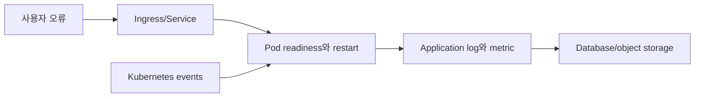
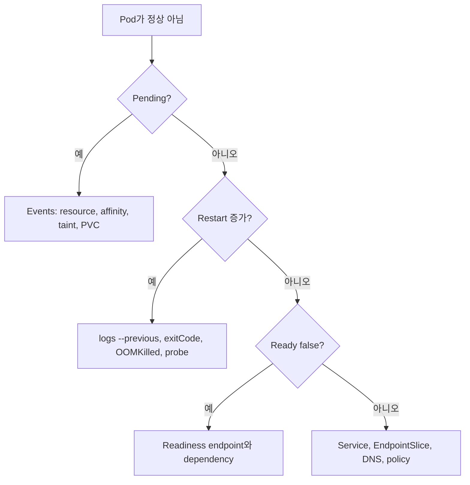
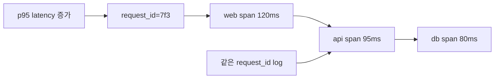

# 12. 관찰성과 문제 해결

[이 책 목차](README.md) · [이전: Helm, Kustomize와 GitOps](11-delivery-helm-gitops.md) · [다음: 로컬 실습](13-local-labs.md)

문제 해결은 명령을 많이 실행하는 일이 아니라 증상을 어느 계층에서 관찰했는지 구분하는 일이다. Kubernetes object status, event, container log, metric, application trace를 같은 시간축으로 연결한다.

## 1. 네 가지 신호

| 신호 | 답하는 질문 | 한계 |
| --- | --- | --- |
| Status·condition | Control plane이 어떤 상태를 관찰했나? | 업무 성공을 직접 증명하지 않음 |
| Event | 최근 어떤 결정·실패 이유가 있었나? | 보존 기간이 짧고 중복 집계 가능 |
| Log | Process가 무엇을 기록했나? | 기록하지 않은 사실은 알 수 없음 |
| Metric·trace | 시간이 지나며 얼마나, 어디서 느린가? | 수집·label·sampling 설계 필요 |



## 2. Pod phase와 Ready

Pod phase는 `Pending`, `Running`, `Succeeded`, `Failed`, `Unknown`의 큰 수명 상태다. `Running`은 적어도 하나의 container가 실행 중이거나 시작·재시작 중이라는 뜻이며 모든 container가 Ready이거나 application이 정상이라는 뜻이 아니다.

```text
PHASE=Running
Ready condition=False
ContainersReady=False
→ process는 있지만 새 traffic을 받지 못할 수 있음
```

`CrashLoopBackOff`는 `kubectl`이 container가 반복 실패하고 backoff 중임을 보여 주는 status/reason 표현이지 Pod phase 이름이 아니다. 실제 Pod phase는 `Running`일 수 있다. [Pod lifecycle](https://kubernetes.io/docs/concepts/workloads/pods/pod-lifecycle/)을 참고한다.

## 3. 읽기 전용 첫 절차

다음은 `lab13` context와 `observe-lab` namespace 전용 읽기 예시다. 여기서는 실행하지 않았다.

```text
1. kubectl config current-context
   예상: lab13
2. kubectl get pods -n observe-lab -o wide
3. kubectl describe pod api-abc -n observe-lab
4. kubectl get events -n observe-lab --sort-by=.metadata.creationTimestamp
5. kubectl logs api-abc -n observe-lab -c api --tail=200 --timestamps
6. kubectl logs api-abc -n observe-lab -c api --previous --tail=200 --timestamps
```

`--previous`는 같은 Pod의 해당 container에서 바로 전에 종료된 instance log를 요청한다. 새 Pod로 교체되었거나 node log가 사라졌다면 중앙 log storage가 필요하다. 공식 [kubectl logs](https://kubernetes.io/docs/reference/kubectl/generated/kubectl_logs/)를 본다.

## 4. 증상별 순서



### Pending

Scheduler event의 `Insufficient cpu`, untolerated taint, affinity mismatch를 본다. PVC Pending이면 provisioner·StorageClass event를 본다.

### ImagePullBackOff

Image 이름과 digest, registry DNS/TLS, pull secret, node egress를 확인한다. Backoff는 원인보다 재시도 상태다.

### OOMKilled

`lastState.terminated.reason`, exit code, memory limit, application heap/native 사용을 본다. Limit만 올리기 전에 leak과 request/limit 관계를 측정한다.

### Ready false

Probe path·port·timeout, startup 시간, dependency 상태를 본다. Liveness를 느슨하게 바꾸어 장애를 숨기지 않는다.

## 5. Event의 성격

Event는 scheduler, kubelet, controller가 남기는 관찰 기록이다. 동일 event는 count로 합쳐질 수 있고 영구 audit log가 아니다.

```text
Warning  FailedScheduling  0/3 nodes available: 3 Insufficient cpu
Warning  BackOff           Back-off restarting failed container api
Normal   Pulled            Container image already present on machine
```

Message 문자열 parsing을 장기 API 계약처럼 사용하지 않는다. Alert는 metric·condition과 함께 설계한다. [Events](https://kubernetes.io/docs/reference/kubernetes-api/cluster-resources/event-v1/)를 참고한다.

## 6. Log 안전성

- Credential, token, Authorization header를 출력하지 않는다.
- Request ID, Pod name, application version을 구조화 field로 남긴다.
- High-cardinality 사용자 값을 metric label에 넣지 않는다.
- Node-local log rotation과 중앙 수집 보존 기간을 구분한다.
- 여러 replica의 clock과 timezone을 맞춘다.

`kubectl logs`는 시작점이며 여러 Pod·과거 Pod·장기 추세에는 중앙 수집이 필요하다.

## 7. Metric과 trace

Resource metric은 CPU·memory 사용을, application metric은 request rate·latency·error를 보여 준다. Distributed trace는 Service 경계를 지난 한 요청 경로를 연결한다. Metric이 정상인데 사용자가 느리면 sampling되지 않은 dependency나 queue 대기를 trace와 log로 좁힌다.



## 8. 문제와 해설

1. Pod phase가 Running이면 Ready인가? **아니다.** Condition을 별도로 본다.
2. CrashLoopBackOff는 Pod phase인가? **아니다.** 반복 실패와 backoff를 보여 주는 표시다.
3. 이전 container instance log는? **`kubectl logs --previous`**로 시도한다.
4. Event가 영구 audit 기록인가? **아니다.** 보존과 집계가 제한된 진단 신호다.

다음 장의 격리 실습에서는 이 읽기 순서를 실제 object에 적용한다.
