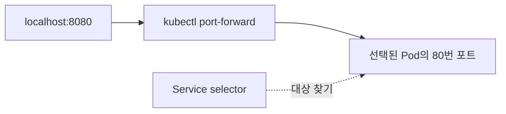

# 13. 격리된 로컬 실습: Pod에서 Service까지

이 장은 **kind가 만든 전용 로컬 클러스터**에서 작은 웹 서버를 실행한다. 연구실의 기존 Kubernetes context에 적용하지 않는다. 실습 대상은 `kind-netai-textbook` context와 `netai-textbook` namespace로 명시한다.

**이 장의 manifest와 명령은 이번 교재 작성 때 클러스터에 적용하지 않았다.** 상태·주소·응답은 설명용 예상 관찰이다. 실행 결과라고 인용하지 않는다. 클러스터 생성과 변경은 독자가 아래 실습을 수행할 때 일어난다.

## 13.1 준비 도구와 버전

kind는 컨테이너 안에 Kubernetes 노드를 실행한다. 여기서는 **kind 0.33.0·노드 이미지 kindest/node:v1.37.0·kubectl 1.37.1**을 기준으로 한다. 이미지 다운로드와 Linux 컨테이너 실행을 위한 Docker 등 지원 container provider가 필요하다. 노트북의 CPU·RAM·디스크를 실제로 사용한다.

kind의 node 이미지와 kubectl 버전은 구별한다. kubectl은 API 요청을 보내는 client다. 1.37.0 클러스터에 1.37.1 client를 쓰는 것은 같은 minor의 patch 차이다. 버전의 지원 상태와 skew는 [15장](15-versions-and-extensions.md)을 따른다.

```bash
kind version
kubectl version --client
docker info
```

도구 설치는 [kind 공식 빠른 시작](https://kind.sigs.k8s.io/docs/user/quick-start/)과 [kubectl 설치](https://kubernetes.io/docs/tasks/tools/)를 따른다. 본 교재는 설치 스크립트를 자동 실행하지 않는다. ARM/x86 아키텍처와 provider의 지원 여부도 확인한다.

## 13.2 전용 클러스터 생성

```bash
kind create cluster --name netai-textbook --image kindest/node:v1.37.0
kubectl --context kind-netai-textbook cluster-info
kubectl --context kind-netai-textbook get nodes
```

기존에 같은 이름의 kind 클러스터가 있다면 실습 용도를 먼저 확인한다. 이름만 같다고 자동 삭제하지 않는다. 이후 모든 `kubectl` 명령에는 context를 직접 넣는다. 현재 기본 context를 바꾸었다고 가정하지 않는다.


## 13.3 Manifest 읽고 적용하기

[examples](examples/README.md)에 namespace·ConfigMap·Deployment·Service를 별도 파일로 제공한다. 저장소 최상위에서 다음 순서로 적용한다.

```bash
kubectl --context kind-netai-textbook apply -f learning/kubernetes/examples/namespace.yaml
kubectl --context kind-netai-textbook apply -f learning/kubernetes/examples/configmap.yaml
kubectl --context kind-netai-textbook apply -f learning/kubernetes/examples/deployment.yaml
kubectl --context kind-netai-textbook apply -f learning/kubernetes/examples/service.yaml
kubectl --context kind-netai-textbook -n netai-textbook rollout status deployment/textbook-web --timeout=120s
kubectl --context kind-netai-textbook -n netai-textbook get pods,deployments,services
```

| 파일의 중요한 줄 | 요청하는 의미 |
| --- | --- |
| `replicas: 2` | Deployment가 웹 Pod 두 개를 유지하도록 요청 |
| `app: textbook-web` | Deployment selector·Pod label·Service selector의 연결 |
| `image: nginx:1.28.0` | 사용할 container image tag |
| `requests.cpu: 100m` | container당 CPU request 0.1 core |
| `limits.memory: 128Mi` | container당 메모리 제한 |
| `readinessProbe` | 요청을 받을 준비 여부 판단 |
| `livenessProbe` | 실행 중 건강 상태 판단; 실패 조건에서 container 재시작 |
| `type: ClusterIP` | 클러스터 내부 Service 주소 요청 |

ConfigMap은 이름 `lab-settings`와 교육용 `COURSE_NAME` 값을 제공하고 Deployment는 env로 주입한다. 이 값은 Nginx 화면을 자동으로 바꾸지 않는다. 환경 변수를 전달하는 것과 프로그램이 그 값을 사용하도록 구현하는 것은 다른 일이다.

`nginx:1.28.0`은 설명용 tag 고정이다. tag는 registry에서 재지정될 수 있으므로 연구의 완전한 재현 기록에는 실제 image digest도 저장한다. 이 예제는 기본 Nginx 실행 방식이며 연구실의 보안 정책을 모두 구현한 운영 manifest가 아니다.

## 13.4 Service로 접속하기

첫 터미널에서 다음 명령을 실행한 채 둔다.

```bash
kubectl --context kind-netai-textbook -n netai-textbook port-forward service/textbook-web 8080:80
```

다른 터미널에서 응답을 확인한다.

```bash
curl http://127.0.0.1:8080/
```

예상 응답은 Nginx 기본 환영 HTML이다. `port-forward`는 실습용 API 연결 경로다. 일반 클러스터 내부 Service 데이터 경로 전체나 외부 Ingress/Gateway 구성을 검증하는 실험과는 다르다. 이 경로를 production 노출 방식으로 해석하지 않는다.



## 13.5 Controller의 복구와 확장 관찰

```bash
kubectl --context kind-netai-textbook -n netai-textbook get pods -l app=textbook-web
```

위 목록에서 **실습 namespace의 Pod 하나**를 고르고, 다음 명령의 `POD_NAME`을 실제 이름으로 바꾼다.

```bash
kubectl --context kind-netai-textbook -n netai-textbook delete pod POD_NAME
kubectl --context kind-netai-textbook -n netai-textbook get pods -w
```

Deployment/ReplicaSet이 목표 개수 두 개를 유지하기 위해 새 Pod를 만든다. 새 Pod의 이름·UID·IP는 달라질 수 있다. 같은 Pod가 부활하는 것으로 설명하지 않는다. watch 종료는 Ctrl-C다. port-forward 대상 Pod가 삭제되면 연결이 끊길 수 있으므로 필요하면 다시 실행한다.

```bash
kubectl --context kind-netai-textbook -n netai-textbook scale deployment/textbook-web --replicas=3
kubectl --context kind-netai-textbook -n netai-textbook get pods
```

세 개가 모두 Ready가 되는지는 노드 자원과 이미지 준비 상태 등에 달려 있다. 원본 Deployment 파일을 다시 apply하면 파일의 목표인 두 개로 돌아간다. 이것은 직접 변경과 선언 파일의 desired state가 달라지는 간단한 drift 예다.

## 13.6 설정 변경과 진단

ConfigMap을 고쳐 apply해도 이미 실행 중인 프로세스의 env 값은 자동으로 교체되지 않는다. Pod를 새로 만드는 흐름이 필요하다. mount 방식의 갱신과 env 방식의 갱신은 [07장](07-config-secrets.md)에서 비교한다.

```bash
kubectl --context kind-netai-textbook -n netai-textbook rollout restart deployment/textbook-web
kubectl --context kind-netai-textbook -n netai-textbook rollout status deployment/textbook-web
kubectl --context kind-netai-textbook -n netai-textbook describe deployment textbook-web
kubectl --context kind-netai-textbook -n netai-textbook get events --sort-by=.metadata.creationTimestamp
kubectl --context kind-netai-textbook -n netai-textbook logs deployment/textbook-web --tail=20
```

마지막 logs 명령은 Deployment의 모든 Pod 로그를 완전히 합치는 관측 시스템이 아니다. 특정 Pod·container와 이전 container 로그가 필요한 상황은 [12장](12-observability-troubleshooting.md)을 따른다.

## 13.7 실습 자원 정리

이 장에서 만든 전용 클러스터만 정리한다. 다음 명령은 해당 실습 클러스터와 그 안의 데이터를 삭제한다. 실습 관찰을 마쳤고 그 안에 보존할 연구 데이터가 없는 경우 사용한다.

```bash
kind delete cluster --name netai-textbook
```

**문제:** Pod 삭제 뒤 새 Pod가 생겼다면 Nginx 내부 파일도 모두 복구되는가? **해설:** 아니다. Controller는 Pod 수와 template 상태를 유지한다. 이전 Pod의 임시 파일을 백업하여 복구하는 역할은 아니다.

**문제:** `containerPort: 80`을 적으면 인터넷에 80번 포트가 공개되는가? **해설:** 아니다. container의 포트 정보를 명시한 것이다. Service의 유형, Gateway/Ingress, 방화벽과 라우팅은 별도다.

공식 자료: [kind 빠른 시작](https://kind.sigs.k8s.io/docs/user/quick-start/), [Deployment](https://kubernetes.io/docs/concepts/workloads/controllers/deployment/), [Service](https://kubernetes.io/docs/concepts/services-networking/service/), [Port forward](https://kubernetes.io/docs/tasks/access-application-cluster/port-forward-access-application-cluster/).

[이전: 장애 진단](12-observability-troubleshooting.md) · [다음: 연구용 Spark 플랫폼](14-research-spark-platform.md) · [목차](README.md)
