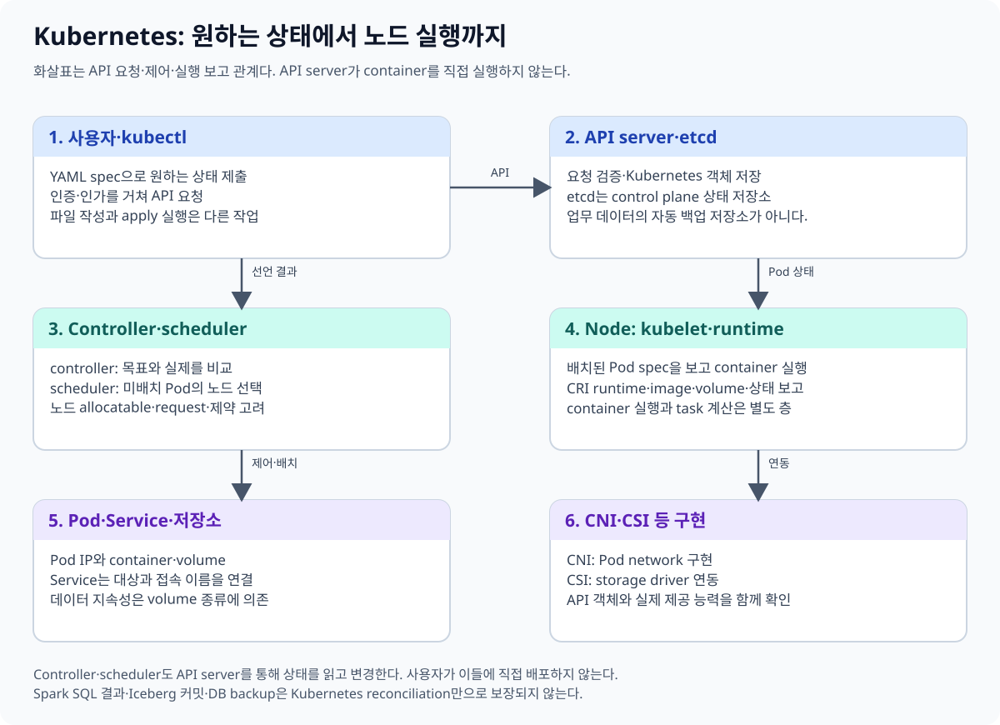
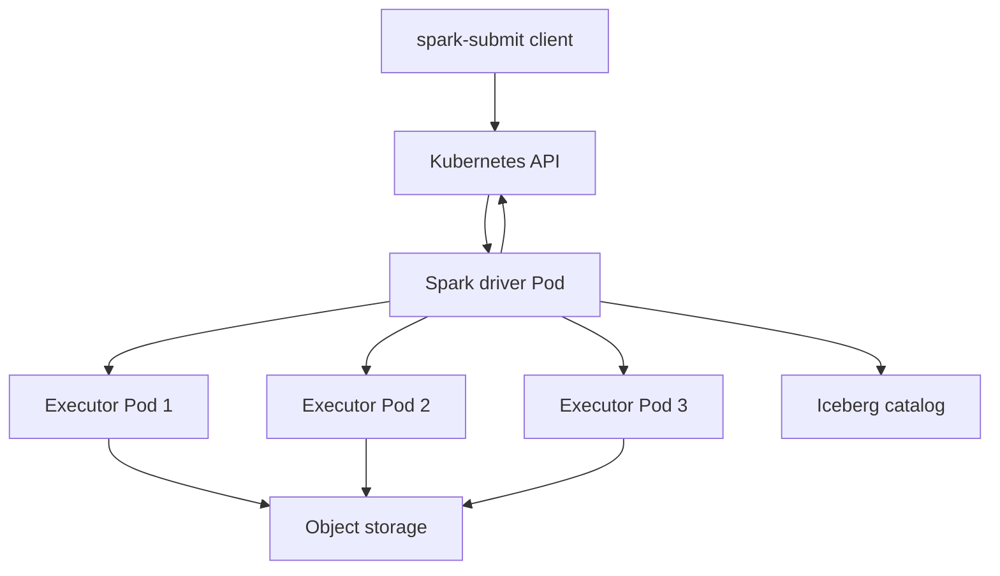
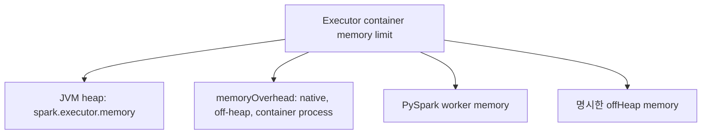
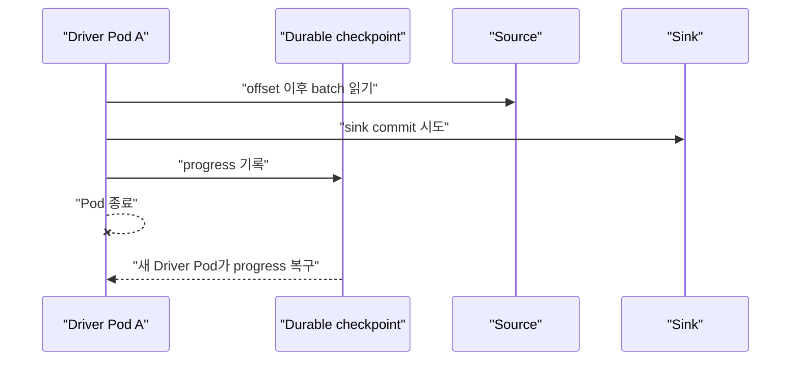

# 14. 연구용 Spark on Kubernetes 플랫폼

[이 책 목차](README.md) · [이전: 로컬 실습](13-local-labs.md) · [다음: 버전과 확장](15-versions-and-extensions.md)

Spark를 Kubernetes에서 실행하면 driver와 executor가 Pod가 된다. Kubernetes는 Pod 배치와 재시작 기반을 제공하지만 Spark job의 commit, streaming source·sink correctness, Iceberg catalog 계약을 대신하지 않는다.



## 1. Process 배치



Cluster deploy mode에서 제출 client가 driver Pod 생성을 요청하고 driver가 executor Pod를 생성·관찰한다. Executor는 task를 수행하고 driver에 상태와 결과를 보낸다. 공식 [Spark on Kubernetes](https://spark.apache.org/docs/4.0.4/running-on-kubernetes.html)를 기준으로 한다.

## 2. ServiceAccount와 API 권한

Driver는 자기 namespace에서 executor Pod와 관련 resource를 만들고 감시·삭제할 권한이 필요하다. 전용 ServiceAccount와 namespace Role을 사용하고 `cluster-admin`을 주지 않는다.

```text
spark.kubernetes.authenticate.driver.serviceAccountName=spark-driver
spark.kubernetes.namespace=spark-lab
```

필요 verb는 Spark version, executor allocation, Service·ConfigMap 사용에 따라 달라진다. [10장](10-security-rbac.md)의 baseline을 실제 API audit와 공식 문서로 보정한다. Executor application code가 Kubernetes API를 쓸 필요가 없다면 token automount를 제한한다.

## 3. Executor 수와 Pod 수

정적 allocation에서 executor 4개라면 기본 Spark application Pod는 driver 1개와 executor 4개로 약 5개다.

```text
spark.executor.instances=4
spark.executor.cores=2
→ executor task slot 기준 약 8개
```

Dynamic allocation을 사용하면 executor Pod 수가 변한다. Pod 수와 CPU slot, 실제 parallelism은 input partition, shuffle partition, scheduler backlog의 영향을 함께 받는다.

## 4. JVM heap와 container memory



`spark.executor.memory=6g`는 container 전체 limit 6Gi와 같은 뜻이 아니다. 대략 heap + overhead + off-heap + PySpark memory를 담을 공간이 필요하다.

```text
--conf spark.executor.memory=6g
--conf spark.executor.memoryOverhead=1g
--conf spark.executor.cores=2
--conf spark.kubernetes.executor.limit.cores=2
```

이 설정 조각은 `lab13/spark-lab` 격리 실습 예시이며 제출하지 않았다. CPU limit이 task slot보다 너무 낮으면 throttling되고 memory overhead가 작으면 heap 밖 사용 때문에 OOMKilled될 수 있다.

## 5. 실행 가능한 제출 형태

```text
spark-submit \
  --master k8s://https://kubernetes.default.svc \
  --deploy-mode cluster \
  --name research-etl \
  --conf spark.kubernetes.namespace=spark-lab \
  --conf spark.kubernetes.authenticate.driver.serviceAccountName=spark-driver \
  --conf spark.kubernetes.container.image=registry.example/spark:4.0.4 \
  --conf spark.executor.instances=4 \
  local:///opt/spark/jobs/etl.py
```

문법 예시일 뿐 image와 job은 실제 존재하지 않으며 이 문서에서는 실행하지 않는다. External production cluster에는 적용하지 않는다.

## 6. Streaming checkpoint

Driver Pod filesystem이나 `emptyDir`에 checkpoint를 두면 Pod 교체 때 잃을 수 있다. 여러 재시작에서 같은 URI를 읽을 수 있는 지속 storage를 사용한다.

```text
checkpointLocation=s3a://research-lake/checkpoints/events-v1
```

Checkpoint 지속성만으로 exactly-once가 완성되지 않는다. Source offset semantics, sink commit/idempotency, query 변경 호환성, credential과 object-store consistency를 함께 검증한다. Pod 재시작은 외부 sink의 중복 write를 자동 취소하지 않는다. [Structured Streaming recovery semantics](https://spark.apache.org/docs/4.0.4/streaming/apis-on-dataframes-and-datasets.html#recovery-semantics-after-changes-in-a-streaming-query)를 참고한다.



Sink commit 성공 뒤 checkpoint 응답을 잃은 구간 같은 failure를 실제 connector 계약으로 시험한다.

## 7. Iceberg catalog와 object storage

개발 laptop의 local filesystem HadoopCatalog 성공은 Kubernetes 다중 writer 계약을 검증하지 않는다. Driver와 executor가 서로 다른 node에서 같은 local path를 본다고 가정할 수 없다.

연구 cluster에서는 다음을 분리한다.

- Catalog: table 이름과 current metadata commit 경계
- Object storage: data, manifest, metadata file byte 저장
- Spark integration: SQL plan, reader/writer와 Iceberg runtime
- IAM: driver·executor의 catalog/storage 권한

Object storage가 있다고 atomic Iceberg catalog commit이 생기는 것도 아니며, catalog가 있다고 모든 executor의 object access가 보장되는 것도 아니다. [Iceberg 통합 장](../apache-spark/09-iceberg-integration.md)을 함께 본다.

## 8. 읽기 전용 진단

```text
kubectl get pods -n spark-lab -l spark-app-name=research-etl
kubectl logs -n spark-lab <driver-pod> --tail=200
kubectl get events -n spark-lab --sort-by=.metadata.creationTimestamp
kubectl auth can-i create pods --as=system:serviceaccount:spark-lab:spark-driver -n spark-lab
```

위 명령은 `lab13/spark-lab` 예시이며 실행하지 않았다. Driver log, executor log, Spark UI event, object-store/catalog log를 application ID와 시간으로 연결한다.

## 9. 문제와 해설

1. Executor 4개면 기본 Pod 수는? **Driver 포함 약 5개**다.
2. `executor.memory=6g`면 container limit도 6Gi인가? **아니다.** overhead 등을 포함해야 한다.
3. Durable checkpoint만 있으면 임의 sink가 exactly-once인가? **아니다.** source·sink 계약이 필요하다.
4. Local HadoopCatalog 성공이 다중 node object storage commit을 증명하는가? **아니다.** 서로 다른 storage·catalog 계약이다.

다음 장에서는 Kubernetes version, API lifecycle, feature gate와 extension의 성숙도를 읽는다.
