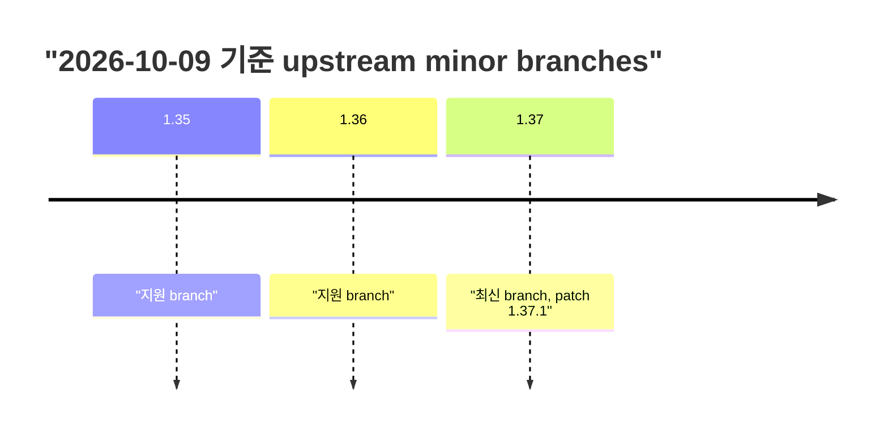
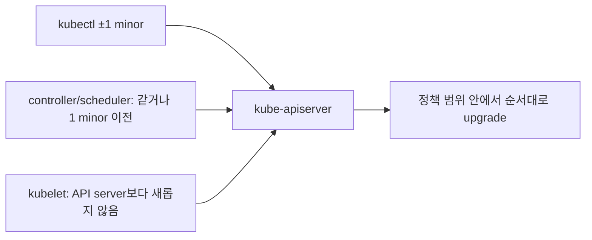
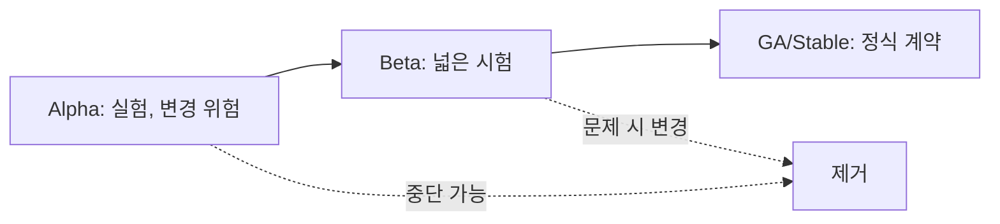
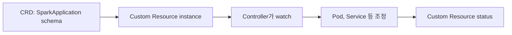

# 15. Version, API와 extension

[이 책 목차](README.md) · [이전: 연구용 Spark 플랫폼](14-research-spark-platform.md) · [다음: 종합 문제와 용어집](16-exercises-and-glossary.md)

Kubernetes version을 올리는 일은 binary 하나를 교체하는 일이 아니다. Control-plane component, kubelet, kubectl, API version, admission webhook, CNI·CSI와 controller compatibility를 함께 본다. 이 장의 날짜 기준은 **2026-10-09**다.

## 1. 현재 release를 정확히 읽는다

공식 [Kubernetes Releases](https://kubernetes.io/releases/) 기준 최신 patch release는 **1.37.1**, release date는 **2026-09-15**다. 유지되는 최근 세 minor branch는 **1.37, 1.36, 1.35**다. “지원 branch”와 사용 중 vendor distribution의 지원 기간은 다를 수 있다.



새 patch가 발표되면 이 숫자는 바뀐다. 설치 전에 [Patch Releases](https://kubernetes.io/releases/patch-releases/)와 distribution 공지를 다시 확인한다.

## 2. Version skew

**Version skew**는 서로 통신하는 component의 minor version 차이다. 공식 [Version Skew Policy](https://kubernetes.io/releases/version-skew-policy/)의 1.37 예시는 다음과 같다.

| Component | kube-apiserver 1.37일 때 upstream 허용 예시 |
| --- | --- |
| kube-apiserver HA peers | 1.37 또는 1.36, newest-oldest 1 minor 이내 |
| kubelet | 1.37, 1.36, 1.35, 1.34; API server보다 새로우면 안 됨 |
| controller-manager·scheduler | 1.37 또는 1.36; API server보다 새로우면 안 됨 |
| kubectl | 1.38, 1.37, 1.36; API server와 ±1 minor |

HA API server가 1.36과 1.37로 섞이면 허용 범위가 더 좁아질 수 있다. Vendor와 설치 도구는 upstream보다 엄격한 규칙을 둘 수 있다.



Minor version을 건너뛰지 않고 현재 branch 최신 patch→target control plane→node component 순서와 webhook compatibility를 계획한다.

## 3. API version lifecycle

Kubernetes API는 alpha, beta, stable 단계를 거칠 수 있다.

| 단계 | 이름 예 | 일반 성격 |
| --- | --- | --- |
| Alpha | `v1alpha1` | 기본 비활성일 수 있고 breaking change 가능 |
| Beta | `v1beta1` | 더 넓은 시험, 기본 활성 여부는 feature별 확인 |
| Stable | `v1` | 장기 호환을 목표로 하는 정식 API |

옛 API version은 deprecate된 뒤 제거될 수 있다. 저장된 object가 자동으로 새 manifest 파일을 고쳐 주는 것은 아니다. Upgrade 전 manifest, Helm render, CRD, webhook이 제거 API를 사용하는지 검사한다. 정책은 [API deprecation](https://kubernetes.io/docs/reference/using-api/deprecation-policy/)을 따른다.

## 4. Feature gate와 성숙도

Feature gate는 component에서 특정 기능을 켜거나 끄는 mechanism이다. Alpha 기능은 opt-in인 경우가 많고 API·behavior가 바뀔 수 있다. Beta와 GA라도 해당 release 문서의 default와 limitation을 확인한다.



2026-10-09에 구분해야 할 resource 기능은 다음과 같다.

| 기능 | 상태 |
| --- | --- |
| Pod-level resources | Kubernetes 1.34에서 Beta, 기본 활성 |
| Container in-place resize core | Kubernetes 1.35에서 GA |
| In-place resize scheduler preemption | Kubernetes 1.37에서 Alpha, opt-in feature gate |

Pod-level resources는 Pod 전체 CPU·memory envelope이고 container resize와 같은 기능이 아니다. 자세한 상태는 [Pod Level Resources Beta](https://kubernetes.io/blog/2025/09/22/kubernetes-v1-34-pod-level-resources/), [In-place resize task](https://kubernetes.io/docs/tasks/configure-pod-container/resize-container-resources/), [1.37 resize preemption](https://kubernetes.io/blog/2026/09/10/kubernetes-v1-37-scheduler-preemption-for-in-place-pod-resize-alpha/)을 확인한다.

## 5. CRD, controller와 operator

**CRD(CustomResourceDefinition)**는 Kubernetes API에 새 resource schema와 endpoint를 추가한다. CRD만 설치하면 그 resource의 업무 동작이 자동 구현되지는 않는다.



**Controller**는 desired state를 조정하는 process다. **Operator**는 custom resource와 controller로 특정 application의 배포·backup·upgrade 같은 운영 지식을 구현하는 pattern을 흔히 뜻한다. 이름이 operator라고 correctness가 자동 보장되지는 않는다. CRD schema version, conversion webhook, controller image와 RBAC를 함께 backup·upgrade한다. [Custom Resources](https://kubernetes.io/docs/concepts/extend-kubernetes/api-extension/custom-resources/)를 참고한다.

## 6. HPA와 VPA extension 경계

HPA API와 controller는 Kubernetes에 포함되지만 resource metric을 쓰려면 metrics API 제공자가 필요하다. VPA는 Kubernetes core 기본 설치가 아니라 별도 controller/recommender 구성이다. CRD가 보인다는 사실만으로 controller가 정상 실행 중이라고 단정하지 않는다.

```text
API object 존재 → schema endpoint 있음
Controller Ready → reconciliation 가능성 있음
Metric provider Ready → autoscaling input 사용 가능
실제 workload 검증 → scaling 결과와 dependency capacity 확인
```

## 7. Upgrade 확인 절차

다음은 `lab13`의 읽기 전용 예시이며 실행하지 않았다.

```text
kubectl version
kubectl api-resources
kubectl get crds
kubectl get --raw /version
kubectl get mutatingwebhookconfigurations,validatingwebhookconfigurations
```

Binary version만 보지 말고 API 사용 현황, admission webhook compatibility, CNI/CSI, metrics, operator support matrix와 rollback 가능성을 기록한다.

## 8. 문제와 해설

1. 2026-10-09 upstream 최신 patch는? **1.37.1**이다.
2. kube-apiserver 1.37에서 kubectl 일반 허용 범위는? **1.36~1.38**이며 HA 혼합 version은 더 좁힐 수 있다.
3. CRD만 설치하면 operator 기능이 동작하는가? **아니다.** controller와 RBAC 등이 필요하다.
4. Pod-level resources Beta와 resize preemption Alpha는 같은 기능인가? **아니다.** 전자는 Pod 자원 envelope, 후자는 deferred in-place resize를 위한 scheduler preemption이다.

다음 장에서 전체 개념을 사례 문제와 용어집으로 다시 연결한다.
