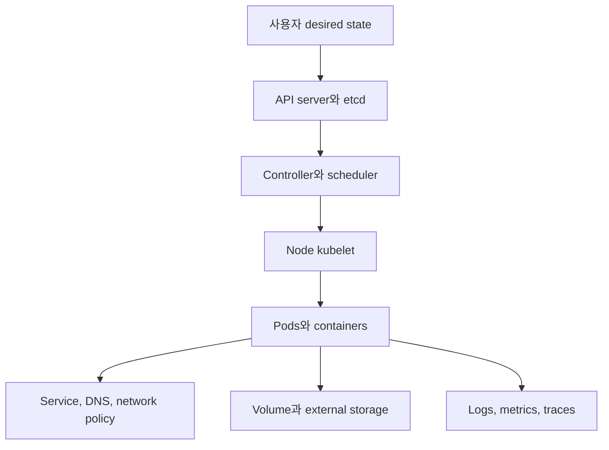
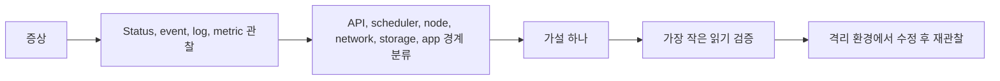

# 16. 종합 문제와 용어집

[이 책 목차](README.md) · [이전: Version, API와 extension](15-versions-and-extensions.md)

이 장은 Kubernetes object 이름을 외우는 시험이 아니다. 원하는 상태, 실제 상태, 책임 경계, 실패 뒤 재시도를 연결해 판단하는 연습이다. 먼저 문제를 풀고 바로 아래 해설에서 빠진 계층을 확인한다.

## 1. 전체 지도

## 2. 종합 문제 12개와 해설

### 문제 1 — Controller 선택

Web API replica 4개를 rolling update하고 Pod 이름은 영구적일 필요가 없다. 무엇을 쓰는가?

**해설:** Deployment를 쓴다. Deployment가 ReplicaSet revision과 Pod 수를 관리한다. 직접 Pod나 ReplicaSet을 운영하면 rollout 추상화가 부족하다.

### 문제 2 — Stateful workload

Broker 세 개가 각각 안정적인 ordinal과 별도 PVC를 요구한다. StatefulSet만 쓰면 복제가 안전한가?

**해설:** StatefulSet이 적합하지만 replication, quorum, backup은 broker 또는 operator가 구현해야 한다. PVC도 backup 자체가 아니다.

### 문제 3 — Service 장애

Service DNS는 해석되지만 connection이 거부된다. 확인 순서를 적어라.

**해설:** Service selector와 port→Pod label→readiness→EndpointSlice→container listen port→NetworkPolicy 순서로 본다. DNS 성공은 ready backend 존재를 보장하지 않는다.

### 문제 4 — CPU 계산

Allocatable 8 CPU node에 request 합 6500m가 있다. 새 Pod request가 2 CPU면 fit하는가?

**해설:** `6500m + 2000m = 8500m`이므로 fit하지 않는다. 순간 실제 사용이 낮아도 scheduler는 request를 기준으로 판단한다.

### 문제 5 — Memory 실패

Pod phase는 Running인데 container restart가 늘고 last reason이 OOMKilled다. 무엇을 구분하는가?

**해설:** Application heap, native/off-heap, sidecar 사용과 container memory limit을 본다. Running은 Ready나 무재시작을 뜻하지 않는다.

### 문제 6 — Probe

Database가 5초 느려질 때마다 API liveness가 실패해 모든 replica가 재시작된다. 어떻게 고치는가?

**해설:** Liveness를 process 자체의 복구 불능 상태에 좁힌다. Dependency 장애는 readiness와 application retry로 다루고 startup probe로 긴 초기화를 분리한다.

### 문제 7 — Storage

PVC reclaim policy가 Retain이다. Backup 요구를 충족하는가?

**해설:** 아니다. Backing volume 하나를 남길 뿐 독립 failure domain의 복사, consistency, retention, restore 검증이 없다.

### 문제 8 — Secret

Secret `data`가 base64이므로 Git에 commit해도 안전하다는 주장에 답하라.

**해설:** Base64는 암호화가 아니다. 실제 값을 Git에 넣지 말고 RBAC, TLS, at-rest encryption, rotation과 external secret workflow를 사용한다.

### 문제 9 — RBAC

Spark driver가 executor Pod를 만들지 못한다. 빠른 해결로 cluster-admin을 줘도 되는가?

**해설:** 전용 namespace의 ServiceAccount와 최소 Role을 사용한다. `kubectl auth can-i`와 audit로 필요한 resource·verb를 확인한다.

### 문제 10 — Rollback

Deployment image를 undo하면 database migration도 자동 복구되는가?

**해설:** 아니다. Pod template revision만 돌아간다. Expand/contract migration, backup·restore와 data repair를 별도로 설계한다.

### 문제 11 — Spark streaming

Driver Pod가 재시작되고 durable checkpoint를 읽었다. Sink exactly-once가 증명되었는가?

**해설:** 아니다. Source offset과 sink commit/idempotency, 실패 구간을 함께 검증해야 한다. Pod 재시작은 transaction protocol이 아니다.

### 문제 12 — Version upgrade

CRD가 새 API server에서 저장되므로 operator도 호환된다고 결론 내려도 되는가?

**해설:** 아니다. CRD schema, conversion webhook, controller binary, RBAC, dependent API 제거와 data migration을 모두 확인한다.

## 3. 용어집 45개

| 용어 | 뜻 |
| --- | --- |
| Pod | Scheduler가 한 node에 배치하는 최소 실행 단위 |
| Node | kubelet과 runtime이 Pod를 실행하는 machine |
| Cluster | Control plane과 worker node의 관리 범위 |
| Control plane | API와 cluster desired state 결정을 관리하는 component 집합 |
| kube-apiserver | Kubernetes API의 인증·인가·admission·저장 입구 |
| etcd | API state를 보관하는 consistent key-value store |
| Scheduler | 미배치 Pod에 적합한 node를 선택하는 component |
| Controller | Desired와 actual state 차이를 반복 조정하는 process |
| Reconciliation | 관찰·비교·행동·재관찰을 반복하는 조정 과정 |
| kubelet | Node에서 배정된 Pod 실행과 상태 보고를 담당하는 agent |
| Container runtime | Image pull과 container lifecycle을 수행하는 software |
| OCI | Image·runtime·distribution 공통 specification |
| CRI | kubelet과 container runtime 사이 interface |
| CNI | Pod network 연결을 구성하는 interface·plugin 생태계 |
| CSI | Kubernetes와 storage driver 사이 interface |
| Namespace | Namespaced API object의 이름·정책 범위 |
| Label | Object 선택과 grouping에 쓰는 key/value metadata |
| Selector | Label 조건으로 object 집합을 고르는 표현 |
| Annotation | 선택보다 부가 정보를 위한 metadata |
| Deployment | Stateless replica와 rolling update를 관리하는 controller |
| ReplicaSet | 같은 template의 Pod 수를 맞추는 controller |
| StatefulSet | Stable ordinal·Pod별 storage가 필요한 workload controller |
| DaemonSet | 선택된 node마다 Pod를 유지하는 controller |
| Job | 성공 완료를 목표로 유한 작업을 실행하는 controller |
| CronJob | Schedule마다 Job을 만드는 controller |
| Service | 변하는 backend Pod에 안정적인 network endpoint를 제공하는 API |
| EndpointSlice | Service backend 주소와 condition을 나눈 object |
| Ingress | HTTP(S) route를 선언하는 frozen API |
| Gateway API | Infrastructure와 route 역할을 나눈 traffic API |
| NetworkPolicy | Pod ingress·egress 허용 범위를 선언하는 API |
| PV | Cluster가 제공하는 persistent storage resource 표현 |
| PVC | Namespace 사용자의 storage 요청 object |
| StorageClass | Dynamic provisioning과 storage class 정책 정의 |
| ConfigMap | 민감하지 않은 설정 key/file object |
| Secret | 민감 값을 전달하는 API object; base64는 암호화 아님 |
| Request | Scheduler 배치와 resource reservation 기준 |
| Limit | Container가 사용할 수 있는 자원 상한과 관련된 값 |
| Allocatable | Node capacity에서 system 예약 등을 뺀 배치 가능 자원 |
| QoS | Resource 설정에 따른 Pod service class |
| Probe | Startup, readiness, liveness 상태 검사 |
| PDB | 자발적 disruption에서 healthy Pod 감소를 제한하는 budget |
| HPA | Metric을 보고 replica 수를 조정하는 autoscaler |
| CRD | Kubernetes API에 custom resource schema를 추가하는 정의 |
| Operator | Application 운영 지식을 controller로 구현하는 pattern |
| GitOps | Git desired state를 controller가 pull·reconcile하는 운영 방식 |

## 4. 공식 자료 색인

| 주제 | 공식 자료 |
| --- | --- |
| 기본 개념·component | [Concepts](https://kubernetes.io/docs/concepts/), [Components](https://kubernetes.io/docs/concepts/overview/components/) |
| Pod·workload | [Pods](https://kubernetes.io/docs/concepts/workloads/pods/), [Workloads](https://kubernetes.io/docs/concepts/workloads/controllers/) |
| Network | [Services](https://kubernetes.io/docs/concepts/services-networking/service/), [NetworkPolicy](https://kubernetes.io/docs/concepts/services-networking/network-policies/) |
| Storage | [Persistent Volumes](https://kubernetes.io/docs/concepts/storage/persistent-volumes/), [Volumes](https://kubernetes.io/docs/concepts/storage/volumes/) |
| Config·Secret | [ConfigMaps](https://kubernetes.io/docs/concepts/configuration/configmap/), [Secrets](https://kubernetes.io/docs/concepts/configuration/secret/) |
| Resource·scheduler | [Resource Management](https://kubernetes.io/docs/concepts/configuration/manage-resources-containers/), [Scheduling](https://kubernetes.io/docs/concepts/scheduling-eviction/) |
| 보안 | [RBAC](https://kubernetes.io/docs/reference/access-authn-authz/rbac/), [Pod Security Standards](https://kubernetes.io/docs/concepts/security/pod-security-standards/) |
| API·version | [API Concepts](https://kubernetes.io/docs/reference/using-api/api-concepts/), [Version Skew](https://kubernetes.io/releases/version-skew-policy/) |
| Helm·Kustomize | [Helm docs](https://helm.sh/docs/), [Kustomize task](https://kubernetes.io/docs/tasks/manage-kubernetes-objects/kustomization/) |
| Spark | [Spark on Kubernetes 4.0.4](https://spark.apache.org/docs/4.0.4/running-on-kubernetes.html) |

이제 object 이름보다 경계를 먼저 묻는다. 누가 desired state를 썼는지, 어느 controller가 조정하는지, data와 side effect를 누가 책임지는지 설명할 수 있으면 실제 cluster 문서를 읽을 기반이 갖춰진다.
