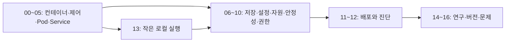

# 처음부터 배우는 Kubernetes

**서버가 여러 대이고 프로그램이 계속 바뀌거나 실패할 때, 원하는 실행 상태를 어떻게 유지하는가?** 이 책은 프로그램·프로세스·컨테이너부터 시작해서 Pod·Deployment·Service·저장소·자원·권한·관측으로 연결한다. Kubernetes를 처음 보는 독자도 YAML의 각 줄이 무엇을 요청하고 어떤 구성요소가 처리하는지 따라갈 수 있게 구성했다.

자료 확인 기준일은 **2026-10-09**다. 최신 지원 버전과 기능의 stable/beta/alpha 상태는 [15장](15-versions-and-extensions.md)에서 구분한다. 로컬 실습의 준비 도구·버전·실행 여부는 [13장](13-local-labs.md)에 따로 명시한다. 문서의 예제는 현재 연구실 클러스터에 적용한 운영 설정이 아니다.

## 연구에서 Spark와 어떻게 연결되는가

Spark는 입력과 계산을 stage·task로 계획한다. Kubernetes는 Spark driver·executor 같은 프로그램을 **어느 노드에서 어떤 자원·네트워크·권한·저장 조건으로 실행할지** 관리한다. Spark의 병목·실패를 설명할 때 CPU throttling, container OOM, Pod 배치, 저장소 접근, driver identity가 중요한 조건이 될 수 있다.

Kubernetes를 사용한다는 사실만으로 SQL 결과·Iceberg 커밋·업무 중복·DB 복구가 자동 보장되는 것은 아니다. 계산·테이블·컨테이너·클러스터의 보장 경계를 나누어 공부한다. 구체적인 연결은 [14장](14-research-spark-platform.md)에 있다.

## 한 권의 목차

| 장 | 출발 질문 | 배우는 내용 |
| --- | --- | --- |
| [00. Kubernetes가 필요한 이유](00-why-kubernetes.md) | 프로그램을 여러 서버에 계속 띄우면 무엇이 어려울까? | 컨테이너·클러스터·원하는 상태·선언형 관리 |
| [01. 컨테이너와 이미지](01-containers-and-images.md) | 이미지와 실행 중인 컨테이너는 어떻게 다를까? | OCI·registry·tag/digest·runtime·Linux 격리 |
| [02. 아키텍처와 제어 루프](02-architecture-and-reconciliation.md) | YAML을 제출하면 누가 무엇을 실행할까? | API server·etcd·scheduler·controller·kubelet·reconciliation |
| [03. Pod와 Namespace](03-pods-and-namespaces.md) | Kubernetes가 배치하는 가장 작은 단위는 무엇일까? | Pod·container·IP·volume·namespace·labels·spec/status |
| [04. Workload 종류](04-workloads.md) | 항상 켜진 서버와 끝나는 작업을 어떻게 다룰까? | Deployment·ReplicaSet·StatefulSet·DaemonSet·Job·CronJob |
| [05. Service와 네트워크](05-networking-services.md) | Pod IP가 바뀌어도 어떻게 접속할까? | Service·DNS·EndpointSlice·CNI·Ingress·Gateway·NetworkPolicy |
| [06. 저장소](06-storage.md) | Pod가 사라져도 데이터를 남기려면? | Volume·PV·PVC·StorageClass·CSI·reclaim policy |
| [07. 설정과 Secret](07-config-secrets.md) | 설정·비밀번호·인증서를 어떻게 전달할까? | ConfigMap·Secret·env·mount·갱신·암호화 경계 |
| [08. 자원과 스케줄링](08-resources-scheduling.md) | CPU·RAM 숫자는 실제로 무엇을 약속할까? | requests·limits·QoS·throttling·OOM·affinity·taints |
| [09. 상태 검사와 배포](09-health-and-rollouts.md) | 느린 프로그램을 재시작하면 항상 해결될까? | startup/readiness/liveness·rollout·종료·PDB·HPA |
| [10. 보안과 RBAC](10-security-rbac.md) | 누가 어떤 API와 파일을 사용할 수 있을까? | 인증·인가·ServiceAccount·Role·Pod security·TLS |
| [11. Helm·Kustomize·GitOps](11-delivery-helm-gitops.md) | 같은 설정을 여러 환경에 어떻게 배포할까? | package·overlay·Git desired state·drift·승격·복구 |
| [12. 관측과 장애 진단](12-observability-troubleshooting.md) | Pending·CrashLoop·접속 실패를 어떻게 구분할까? | status·events·logs·metrics·node·network·storage 진단 |
| [13. 격리된 로컬 실습](13-local-labs.md) | 연구실 클러스터 없이 작은 앱을 실행할 수 있을까? | kind·context·namespace·Deployment·Service·rollout·정리 |
| [14. 연구용 Spark 플랫폼](14-research-spark-platform.md) | Spark·Iceberg 연구를 어떤 실행 환경에 놓을까? | driver/executor pods·권한·자원·데이터 경로·재현성 |
| [15. 버전과 확장](15-versions-and-extensions.md) | CRD·operator와 최신 기능을 어떻게 구별할까? | 지원 버전·skew·feature gate·HPA/VPA·확장 API |
| [16. 문제·해설·용어사전](16-exercises-and-glossary.md) | 객체 이름을 외운 것과 동작을 이해한 것을 어떻게 나눌까? | 계산 문제·장애 반례·설계 과제·공식 자료 지도 |

## 읽는 순서

처음이라면 **00 → 01 → 02 → 03 → 04 → 05**를 읽는다. 프로그램이 Pod로 실행되고 Service로 연결되는 한 경로를 먼저 그린다. 그다음 **13장**의 작은 로컬 앱으로 상태를 관찰한다.

저장·설정·자원은 06~08, 실행 안정성과 권한은 09~10, 지속적인 배포와 진단은 11~12로 이어진다. Spark 연구는 14와 [Spark 교재](../apache-spark/README.md), 테이블 저장은 [Iceberg 교재](../apache-iceberg/README.md)로 연결한다.

## 그림·YAML·실습을 읽는 법

YAML 예제는 Kubernetes API에 원하는 상태를 전달하는 manifest다. 파일을 쓰는 것과 클러스터에 적용하는 것은 다른 작업이다. `kubectl apply`를 실행하기 전 선택한 context와 namespace를 확인하고, 이 책의 쓰기 예제는 13장의 격리된 실습 클러스터에서 사용한다.

단어가 처음 나오면 한국어 뜻과 실제 역할을 함께 설명한다. 그림의 화살표는 API 요청·데이터 이동·제어 관계 중 무엇인지 본문에서 구분한다. [SVG 그림 목록](assets/README.md)에서 크게 볼 수 있다. 예상 Pod 이름·IP·노드 이름·시각은 실제 실행에서 달라진다.

모든 예시는 교육용이며 특정 연구실·클라우드의 현행 보안 정책이나 배포 상태를 주장하지 않는다. 운영에서 사용할 때는 저장·권한·복구·지원 버전 등 조건을 실제 구성에 맞춰 정한다.

## 기존 심화 자료와 연결

- [기존 Kubernetes 운영 목차](../../kubernetes/README.md): 운영 분야별 자료.
- [네트워크 기초 교재](../../kubernetes/networking/networking-foundations/README.md): IP·DNS·패킷·Linux 경로의 기초.
- [데이터 시스템 교재](../../kubernetes/storage/data-systems-foundations/README.md): 파일·장치·객체 저장·복구.
- [Linux 커널 교재](../../linux/learning/linux-kernel/README.md): 프로세스·namespace·cgroup·권한의 아래 계층.
- [Spark 교재](../apache-spark/README.md): 분산 계산의 계획과 실행.

[통합 learning 목차](../README.md) · [첫 장 시작](00-why-kubernetes.md)
