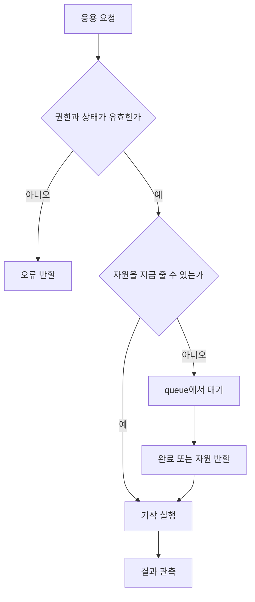

# 00. 운영체제가 하는 일

[이 책 목차](README.md) · [다음](01-processes-threads-syscalls.md)

## 문제에서 시작하기

CPU 하나와 RAM, SSD만 있는 컴퓨터를 생각하자.
프로그램 A와 B가 동시에 CPU를 쓰려 한다.
둘 다 RAM 주소 1000에 자기 데이터를 놓으려 한다.
둘 다 SSD의 같은 block을 갱신하려 한다.
규칙이 없으면 빠른 프로그램이 자원을 독점하거나 서로의 상태를 깨뜨린다.

운영체제는 네 가지 일을 함께 한다.

1. 자원을 쓸 수 있는 이름과 인터페이스를 만든다.
2. 여러 요청 중 누가 언제 쓸지 정책을 정한다.
3. 잘못된 접근이 다른 작업으로 번지지 않게 보호한다.
4. 전원 장애와 장치 완료처럼 시간차가 큰 사건을 연결한다.


## 자원과 추상화

자원은 CPU core, RAM byte, device queue, storage block처럼 실제로 제한된 대상이다.
추상화는 자원을 다루는 안정된 관점이다.

| 실제 자원 | 대표 추상화 | 얻는 효과 |
|---|---|---|
| CPU | process/thread | 각 프로그램이 자기 실행 흐름을 가진 것처럼 보임 |
| RAM | address space/page | 같은 주소를 프로세스마다 독립적으로 사용 |
| 저장 block | file/directory | 이름과 byte stream으로 접근 |
| NIC/NVMe | fd/socket/request | 장치별 register 대신 공통 API 사용 |

추상화는 자원을 새로 만들지 않는다.
가상 CPU가 많아 보여도 물리 CPU 시간은 나누어 쓴다.
큰 가상 주소 공간이 보여도 실제 data는 RAM이나 storage 어딘가에 있어야 한다.

## 정책과 기작

**정책(policy)**은 무엇을 선택할지 답한다.
**기작(mechanism)**은 선택을 어떻게 실행할지 답한다.

```text
정책: 다음에는 B를 2ms 실행하자.
기작: timer를 설정하고 B의 register를 복원한다.

정책: 이 page를 RAM에서 내보내자.
기작: page table을 바꾸고 필요하면 storage에 기록한다.
```

정책을 바꿔도 context switch 기작은 재사용할 수 있다.
기작이 제공되지 않으면 좋은 정책도 실행할 수 없다.

## 작은 자원 계산

CPU 하나에서 A가 6ms, B가 4ms의 계산을 원한다고 하자.
동시에 10ms 동안 실행할 수는 없다.
선점 없이 A부터 실행하면 B의 첫 실행은 6ms 뒤다.
2ms씩 번갈아 실행하면 B는 2ms 뒤 첫 CPU를 얻는다.
총 CPU 일 10ms는 사라지지 않는다.
정책은 응답 시간과 공정성을 바꾼다.

RAM 8GiB에 process 네 개가 각각 3GiB의 실제 상주 data를 요구하면 합은 12GiB다.
주소 공간을 가상화했다고 4GiB가 생기지 않는다.
OS는 일부를 회수하거나 swap하거나 allocation을 실패시켜야 한다.

## 누가 언제 일하는가

| 시점 | 주체 | 하는 일 |
|---:|---|---|
| t0 | application | API로 자원 요청 |
| t1 | CPU | syscall/exception/interrupt로 kernel 진입 |
| t2 | kernel | 권한과 상태 검증 |
| t3 | policy | 지금 실행·대기·거절 중 하나를 선택 |
| t4 | mechanism | page table, queue, timer, driver를 조작 |
| t5 | hardware | instruction, DMA, storage 작업 수행 |
| t6 | kernel | 완료를 기록하고 waiter를 깨움 |
| t7 | application | 결과 또는 오류를 받음 |



## 세 가지 불변조건

첫째, 한 자원을 동시에 쓸 때도 상태가 정의된 규칙을 따라야 한다.
둘째, 권한 없는 주체가 다른 보호 영역을 임의로 바꾸면 안 된다.
셋째, 완료라고 말하는 계층은 무엇이 완료됐는지 정확히 정의해야 한다.

이 불변조건은 특정 OS 명령이 아니다.
모든 구현이 다른 방식으로 지켜야 하는 설계 질문이다.

## 반례와 경계

작은 embedded 장치는 process 격리 없이 한 프로그램만 돌 수 있다.
그래도 interrupt, device timing, memory allocation 규칙은 필요할 수 있다.
unikernel은 application과 OS 경계를 합칠 수 있다.
경계가 합쳐져도 CPU, memory, I/O의 물리 제약은 사라지지 않는다.

Linux kernel은 운영체제 전체와 같은 말이 아니다.
배포판에는 kernel 외에도 libc, shell, service manager, 도구가 있다.
이 책의 모형을 Linux의 현재 구현 세부와 동일시하지 않는다.

## 확인 문제

## 같은 장치에 두 요청이 도착한 작은 사례

SSD queue가 한 번에 한 요청만 처리하고, A의 read는 3 tick, B의 read는 1 tick 걸린다고 하자.
A는 t=0, B는 t=1에 요청한다.

| 시점 | A | B | SSD | kernel이 유지할 상태 |
|---:|---|---|---|---|
| 0 | running→blocked | ready | A 시작 | A의 buffer와 completion 대상 |
| 1 | blocked | running→blocked | A 처리 중 | B를 device queue 뒤에 연결 |
| 3 | ready | blocked | A 완료, B 시작 | A 결과와 B 요청을 혼동하지 않음 |
| 4 | ready/running 후보 | ready | B 완료 | 두 waiter를 각각 깨움 |

두 application은 모두 `read()`를 호출했지만 완료 순서는 queue 정책과 device 상태가 정한다.
kernel은 “요청 두 개”만 세면 안 된다.
각 요청의 owner, buffer, offset, 오류, 완료 대상을 연결해야 한다.

만약 completion을 잘못 A와 B에 바꾸어 전달하면 protection과 correctness가 함께 깨진다.
추상화가 필요한 이유는 API 이름을 예쁘게 만드는 데 있지 않다.
비동기 hardware 사건을 원래 요청과 정확히 연결하는 불변조건을 제공해야 한다.

반례로 SSD가 여러 hardware queue와 병렬 channel을 가지면 B가 먼저 끝날 수 있다.
그 경우에도 요청별 identity와 완료 연결은 유지되어야 한다.
“먼저 제출한 요청이 항상 먼저 완료한다”는 규칙은 API가 보장할 때만 가정한다.

1. 가상화가 물리 자원을 늘린다고 말할 수 없는 이유는?
2. scheduler policy와 context-switch mechanism을 나누어 설명하라.
3. `write()`의 return과 storage 영속화가 왜 다른가?

## 해설

1. 가상화는 이름과 multiplexing을 제공하지만 실제 CPU 시간과 RAM byte 합계를 만들지 않는다.
2. 정책은 다음 실행 주체를 고르고, 기작은 register 저장·복원과 timer 설정을 수행한다.
3. kernel이 byte를 받아들인 시점과 장치가 crash 뒤에도 남도록 기록한 시점이 다르기 때문이다.

## 근거

- [OSTEP 공식 공개 목차와 장](https://pages.cs.wisc.edu/~remzi/OSTEP/)
- [MIT xv6 book 자료](https://pdos.csail.mit.edu/6.S081/)
