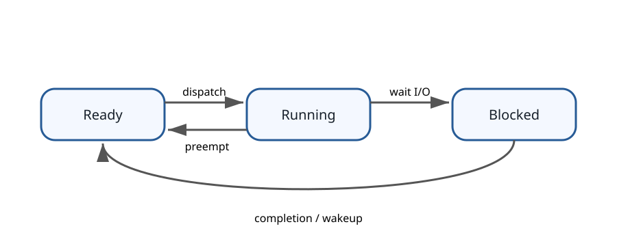
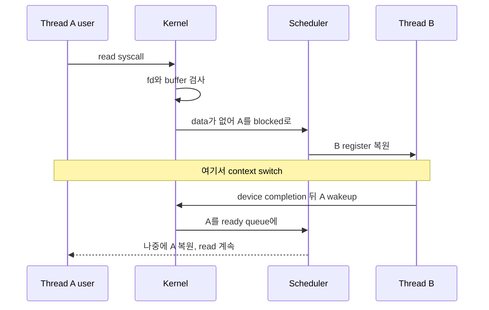

# 01. 프로세스·스레드·시스템 호출

[이 책 목차](README.md) · [이전](00-what-an-os-does.md) · [다음](02-cpu-scheduling.md)

## 프로그램과 프로세스

프로그램은 저장장치에 있는 instruction과 data의 정적 묶음이다.
프로세스는 그 프로그램을 실행하는 현재 상태다.
현재 register, address space, 열린 file, 권한, signal 상태가 포함된다.

같은 프로그램을 두 번 실행하면 code byte는 같을 수 있다.
하지만 PID, register, stack, 열린 fd는 별개다.

## 스레드와 주소 공간

한 프로세스의 여러 thread는 보통 다음을 공유한다.

- code와 global data
- heap과 memory mapping
- 열린 file을 가리키는 process 수준 table

각 thread는 보통 다음을 따로 가진다.

- program counter와 일반 register
- stack
- scheduling state
- thread-local storage

`thread = address space`가 아니다.
여러 thread가 주소 공간 하나를 공유할 수 있다.
stack도 주소 공간 안에 있지만 thread마다 다른 구간을 사용한다.

| 객체 | 공유 여부 | 잘못 공유하면 |
|---|---|---|
| global counter | 공유 | lost update 가능 |
| heap queue | 공유 | lock 없는 구조 손상 가능 |
| thread stack | thread별 | 다른 thread가 임의 사용하면 frame 손상 |
| file offset | fd 복제 방식에 따라 공유 가능 | 예상 밖 위치에서 read 가능 |

## task라는 말

많은 OS 문서에서 task는 scheduler가 실행 단위로 다루는 객체를 넓게 뜻한다.
Linux 구현의 `task_struct`와 모든 OS의 thread 정의를 같은 것으로 외우지 않는다.
공통 모형에서는 “CPU에 올릴 수 있는 실행 흐름”이라고 읽는다.

## syscall, exception, interrupt

system call은 user program이 의도적으로 kernel service를 요청하는 진입이다.
exception은 현재 instruction 때문에 CPU가 발견한 사건이다.
interrupt는 timer나 device처럼 현재 instruction 밖에서 온 알림이다.

| 사건 | 원인 | 현재 instruction과 관계 |
|---|---|---|
| syscall | 프로그램 요청 | 동기 |
| divide fault | instruction 실행 | 동기 |
| page fault | memory access | 동기 |
| timer interrupt | timer | 비동기 |
| device completion | NIC/NVMe | 비동기 |

## context switch는 별도 사건

user mode에서 kernel mode로 들어간다고 실행 주체가 반드시 바뀌지 않는다.
같은 thread가 syscall을 처리하고 바로 돌아올 수 있다.
context switch는 CPU에 올라간 task 자체가 바뀌는 일이다.

## 작은 상태 추적

A가 `read(pipe)`를 호출했지만 pipe가 비어 있다.

| 순서 | A 상태 | B 상태 | kernel 작업 |
|---:|---|---|---|
| 1 | running | ready | A syscall entry |
| 2 | blocked | ready | A를 wait queue에 등록 |
| 3 | blocked | running | B로 context switch |
| 4 | blocked | running | B가 pipe에 write |
| 5 | ready | running | A wakeup |
| 6 | running | ready | scheduler가 A 선택 |

syscall은 1에서 시작했다.
context switch는 3에서 일어났다.
wakeup은 5에서 A를 즉시 실행시킨다는 뜻이 아니다.
ready가 되었을 뿐 CPU 선택은 scheduler가 한다.

## 생성과 종료

새 process 생성은 address space, identity, resource reference를 준비한다.
Unix 계열의 `fork`와 `exec` 조합은 하나의 설계다.
다른 OS는 spawn API로 비슷한 결과를 낼 수 있다.

종료할 때도 바로 모든 흔적이 사라진다고 단정하지 않는다.
부모가 exit status를 수집해야 하거나 kernel reference가 남을 수 있다.

## 불변조건

- 실행 재개 전에 register와 stack이 해당 thread의 상태와 맞아야 한다.
- user pointer는 kernel이 권한과 mapping을 검증해야 한다.
- blocked task는 완료 조건 없이 runnable로 간주하면 안 된다.
- resource reference는 사용 중 해제되지 않아야 한다.

## 반례

한 프로세스 안의 thread도 서로 다른 CPU에서 동시에 실행될 수 있다.
프로세스가 다르더라도 shared memory를 명시적으로 공유할 수 있다.
syscall이 짧아도 timer interrupt가 중간에 들어올 수 있다.
interrupt handler가 실행됐다고 반드시 user task가 바뀌는 것은 아니다.

## 확인 문제

## interrupt 뒤에는 어디로 돌아가는가

Thread A가 user mode에서 `sum += array[i]`를 실행하던 중 timer interrupt가 왔다고 하자.
CPU는 완료한 instruction 다음의 재개 위치와 register를 저장한다.
kernel interrupt handler가 timer를 확인한다.

| 순서 | CPU mode | 실행 주체 | 재개 후보 |
|---:|---|---|---|
| 1 | user | A | 다음 user instruction |
| 2 | kernel | interrupt handler | 저장된 A 위치 |
| 3 | kernel | scheduler | A 계속 또는 B 선택 |
| 4a | user | A | 저장한 A 위치로 복귀 |
| 4b | user | B | B의 저장된 위치로 복귀 |

interrupt 자체는 “B로 바꿔라”라는 명령이 아니다.
handler 뒤 scheduler가 A를 계속 실행할 수도 있다.
B를 선택하면 그때 context switch가 일어난다.

page fault에서는 faulting instruction을 다시 시도해야 할 수 있다.
syscall return에서는 syscall 다음 instruction으로 돌아간다.
정확한 재개 위치는 trap 원인과 architecture 계약에 따라 다르다.

반례로 non-maskable interrupt나 치명적 exception은 원래 흐름으로 복귀하지 않을 수 있다.
따라서 “kernel에 들어가면 항상 다음 instruction으로 돌아온다”는 일반화는 틀리다.

1. thread 두 개가 공유하는 것과 분리되는 것을 각각 두 개 쓰라.
2. syscall과 context switch가 같은 말이 아닌 이유는?
3. wakeup 직후 task가 반드시 실행되지 않는 이유는?

## 해설

1. code와 heap은 공유하고 register와 stack은 분리한다.
2. syscall은 privilege 경계 진입이고 context switch는 실행 task 교체다.
3. wakeup은 ready queue 진입이며 scheduler가 CPU 배치를 결정한다.

## 근거

- [MIT 6.S081 traps 자료](https://pdos.csail.mit.edu/6.S081/)
- [OSTEP Processes](https://pages.cs.wisc.edu/~remzi/OSTEP/)
