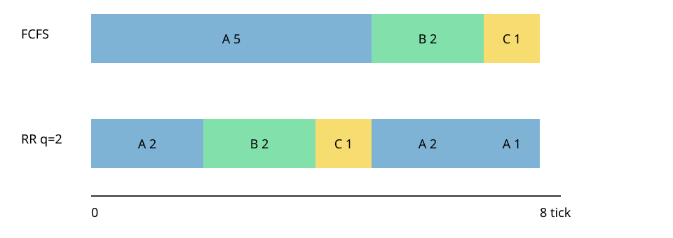

# 02. CPU 스케줄링

[이 책 목차](README.md) · [이전](01-processes-threads-syscalls.md) · [다음](03-synchronization.md)

## 목표가 먼저다

scheduler는 ready task 중 다음 실행 대상을 고른다.
좋은 정책은 workload와 목표에 따라 달라진다.

| 지표 | 계산 |
|---|---|
| turnaround | finish - arrival |
| response | first_run - arrival |
| waiting | turnaround - CPU burst 합 |
| throughput | 완료 job 수 / 시간 |

공정성, 평균 지연, tail latency, deadline은 서로 충돌할 수 있다.

## 입력

| Job | arrival | CPU burst |
|---|---:|---:|
| A | 0 | 5 |
| B | 1 | 2 |
| C | 2 | 1 |

## FCFS

먼저 온 순서로 비선점 실행하면 `A A A A A B B C`다.
A finish=5, B=7, C=8이다.
turnaround는 A=5, B=6, C=6이다.
평균은 `(5+6+6)/3 = 5.67` tick이다.
B와 C는 짧지만 긴 A 뒤에서 기다린다.
이를 convoy effect로 설명할 수 있다.

## SJF

모든 job이 t=0에 함께 도착하고 burst를 안다고 가정해 보자.
순서는 C(1), B(2), A(5)다.
turnaround는 1, 3, 8이고 평균은 4 tick이다.
짧은 일을 먼저 하면 평균 turnaround가 줄 수 있다.

그러나 실제 미래 burst는 모르는 경우가 많다.
계속 짧은 job이 오면 긴 job이 굶을 수 있다.
SJF 모형의 최적 성질은 가정 안에서만 성립한다.

## Round Robin

quantum 2의 결과는 `A A B B C A A A`다.
response는 A=0, B=1, C=2다.
FCFS에서 C의 response는 5였다.
RR은 짧은 응답을 줄 수 있다.

quantum이 너무 작으면 context-switch overhead가 커진다.
quantum 2ms, switch 0.1ms라면 매 quantum마다 전환한다고 단순화한 overhead 비율은 `0.1/(2+0.1) ≈ 4.8%`다.
quantum 20ms면 약 0.5%다.
큰 quantum은 interactive response를 늦출 수 있다.

```mermaid
gantt
    title RR quantum 2
    dateFormat X
    axisFormat %L
    section CPU
    A :0, 2
    B :2, 4
    C :4, 5
    A :5, 8
```

## MLFQ 모형

MLFQ는 여러 priority queue를 둔다.
새 job을 높은 queue에 넣는다.
quantum을 모두 쓰면 CPU-bound라고 추정해 낮춘다.
I/O로 자주 양보하는 job은 높은 응답성을 유지할 수 있다.
주기적 priority boost로 starvation을 줄인다.

| 시점 | A CPU-bound | B interactive | 선택 이유 |
|---:|---|---|---|
| 0 | high에서 시작 | 아직 없음 | A만 ready |
| 1 | quantum 소진, down | high 도착 | B가 높은 priority |
| 2 | low ready | I/O wait | A 실행 가능 |
| 3 | low 실행 | I/O 완료, high | B preempt 가능 |

MLFQ는 행동으로 미래를 추정하는 교육 모형이다.
규칙과 parameter에 따라 gaming과 starvation이 생길 수 있다.

## 현재 Linux와 구분

RR, SJF, MLFQ는 원리를 비교하는 모델이다.
현재 Linux 일반 task scheduler를 MLFQ라고 부르면 안 된다.
Linux의 EEVDF는 eligible virtual deadline을 사용하는 별도 정책과 구현이다.
실시간 class의 FIFO/RR도 일반 RR 교재 모형과 적용 범위가 다르다.

## multi-core의 추가 문제

ready queue 하나는 lock 경합을 만들 수 있다.
CPU별 queue는 확장성이 좋지만 load imbalance가 생긴다.
task migration은 균형을 돕지만 cache locality를 잃을 수 있다.
NUMA에서는 CPU 이동 뒤 memory가 먼 node에 남을 수 있다.

## 결과가 바뀌는 반례

I/O burst가 있으면 job은 CPU burst 중간에 blocked가 된다.
SJF의 “길이”가 전체 실행 시간인지 다음 CPU burst인지 구분해야 한다.
deadline job은 평균 turnaround보다 마감 준수가 중요하다.
energy-aware 환경은 성능 외 전력 목표도 본다.

## 모형 실행

[`examples/scheduler.py`](examples/scheduler.py)는 위 입력을 계산한다.
예상 FCFS timeline은 `A A A A A B B C`다.
예상 RR timeline은 `A A B B C A A A`다.
제공한 입력의 출력은 [로컬 모형 실습](12-local-model-labs.md)의 손 계산과 일치함을 확인했다. 다른 입력의 정확성이나 실제 Linux의 성능을 보장하는 실험은 아니다.

## 확인 문제

## blocked와 ready가 섞인 두 프로세스 시간표

A는 CPU 2 tick 뒤 I/O 3 tick, 다시 CPU 1 tick을 쓴다.
B는 t=0부터 CPU 4 tick을 원한다.
한 CPU에서 FCFS ready queue를 쓴다고 하자.

| tick 시작 | A 상태 | B 상태 | CPU에서 실행 |
|---:|---|---|---|
| 0 | ready | ready | A 첫 CPU burst |
| 1 | running | ready | A |
| 2 | blocked, I/O 시작 | ready | B |
| 3 | blocked | running | B |
| 4 | blocked | running | B |
| 5 | ready, I/O 완료 | running | B |
| 6 | ready | finished | A 마지막 burst |

A의 전체 elapsed time은 7 tick이지만 CPU burst 합은 3 tick이다.
waiting time을 단순히 elapsed-burst=4로 계산하면 I/O blocked 3 tick과 ready waiting 1 tick을 섞는다.
지표 정의에 blocked 시간을 포함하는지 먼저 정해야 한다.

반례로 preemptive priority에서 A가 t=5에 높은 priority로 깨어나면 B를 즉시 선점할 수 있다.
non-preemptive FCFS에서는 B burst가 끝날 때까지 기다린다.
같은 arrival와 burst라도 정책과 blocked 전이가 timeline을 바꾼다.

1. FCFS에서 C response는 얼마인가?
2. RR quantum이 작아질 때 생기는 trade-off는?
3. MLFQ를 Linux EEVDF와 같다고 하면 왜 틀리는가?

## 해설

1. arrival 2, first run 7이므로 5 tick이다.
2. response는 좋아질 수 있지만 switch overhead와 cache 손실이 늘 수 있다.
3. 목적을 설명하는 교재 모형과 현재 kernel의 구체 정책·자료구조가 다르다.

## 근거

- [OSTEP scheduling 자료](https://pages.cs.wisc.edu/~remzi/OSTEP/)
- [Linux scheduler 문서](https://docs.kernel.org/scheduler/)
