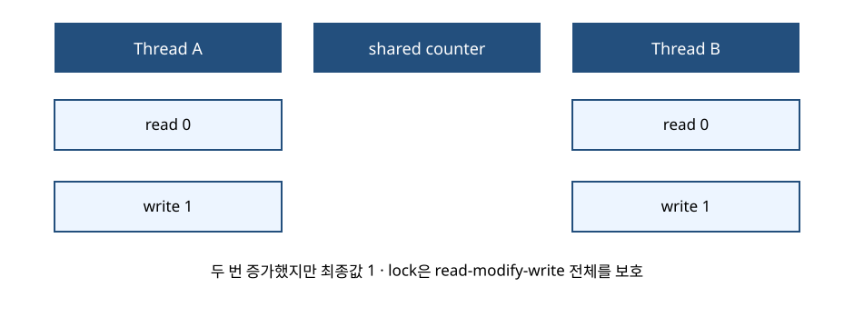
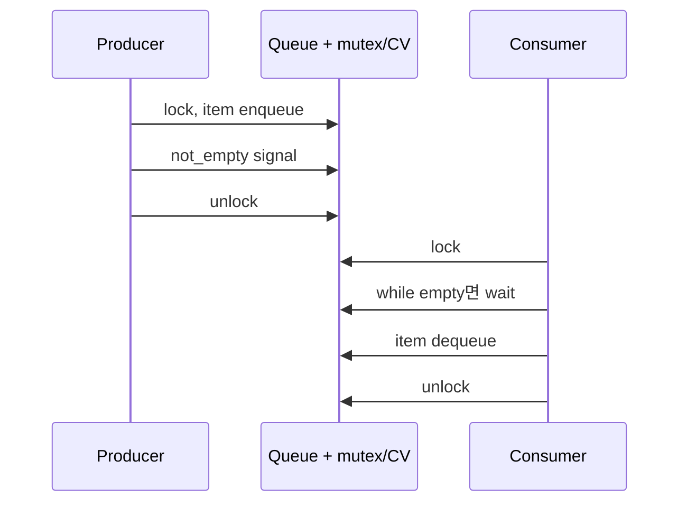

# 03. 동기화

[이 책 목차](README.md) · [이전](02-cpu-scheduling.md) · [다음](04-deadlocks.md)

## 공유 data에서 시작하기

두 thread가 `counter += 1`을 한 번씩 실행한다.
초기값은 0이다.
사람은 결과 2를 기대한다.
하지만 증가는 read, add, write로 나뉠 수 있다.



```text
A read 0
B read 0
A add 1, write 1
B add 1, write 1
결과 1
```

문제는 instruction 수가 아니라 공유 상태와 interleaving이다.
결과가 실행 순서에 따라 달라지는 오류를 race condition이라 한다.

## critical section과 불변조건

critical section은 공유 불변조건을 바꾸는 코드 구간이다.
counter 증가의 불변조건은 완료된 증가 수와 counter가 같다는 것이다.
mutex는 한 번에 한 thread만 그 구간에 들어가게 한다.



## producer-consumer

용량 2 queue에 producer가 P1, P2, P3를 넣고 consumer가 꺼낸다.

| 시점 | queue | producer | consumer |
|---:|---|---|---|
| 0 | [] | P1 준비 | wait 예정 |
| 1 | [P1] | signal not_empty | runnable |
| 2 | [P1,P2] | queue full | lock 대기 가능 |
| 3 | [P2] | P3 넣을 공간 생김 | P1 소비 |
| 4 | [P2,P3] | 진행 | 다음 item 가능 |

조건은 `queue not empty`와 `queue not full`이다.
mutex는 queue 구조를 보호한다.
condition variable은 조건 변화까지 sleep/wake를 연결한다.

## lost wakeup

잘못된 순서:

```text
consumer: empty 확인
producer: item 추가, wake
consumer: 이제 sleep
```

wake 시점에 waiter가 없으면 알림이 사라질 수 있다.
조건 확인과 wait 등록을 같은 lock protocol 안에서 원자적으로 연결해야 한다.

올바른 모형:

```text
lock
while queue is empty:
    wait(cv, lock)  # lock을 놓고 sleep, 깨어나 lock 재획득
item = dequeue
unlock
```

`if`가 아니라 `while`인 이유가 있다.
여러 consumer가 동시에 깨어날 수 있다.
먼저 lock을 얻은 consumer가 item을 가져갈 수 있다.
다음 consumer는 조건을 다시 확인해야 한다.

## atomic과 lock

atomic read-modify-write는 한 memory location의 작은 변화를 쪼개지 않게 한다.
여러 field의 관계를 자동으로 보호하지 않는다.

```text
불변조건: balance = credits - debits
credits만 atomic, debits만 atomic이어도
두 값을 함께 읽는 snapshot은 중간 상태를 볼 수 있다.
```

spinlock은 기다리며 CPU를 계속 쓴다.
mutex는 waiter를 sleep시킬 수 있다.
짧은 kernel critical section과 긴 user 작업에 같은 선택을 쓰지 않는다.

## semaphore

semaphore 값은 사용 가능한 permit 수를 나타내는 모형이다.
초기값 3이면 최대 세 작업이 동시에 resource를 쓸 수 있다.
mutex는 소유권과 상호 배제 의미가 중심이다.
binary semaphore를 모든 mutex와 같은 것으로 취급하면 ownership 차이를 놓친다.

## memory ordering

lock이 없으면 `data=42; ready=1`이 다른 CPU에 같은 순서로 보인다고 단정할 수 없다.
compiler와 CPU는 허용된 범위에서 접근을 재배치할 수 있다.
acquire/release는 data와 publication의 순서를 연결한다.
초보자는 임의 barrier보다 검증된 mutex, queue, atomic API를 우선한다.

## 주체와 시점

| 사건 | user thread | runtime/libc | kernel |
|---|---|---|---|
| uncontended mutex | atomic fast path | 구현 제공 | 보통 관여 없음 |
| contended mutex | wait 요청 | 상태 전환 | sleep/wake queue |
| condition signal | predicate 수정 | waiter 선택 도움 | 필요하면 wake |
| preemption | 중단될 수 있음 | 해당 없음 | scheduler 실행 |

## 반례

single-thread program에도 signal handler가 공유 상태를 건드리면 동시성 문제가 생길 수 있다.
thread가 많다고 항상 parallel인 것은 아니다.
CPU 하나에서도 preemption으로 race가 생긴다.
lock을 추가하면 data race는 줄지만 deadlock은 새로 생길 수 있다.

## 확인 문제

## lost update를 여섯 단계로 고정하기

공유 `balance=100`에 A와 B가 각각 10을 더한다.
고수준 문장 두 개는 같아 보여도 실제 interleaving은 다음과 같을 수 있다.

| 단계 | Thread A | Thread B | memory balance |
|---:|---|---|---:|
| 1 | 100을 register a에 load | 대기 | 100 |
| 2 | a=110 계산 | 100을 register b에 load | 100 |
| 3 | 대기 | b=110 계산 | 100 |
| 4 | 110 store | 대기 | 110 |
| 5 | 완료 | 110 store | 110 |
| 6 | 두 증가 완료라고 보고 | 완료 | 110 |

기대값은 120인데 실제값은 110이다.
각 load와 store 자체가 정상이어도 read-modify-write 전체가 원자적이지 않기 때문이다.

mutex는 1~4와 2~5가 겹치지 않게 critical section을 묶는다.
atomic fetch-add는 이 한 counter 갱신을 쪼개지지 않는 operation으로 제공할 수 있다.

반례로 A와 B가 서로 다른 balance를 갱신하면 이 lost update는 없다.
하지만 두 account 합계라는 더 큰 불변조건을 함께 바꾸면 다른 동기화가 필요할 수 있다.

1. lost update의 최소 interleaving을 쓰라.
2. condition wait에서 `while`이 필요한 이유는?
3. atomic counter가 여러 field 불변조건을 보호하지 못하는 이유는?

## 해설

1. 두 thread가 모두 옛 값을 읽고 각각 같은 새 값을 쓰면 한 update가 사라진다.
2. spurious wake와 waiter 경쟁 뒤 조건이 다시 false일 수 있다.
3. atomicity 범위가 한 연산·한 위치이고 field 사이 관계는 별도 protocol이 필요하다.

## 근거

- [OSTEP concurrency 자료](https://pages.cs.wisc.edu/~remzi/OSTEP/)
- [MIT xv6 locking 자료](https://pdos.csail.mit.edu/6.S081/)
