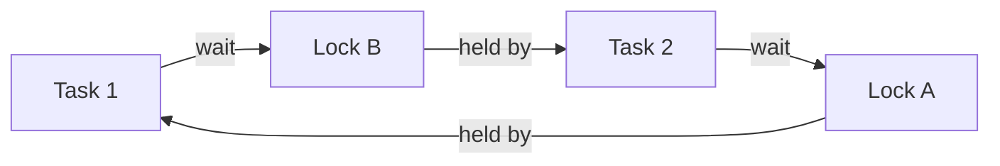
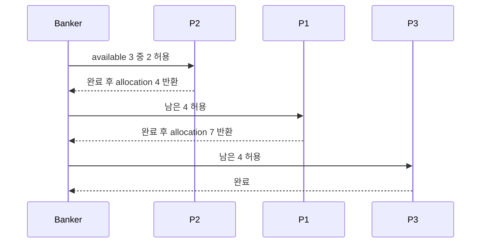

# 04. 교착상태

[이 책 목차](README.md) · [이전](03-synchronization.md) · [다음](05-address-spaces.md)

## 기다림의 고리

deadlock은 작업들이 서로가 가진 resource를 기다려 아무도 진행하지 못하는 상태다.
느리다는 뜻이 아니다.
시간을 더 줘도 외부 개입 없이는 상태가 바뀌지 않는다.

예:

```text
T1: lock A 획득 → lock B 대기
T2: lock B 획득 → lock A 대기
```

## 네 조건

고전 모형의 네 조건은 다음과 같다.

1. mutual exclusion: resource를 동시에 공유할 수 없다.
2. hold and wait: 가진 채 다른 resource를 기다린다.
3. no preemption: 강제로 빼앗기 어렵다.
4. circular wait: 기다림의 cycle이 있다.

모두 성립해야 이 모형의 deadlock이 가능하다.
조건 하나를 깨는 것이 예방 전략이다.



## resource-allocation graph

task에서 resource로 향하는 edge는 요청이다.
resource에서 task로 향하는 edge는 할당이다.
각 resource instance가 하나일 때 cycle은 deadlock을 뜻한다.
instance가 여러 개면 cycle만으로 확정할 수 없다.

## 예방

모든 code가 lock을 A 다음 B 순서로 잡게 하면 circular wait를 깰 수 있다.
필요한 lock을 한 번에 요청하면 hold-and-wait를 줄일 수 있다.
try-lock 실패 시 가진 것을 놓고 재시도할 수 있다.

각 방법에는 비용이 있다.
전역 lock 순서는 설계를 제약한다.
한꺼번에 예약하면 resource 이용률이 낮아진다.
재시도는 livelock과 starvation을 만들 수 있다.

## 회피와 safe state

deadlock avoidance는 현재 할당 뒤에도 모든 task가 끝날 수 있는 순서가 남는지 본다.
**safe state**는 그런 완료 순서가 하나 이상 있는 상태다.
**unsafe state**는 지금 deadlock이라는 뜻이 아니다.
미래 요청에 따라 deadlock으로 갈 수 있어 안전을 보장하지 못한다는 뜻이다.

## Banker's algorithm 작은 예

resource type은 X 하나이고 총 10개다.

| Process | 현재 할당 | 최대 요구 | 남은 요구 |
|---|---:|---:|---:|
| P1 | 3 | 7 | 4 |
| P2 | 2 | 4 | 2 |
| P3 | 2 | 6 | 4 |

현재 할당 합은 7이다.
available은 `10-7=3`이다.

P2의 남은 요구 2는 available 3 이하이다.
P2를 완료시킬 수 있다.
P2가 가진 2를 반환하면 available은 5다.
이제 P1의 남은 4를 줄 수 있다.
P1 완료 뒤 available은 8이다.
마지막 P3도 끝난다.
안전 순서 하나는 `P2 → P1 → P3`다.



## unsafe 계산

위 상태에서 P3에 3개를 먼저 더 준다고 하자.
available은 0이 된다.
P1은 4, P2는 2, P3는 1이 더 필요하다.
누구도 현재 available 0으로 끝낼 수 없다.
이 grant 뒤 상태는 unsafe다.

하지만 P3가 실제로 추가 1을 요청하지 않고 스스로 일부 resource를 반환할 수 있는 protocol이라면 결과가 달라질 수 있다.
Banker 모형은 최대 요구가 사전에 알려지고 resource가 반환된다는 가정에 의존한다.

## detection과 recovery

예방·회피를 하지 않으면 wait-for graph를 검사해 deadlock을 탐지할 수 있다.
복구는 task 중단, transaction rollback, resource 강제 회수 같은 비용을 낸다.
database는 victim transaction을 abort할 수 있다.
kernel lock을 임의로 빼앗는 것은 불변조건을 깨뜨릴 수 있다.

## livelock과 starvation

livelock은 상태가 계속 바뀌지만 유용한 진전이 없는 경우다.
두 task가 서로 양보만 반복할 수 있다.
starvation은 특정 task가 계속 선택되지 못하는 상태다.
deadlock cycle 없이도 생긴다.

## 주체와 시점

| 단계 | task | resource manager |
|---|---|---|
| declare | 최대 요구 표현 | model에 기록 |
| request | 추가 resource 요청 | safe 여부 계산 |
| grant | 실행 계속 | allocation 갱신 |
| wait | blocked | queue 관리 |
| release | 완료/중간 반환 | available 증가, waiter wake |

## 확인 문제

## cycle이 있어도 즉시 deadlock이 아닌 경우

resource R에 instance가 두 개 있고 T1이 하나, T2가 하나를 가진다.
T1과 T2가 각각 R 하나를 더 요청하면 graph에는 서로 기다리는 모양을 그릴 수 있다.
현재 available은 0이라 두 task 모두 진행하지 못한다.
이 상태는 실제 deadlock이다.

이제 R instance가 세 개였다고 바꾸자.
T1과 T2가 하나씩 가진 뒤 available은 1이다.
T1의 추가 요청을 주면 T1은 완료해 두 instance를 반환할 수 있다.
그 뒤 T2도 끝난다.

| 총 instance | 초기 available | 완료 순서 | 판정 |
|---:|---:|---|---|
| 2 | 0 | 없음 | deadlock |
| 3 | 1 | T1→T2 또는 T2→T1 | safe 가능 |

왜 결과가 다른가?
resource type마다 instance가 하나인 graph에서는 cycle이 결정적이다.
여러 instance에서는 cycle 밖의 available 수와 남은 요구를 함께 계산해야 한다.

반례로 T1의 최대 추가 요구가 2라면 available 1로 끝내지 못한다.
“instance가 하나 더 있다”만으로 safe를 단정하지 말고 remaining claim을 사용한다.

1. unsafe와 deadlocked의 차이는?
2. lock ordering은 네 조건 중 무엇을 깨는가?
3. 여러 instance가 있는 graph에서 cycle만으로 확정할 수 없는 이유는?

## 해설

1. unsafe는 안전 완료 순서를 보장하지 못하지만 아직 진행 가능한 요청이 있을 수 있다.
2. circular wait를 방지한다.
3. cycle 밖의 남은 instance가 task 하나를 끝내고 cycle을 풀 수 있기 때문이다.

## 근거

- [OSTEP concurrency bugs](https://pages.cs.wisc.edu/~remzi/OSTEP/)
