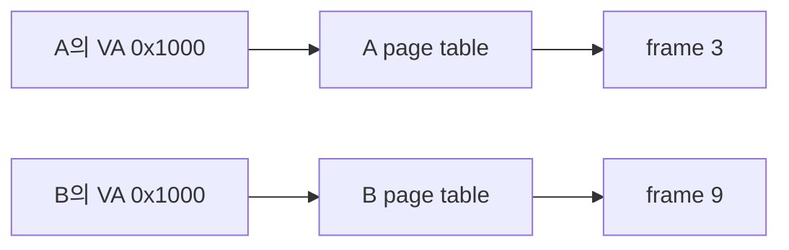

# 05. 주소 공간

[이 책 목차](README.md) · [이전](04-deadlocks.md) · [다음](06-paging-virtual-memory.md)

## 같은 주소, 다른 의미

프로세스 A와 B가 모두 주소 `0x1000`을 사용할 수 있다.
두 주소가 같은 RAM byte를 뜻할 필요는 없다.
각 process의 address space가 주소 해석의 context를 제공한다.

주소 공간은 process가 사용할 수 있는 logical/virtual address와 권한의 모형이다.
code, data, heap, mapping, stack이 놓인다.



## 왜 필요한가

relocation: 프로그램이 특정 physical address를 몰라도 된다.
protection: 다른 process memory를 임의 접근하지 못한다.
sharing: 필요한 page만 명시적으로 함께 매핑할 수 있다.
sparse allocation: 큰 address range를 예약하고 필요한 부분만 backing한다.

## logical address

CPU instruction의 load/store가 사용하는 주소를 logical 또는 virtual address라고 부른다.
MMU와 page table이 physical address로 바꾼다.
용어는 architecture 문맥에 따라 차이가 있으므로 이 책에서는 virtual과 logical을 같은 입문 모형으로 쓴다.

## layout 예

```text
높은 주소
┌─────────────────┐
│ thread stack    │ 아래로 성장하는 모형
├─────────────────┤
│ mmap 영역       │ file/shared mapping
├─────────────────┤
│ 빈 예약 영역    │ 아직 RAM이 없을 수 있음
├─────────────────┤
│ heap            │ 동적 allocation
├─────────────────┤
│ data / bss      │ global state
├─────────────────┤
│ code            │ instruction
└─────────────────┘
낮은 주소
```

실제 배치와 성장 방향은 ABI와 OS에 따라 다르다.
그림의 목적은 역할을 나누는 것이다.

## base-and-bounds 모형

가장 작은 동적 재배치 모형은 base와 bounds다.
logical 120, base 1000이면 physical은 1120이다.
bounds가 500이면 logical 0..499만 허용한다.
logical 600은 범위를 벗어나 fault다.

```text
if 0 <= logical < bounds:
    physical = base + logical
else:
    protection fault
```

간단하지만 process 영역을 연속 physical memory에 두어야 한다.
성장과 공유에 불편하고 external fragmentation이 생길 수 있다.

## segmentation

code, heap, stack을 서로 다른 segment로 나눈다.
각 segment에 base, limit, permission을 둔다.
논리 구조와 보호를 연결할 수 있다.
그러나 가변 크기 segment는 physical free space를 조각낸다.

## stack과 thread

thread마다 stack이 다르지만 같은 process address space 안에 있을 수 있다.
stack pointer register가 현재 top을 가리킨다.
function call은 return address, local variable, saved register를 frame에 둘 수 있다.

| Thread | stack range 모형 | shared heap |
|---|---|---|
| T1 | 0x7000..0x7fff | 0x2000..0x4fff |
| T2 | 0x6000..0x6fff | 같은 heap |

T1이 잘못된 pointer로 T2 stack을 쓰면 process 내부에서는 hardware permission으로 막히지 않을 수 있다.
thread 격리와 process 격리가 다른 이유다.

## 생성과 copy-on-write

process 생성 때 address space 전체를 즉시 copy하면 비싸다.
copy-on-write는 처음에는 page를 공유 read-only로 두고 write 시 복사한다.
write fault는 정상 기작이 될 수 있다.
fault라는 이름이 곧 application 오류를 뜻하지 않는다.

## ASLR과 guard

ASLR은 code, library, stack 등의 위치를 무작위화해 공격 예측을 어렵게 한다.
완전한 격리나 memory safety를 제공하지 않는다.
guard page는 stack 경계 같은 곳을 unmapped로 두어 넘침을 빨리 fault로 만든다.

## 주체와 시점

| 사건 | CPU/MMU | kernel | process |
|---|---|---|---|
| load | VA와 권한 검사 시작 | 보통 관여 없음 | instruction 실행 |
| mapping hit | PA 생성 | 없음 | data 받음 |
| mapping fault | exception | VMA와 권한 검사 | 잠시 중단 |
| legal demand | 재시도 | frame/mapping 준비 | 계속 실행 |
| illegal | fault 전달 | signal/termination 결정 | 오류 관측 |

## paging으로 넘어가는 이유

고정 크기 page는 연속 physical 영역 요구를 줄인다.
각 virtual page를 임의 frame에 둘 수 있다.
대가로 page table, TLB, internal fragmentation이 생긴다.
다음 장에서 숫자로 계산한다.

## 반례

kernel thread는 독립 user address space가 없을 수 있다.
shared library page는 여러 process가 physical frame을 공유할 수 있다.
같은 virtual address가 항상 같은 physical address라는 가정은 틀리다.
DMA device가 보는 주소 공간은 CPU process address space와 다를 수 있다.

## 확인 문제와 해설

## valid mapping과 permission fault 구분

page table에 다음 세 entry가 있다고 하자.

| VPN | present | permission | PFN |
|---:|---|---|---:|
| 0x10 | 1 | read+execute | 0x21 |
| 0x11 | 1 | read+write | 0x22 |
| 0x12 | 0 | 없음 | - |

instruction fetch가 VA `0x10A0`을 사용하면 execute permission이 있어 진행한다.
store가 같은 VA를 사용하면 mapping은 있지만 write permission이 없어 protection fault다.
load가 VA `0x11B0`을 사용하면 read permission이 있어 진행한다.
load가 VA `0x12C0`을 사용하면 non-present fault다.

non-present가 반드시 불법 주소는 아니다.
VMA 안의 demand-zero page라면 kernel이 frame을 준비하고 재시도할 수 있다.
VMA 밖이면 process에 오류를 전달한다.

반례로 execute-only mapping을 지원하는 architecture에서는 instruction fetch는 되지만 data read는 막힐 수 있다.
present bit 하나만 보고 access 가능 여부를 판단하면 안 된다.

1. A와 B의 VA가 같아도 충돌하지 않는 이유는 각 page table context가 다르기 때문이다.
2. thread stack은 분리되지만 같은 address space에 있어 pointer bug로 침범 가능하다.
3. base-and-bounds는 간단하지만 연속 physical allocation과 fragmentation 부담이 있다.

## 근거

- [OSTEP memory virtualization](https://pages.cs.wisc.edu/~remzi/OSTEP/)
- [MIT xv6 page tables](https://pdos.csail.mit.edu/6.S081/)
