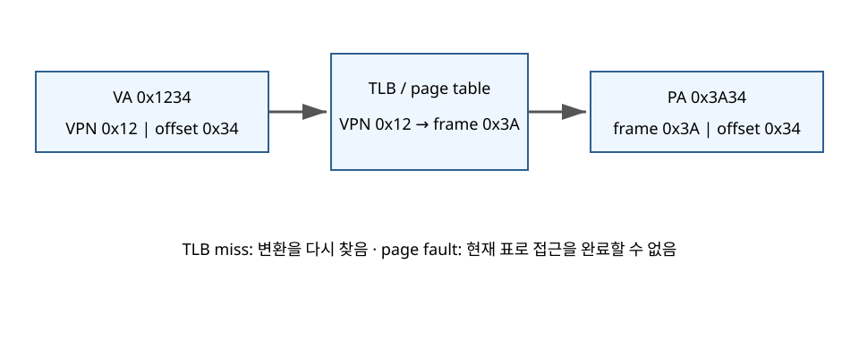
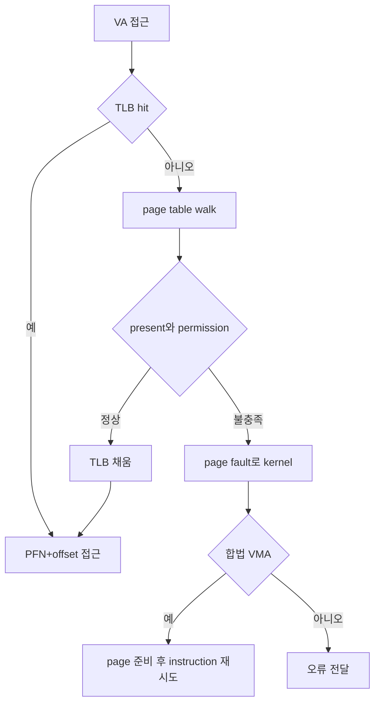

# 06. 페이징과 가상 메모리

[이 책 목차](README.md) · [이전](05-address-spaces.md) · [다음](07-allocation-and-reclaim.md)

## 고정 크기로 나누기

virtual address space를 page로 나눈다.
physical memory를 같은 크기의 frame으로 나눈다.
page table은 VPN을 PFN에 연결하고 permission/present 상태를 기록한다.



## 16-bit, 256-byte 계산

virtual address가 16-bit이면 주소 범위는 0..65535다.
page size 256B는 `2^8`이다.
따라서 offset은 아래 8-bit다.
VPN은 위 8-bit다.
virtual page 수는 `2^16 / 2^8 = 256`개다.

VA `0x2B7C`를 나누자.

```text
VPN    = 0x2B
offset = 0x7C
```

page table에서 VPN `0x2B → PFN 0x13`이라고 하자.
physical address는 frame base와 offset을 합친 `0x137C`다.

```text
PA = PFN × page_size + offset
   = 0x13 × 0x100 + 0x7C
   = 0x137C
```

physical memory가 64 frame이면 PFN은 6-bit로 충분하다.
offset 8-bit와 합쳐 physical address는 이 모형에서 14-bit다.

## TLB

TLB는 최근 VPN→PFN 변환을 CPU 가까이에 cache한다.
TLB hit이면 page table walk를 줄인다.
TLB miss는 변환 cache에 없다는 뜻이다.
page table entry가 valid하면 walk 뒤 계속 실행한다.

## page fault

page fault는 현재 mapping/permission으로 access를 끝낼 수 없다는 CPU exception이다.



TLB miss와 page fault를 같은 말로 쓰면 안 된다.
fault도 모두 오류가 아니다.
demand-zero, file mapping, copy-on-write는 정상 fault일 수 있다.

## 시간순서 표

| 순서 | CPU | kernel | storage |
|---:|---|---|---|
| 1 | TLB lookup miss | 없음 | 없음 |
| 2 | page table walk | 없음 | 없음 |
| 3 | non-present 발견, exception | fault handler 시작 | 없음 |
| 4 | legal mapping 확인 | free frame 선택 | 필요 시 read 제출 |
| 5 | instruction 중단 | blocked 가능 | page data 반환 |
| 6 | PTE/TLB 준비 | task runnable | 완료 |
| 7 | instruction 재시도 | user 복귀 | 없음 |

## multi-level page table

256개 entry 정도면 linear table도 작다.
64-bit sparse address space는 모든 entry를 미리 만들면 너무 크다.
주소 bit를 여러 index로 나누고 필요한 하위 table만 만든다.

각 level read가 cache miss면 walk 비용이 커진다.
page-walk cache와 TLB가 이를 줄인다.
정확한 level 수는 architecture와 page size에 따라 다르다.

## internal fragmentation

process가 마지막 page에서 1B만 사용해도 frame 하나를 차지할 수 있다.
page size 256B에서 513B allocation은 3 page, 768B frame 공간을 요구한다.
낭비는 `768-513=255B`다.

큰 page는 TLB coverage를 늘린다.
그러나 내부 낭비와 큰 단위 이동 비용이 늘 수 있다.

## 가상 메모리는 RAM 마법이 아니다

page table은 주소를 매핑한다.
사용 중 data가 실제로 필요할 때 RAM frame이 있어야 한다.
RAM이 부족하면 clean page를 버리거나 dirty data를 writeback하거나 anonymous page를 swap할 수 있다.
working set이 RAM보다 크고 계속 다시 읽으면 thrashing이 생길 수 있다.

## locality

temporal locality는 최근 사용한 것을 다시 쓸 가능성이다.
spatial locality는 가까운 주소를 함께 쓸 가능성이다.
page와 cache는 locality가 있을 때 효과가 크다.
큰 배열을 random access하면 TLB와 cache miss가 늘 수 있다.

## 모형 코드

[`examples/address_translation.py`](examples/address_translation.py)는 VA `0x1234`, `0x7FFE`, `0x2201`을 변환한다.
예상: `0x1234 → VPN 0x12, offset 0x34 → PA 0x3A34`.
예상: `0x7FFE → VPN 0x7F, offset 0xFE → PA 0x04FE`.
예상: VPN `0x22` mapping이 없어 page fault 모형을 출력한다.
제공한 입력의 출력은 [로컬 모형 실습](12-local-model-labs.md)의 주소 계산과 일치함을 확인했다. 실제 MMU와 kernel의 전체 fault 처리 경로를 실행한 결과는 아니다.

## 반례

TLB hit여도 data cache miss는 날 수 있다.
PTE가 present여도 write permission이 없으면 fault다.
page fault가 storage I/O를 항상 요구하지 않는다.
huge page에서는 VPN/offset bit 경계가 달라진다.

## 문제와 해설

## 한 주소에서 TLB miss 뒤 fault가 갈리는 사례

TLB가 비어 있고 VA `0x2B7C`를 load한다고 하자.
먼저 VPN `0x2B` entry가 present이며 PFN `0x13`인 경우다.

```text
TLB miss
→ page table에서 VPN 0x2B 발견
→ PFN 0x13과 read permission 확인
→ TLB 채움
→ PA 0x137C 접근
```

같은 주소에서 entry를 non-present로 바꾸면 TLB miss 뒤 page fault가 난다.
kernel이 합법 file mapping임을 확인하면 storage read 후 PTE를 present로 바꾼다.
그 뒤 같은 load instruction을 재시도한다.

| 조건 | TLB miss | page fault | 최종 결과 |
|---|---|---|---|
| present+read | 예 | 아니오 | 즉시 PA 접근 |
| non-present, 합법 | 예 | 예 | page 준비 뒤 재시도 |
| present, read 금지 | 예 | 예 | protection 오류 가능 |

반례로 TLB에 오래된 permission이 남지 않도록 mapping 변경 시 invalidation이 필요하다.
page table만 고치면 모든 CPU가 즉시 새 변환을 쓴다고 단정할 수 없다.

1. 16-bit VA, 256B page의 VPN/offset은 각각 8-bit다.
2. VA `0xABCD`의 VPN은 `0xAB`, offset은 `0xCD`다.
3. TLB miss 뒤 valid PTE를 찾으면 page fault 없이 계속할 수 있다.

## 근거

- [OSTEP Paging](https://pages.cs.wisc.edu/~remzi/OSTEP/vm-paging.pdf)
- [MIT xv6 page-table 자료](https://pdos.csail.mit.edu/6.S081/)
