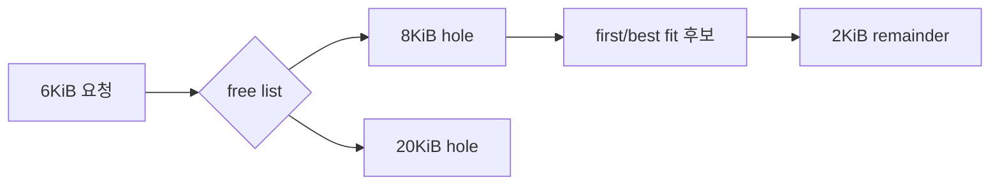

# 07. 할당과 회수

[이 책 목차](README.md) · [이전](06-paging-virtual-memory.md) · [다음](08-io-files-filesystems.md)

## free space도 자료구조다

memory allocator는 요청 크기에 맞는 free region을 찾는다.
free list, bitmap, buddy 같은 구조로 빈 공간을 기록한다.
할당보다 free 뒤 합치기와 fragmentation 관리가 어렵다.

## external과 internal fragmentation

external fragmentation은 free 총량은 충분하지만 조각나 큰 연속 요청을 못 받는 상태다.
internal fragmentation은 할당 단위 안에서 사용하지 않는 공간이다.

```text
free: 3KiB + 3KiB, 서로 떨어짐
요청: 연속 5KiB
총 free 6KiB지만 실패 가능
```

page 4KiB에서 5KiB 요청은 2 page=8KiB를 쓸 수 있다.
이때 최대 3KiB가 내부에 남는다.

## first-fit와 best-fit

first-fit은 처음 맞는 hole을 고른다.
best-fit은 요청 이상 중 가장 작은 hole을 고른다.
best-fit이 항상 미래 fragmentation을 최소화하지 않는다.
workload의 allocation/free 순서가 결과를 바꾼다.



## page allocation과 object allocation

OS는 physical page frame을 관리한다.
kernel object allocator는 page 안을 더 작은 object로 나눌 수 있다.
user allocator는 process heap/mapping 위에서 작은 allocation을 관리한다.
“free 했다”가 즉시 OS free page 증가를 뜻하지 않을 수 있다.

## reclaim이 필요한 순간

새 page를 요구했는데 적합한 free frame이 부족하면 OS는 reclaim 후보를 찾는다.

| page 종류 | 회수 경로 |
|---|---|
| clean file page | 원본이 storage에 있어 drop 가능 |
| dirty file page | writeback 뒤 drop 가능 |
| anonymous page | swap이 있으면 내보낼 수 있음 |
| pinned/unevictable | 일반 회수 어려움 |
| reclaimable kernel cache | shrink 가능 |

clean은 “사용하지 않음”이 아니다.
storage 원본과 같아 재읽을 수 있다는 뜻이다.
dirty는 RAM 내용이 backing storage보다 새롭다는 뜻이다.

## 시간순서

| 순서 | allocating task | reclaim 주체 | device |
|---:|---|---|---|
| 1 | page 요청 | free 검사 | 없음 |
| 2 | 부족해 대기 가능 | 후보 scan | 없음 |
| 3 | blocked/direct work | clean drop | 없음 |
| 4 | 계속 대기 가능 | dirty writeback | write 수행 |
| 5 | 재시도 | frame free | completion |
| 6 | frame 획득 | accounting 갱신 | 없음 |

background reclaim은 미리 free target을 회복한다.
direct reclaim은 allocation task가 회수 비용을 직접 맞는다.
따라서 memory pressure는 request latency로 나타날 수 있다.

## replacement policy 모형

FIFO는 먼저 들어온 page를 먼저 내보낸다.
LRU는 오래 사용하지 않은 page를 고르려 한다.
정확한 LRU는 접근마다 갱신 비용이 크다.
실제 OS는 reference bit, generation, active/inactive list 같은 근사를 쓸 수 있다.

reference string `A B C A D B`와 frame 3개를 보자.

```text
A: [A]
B: [A B]
C: [A B C]
A: hit
D: 오래된 B 또는 policy 선택에 따라 교체
B: 앞 선택에 따라 hit/fault
```

정책 이름만으로 결과를 계산하지 말고 각 시점의 상태를 기록한다.

## swap

swap은 anonymous page의 backing store 역할을 할 수 있다.
느린 RAM이라는 표현은 부정확하다.
swap-out은 frame을 비우고 page 내용을 storage slot에 둔다.
다시 접근하면 page fault로 swap-in한다.

swap이 있어도 working set이 너무 크면 반복 I/O로 느려진다.
swap이 없어도 clean file cache reclaim은 일어난다.
swap 사용량이 0이 아니어도 지금 swap I/O 중이라는 뜻은 아니다.

## thrashing

task들의 active working set이 RAM보다 크고 계속 재접근하면 fault와 eviction이 반복된다.
CPU는 user work보다 page 이동을 기다린다.
throughput이 떨어지고 latency가 오른다.
더 많은 concurrency가 오히려 상황을 악화시킬 수 있다.

## cgroup과 NUMA 연결

host 전체 RAM이 남아도 memory cgroup limit에 닿을 수 있다.
특정 NUMA node만 부족할 수 있다.
allocation policy와 cpuset이 fallback 범위를 제한할 수 있다.
free memory 한 숫자만으로 원인을 단정하지 않는다.

## 불변조건

- 사용 중 frame을 다른 owner에게 동시에 주면 안 된다.
- dirty data를 버리기 전 복구 가능한 backing이 있어야 한다.
- page table mapping과 frame reference 수명이 맞아야 한다.
- accounting 범위와 OOM 판단 범위가 같아야 한다.

## 반례

free RAM이 적어도 page cache가 reclaimable하면 즉시 문제는 아닐 수 있다.
free RAM이 많아도 연속 high-order allocation은 실패할 수 있다.
LRU라는 이름의 실제 구현이 완전한 시간순 list는 아닐 수 있다.
SSD가 빨라도 fault 폭풍은 queue와 tail latency를 만들 수 있다.

## 문제와 해설

## 실제 block 배치에서 fragmentation 보기

연속 16KiB memory를 1KiB block 16개로 표시한다.
초기 allocation은 다음과 같다.

```text
index:  0 1 2 3 4 5 6 7 8 9 A B C D E F
state:  A A . . B B B . . C C . . . D D
```

free block은 총 7KiB다.
하지만 가장 큰 연속 hole은 index C~D 앞의 3KiB가 아니라 B~D의 3KiB이며, 다른 hole은 2KiB씩이다.
연속 4KiB 요청은 총 free가 충분해도 실패한다.

B의 3KiB를 free하면 index 4~8의 hole이 이웃 free와 합쳐 5KiB가 된다.
이제 같은 4KiB 요청을 받을 수 있다.
coalescing이 필요한 이유다.

page allocation이라면 4KiB page 네 개를 서로 떨어진 frame에 둘 수 있어 virtual 16KiB를 제공할 수도 있다.
하지만 DMA나 huge page처럼 physical 연속성을 요구하는 요청은 여전히 실패할 수 있다.

반례로 compaction이 movable page를 옮길 수 있으면 큰 hole을 만들 수 있다.
pinned page가 사이에 있으면 이동할 수 없어 compaction이 성공하지 못할 수 있다.

1. clean file page는 storage 원본과 같아 drop 후 재읽을 수 있다.
2. dirty page는 writeback 없이 버리면 최신 변경을 잃는다.
3. swap과 reclaim은 동일어가 아니다. swap은 reclaim 선택지 하나다.

## 근거

- [OSTEP free space와 paging policy](https://pages.cs.wisc.edu/~remzi/OSTEP/)
- [Linux memory concepts](https://docs.kernel.org/admin-guide/mm/concepts.html)
