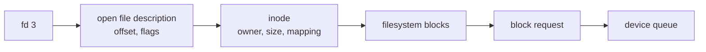
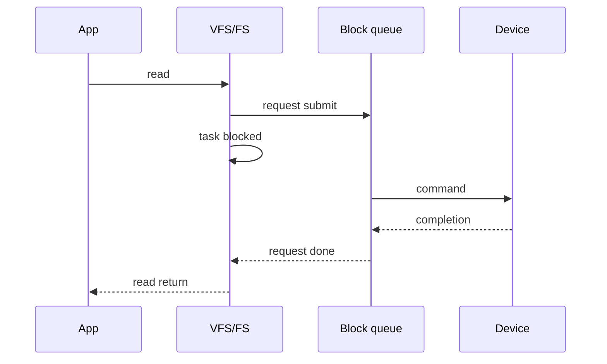

# 08. I/O·파일·파일시스템

[이 책 목차](README.md) · [이전](07-allocation-and-reclaim.md) · [다음](09-persistence-crash-recovery.md)

## 장치는 시간이 다르다

CPU instruction과 storage I/O는 시간 규모가 다르다.
OS는 요청을 queue에 넣고 task를 재우며 completion 뒤 깨운다.
polling은 상태를 반복 확인하고 interrupt는 장치가 알린다.
둘은 workload에 따라 비용이 다르다.

## fd에서 block까지

file descriptor(fd)는 process가 가진 작은 정수 handle이다.
fd table entry는 열린 file 상태를 가리킨다.
inode는 파일의 identity, metadata, data block mapping을 나타내는 모형이다.
directory는 이름을 inode identity에 연결한다.



`dup()`로 만든 fd 둘은 같은 open file description을 가리켜 offset을 공유할 수 있다.
파일을 두 번 별도로 `open()`하면 같은 inode를 가리켜도 offset은 다를 수 있다.

## 작은 read

`read(fd, buf, 4096)`를 추적한다.

| 순서 | 주체 | 작업 |
|---:|---|---|
| 1 | process | fd와 user buffer 전달 |
| 2 | VFS | fd→open file→inode 확인 |
| 3 | filesystem | offset을 file block에 매핑 |
| 4 | page cache | hit면 copy, miss면 I/O 준비 |
| 5 | block layer/driver | request를 device queue에 제출 |
| 6 | device | DMA와 completion |
| 7 | kernel | waiter wake, offset 갱신 |
| 8 | process | byte 수 또는 오류 받음 |

page cache hit이면 5~6이 없을 수 있다.
direct I/O도 모든 cache와 copy를 없애는 보편 고속 버튼은 아니다.

## 작은 write

buffered write는 user byte를 page cache에 복사하고 dirty로 표시한 뒤 돌아올 수 있다.
storage 기록은 writeback에서 나중에 일어난다.

```text
user buffer → dirty page cache → filesystem mapping
            → block request → device cache/media
```

4KiB write를 초당 1,000번 받으면 user data rate는 약 4.096MB/s다.
metadata, journal, alignment, device write amplification은 별도다.

## inode와 이름

inode는 이름 자체가 아니다.
한 inode에 여러 hard link 이름이 연결될 수 있다.
이름을 지워도 열린 fd나 다른 link가 있으면 data 수명이 남을 수 있다.

rename은 directory mapping을 바꾸는 operation이다.
같은 filesystem 안에서 atomic namespace 변화로 제공될 수 있다.
atomic visible과 crash-durable은 다른 보장이다.

## allocation

filesystem은 file offset을 storage block에 매핑한다.
연속 allocation은 sequential I/O에 유리하지만 성장과 free-space 조건이 필요하다.
extent는 연속 block 범위를 압축해 표현한다.
작은 file은 metadata overhead 비중이 클 수 있다.

## queue와 completion

submission은 요청이 queue에 들어간 사건이다.
completion은 특정 계층이 요청 처리를 마쳤다는 사건이다.
application transaction 완료와 동일하지 않다.



## 오류

short read/write는 요청보다 적은 byte를 처리한 정상 API 결과일 수 있다.
caller는 return 값을 확인해야 한다.
뒤늦은 writeback error는 이후 `fsync`, `write`, `close` 등에서 보일 수 있다.
오류가 언제 어느 호출자에게 전달되는지는 API 계약을 확인한다.

## 반례

fd 숫자 3은 모든 process에서 같은 file을 뜻하지 않는다.
같은 pathname도 mount namespace와 cwd에 따라 다른 inode로 갈 수 있다.
file size가 늘었다고 data가 durable하다고 단정할 수 없다.
device completion이 user request 성공을 항상 뜻하지 않는다.

## 전체 경로를 진단하는 질문

I/O가 느릴 때 먼저 application이 실제로 blocked인지 확인한다.
그다음 page cache hit/miss를 구분한다.
filesystem lock이나 allocation 대기가 있는지 본다.
block queue에 요청이 오래 머무는지 본다.
device service time과 queue time을 분리한다.

```text
application latency
= syscall 앞 user 대기
+ VFS/filesystem 처리
+ queue 대기
+ device service
+ completion 뒤 scheduling 대기
```

각 항은 겹칠 수 있으므로 단순 합은 교육용 분해다.
평균 latency가 낮아도 일부 요청의 tail이 클 수 있다.
throughput이 높아도 queue가 길면 interactive latency는 나쁠 수 있다.
read-ahead는 순차 접근을 돕지만 random access에서는 낭비가 될 수 있다.
write coalescing은 처리량을 돕지만 dirty data의 체류 시간을 늘릴 수 있다.

## 문제와 해설

## 같은 inode, 다른 offset 사례

file 내용이 `ABCDEFGH`이고 처음 `open()`한 fd 3의 offset은 0이다.
`dup(3)`으로 fd 4를 만들면 같은 open file description을 공유한다고 하자.

| 호출 | 읽은 byte | 공유 offset |
|---|---|---:|
| `read(3, 2)` | AB | 2 |
| `read(4, 2)` | CD | 4 |
| `read(3, 1)` | E | 5 |

fd 4가 별도 offset 0에서 시작한다고 기대하면 결과를 오해한다.
두 fd 번호는 달라도 열린 file 상태 하나를 가리킨다.

반대로 같은 pathname을 다시 `open()`해 fd 5를 얻으면 별도 open file description과 offset 0을 가질 수 있다.
`read(5, 2)`는 AB를 읽을 수 있다.

`pread(fd, buf, 2, 6)`처럼 명시 offset API는 shared current offset을 바꾸지 않고 GH를 읽는 모형이다.
정확한 concurrent offset atomicity는 OS/API 계약을 확인한다.

왜 중요한가?
여러 thread가 fd를 공유할 때 data 자체뿐 아니라 offset도 shared mutable state가 될 수 있기 때문이다.

1. fd와 inode 사이에는 열린 file 상태가 있어 offset과 flags를 둔다.
2. page-cache hit read는 storage I/O 없이 끝날 수 있다.
3. inode와 filename은 다르며 directory가 둘을 연결한다.

## 근거

- [OSTEP file-system 자료](https://pages.cs.wisc.edu/~remzi/OSTEP/)
- [MIT xv6 file-system 자료](https://pdos.csail.mit.edu/6.S081/)
