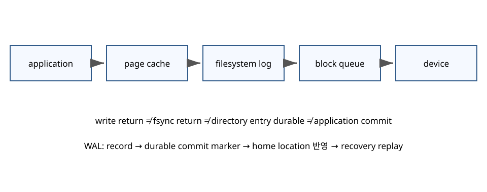
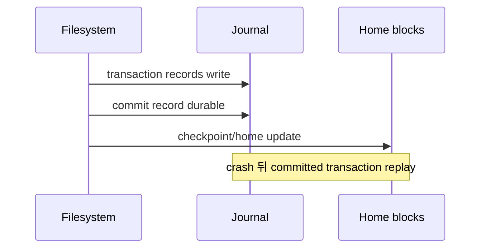

# 09. 지속성과 크래시 복구

[이 책 목차](README.md) · [이전](08-io-files-filesystems.md) · [다음](10-protection-and-virtualization.md)

## 완료의 층위



| 사건 | 말할 수 있는 것 |
|---|---|
| `write()` return | kernel이 byte를 수락 |
| writeback completion | device write가 완료됐다고 보고 |
| `fsync()` return | 해당 API가 요구한 file data/metadata 동기화 |
| directory `fsync()` | directory entry 지속성 강화 |
| application commit | application protocol의 성공 |

Linux `fsync()`도 새 directory entry 자체의 지속성을 위해 directory fd 동기화가 별도로 필요할 수 있다고 문서화한다.

## crash consistency

한 logical operation이 여러 block write를 요구하면 crash가 중간에 날 수 있다.
inode는 새 block을 가리키는데 bitmap은 free라고 말하는 모순이 생길 수 있다.
파일시스템은 crash 뒤 허용 상태를 정의하고 복구 기작을 둔다.

## WAL/journal

write-ahead logging의 핵심 불변조건은 home location보다 복구 record가 먼저 durable해야 한다는 것이다.



단순 순서:

1. 변경할 metadata/data record를 journal에 쓴다.
2. transaction commit marker를 durable하게 만든다.
3. home location에 반영한다.
4. checkpoint가 끝나면 log space를 재사용한다.

## crash 지점

| crash 시점 | recovery 판단 |
|---|---|
| log 일부만 기록 | commit 없음, transaction 무시 |
| log+commit durable | replay 가능 |
| home 일부 반영 | committed log를 replay해 일관 상태 |
| checkpoint 완료 | home이 최신, log 재사용 가능 |

WAL은 모든 application 의미를 자동 보장하지 않는다.
filesystem metadata journal과 database WAL은 보호 범위가 다르다.

## 작은 rename protocol

새 설정 파일을 안전하게 교체하려는 모형:

```text
1. 같은 directory에 temp 생성
2. temp에 전체 내용 write
3. temp fsync
4. temp를 target으로 rename
5. directory fsync
```

왜 3이 필요한가?
새 이름이 보이는데 file data가 durable하지 않은 상태를 줄이기 위해서다.
왜 5가 필요한가?
rename으로 바뀐 directory entry의 crash 지속성을 요구하기 때문이다.

정확한 보장은 filesystem, mount option, storage와 OS 계약을 확인한다.
이 순서를 모든 원격 filesystem에 그대로 일반화하지 않는다.

## group commit

storage flush가 500µs라고 하자.
transaction마다 직렬 flush하면 단순 상한은 초당 2,000회다.
10개 WAL record를 한 durable flush로 묶으면 transaction 기준 단순 상한은 20,000/s까지 늘 수 있다.
대신 첫 transaction은 batch를 기다려 latency가 늘 수 있다.

## fsck와 journal

fsck는 저장 구조를 scan해 모순을 찾고 복구한다.
큰 filesystem 전체 scan은 오래 걸릴 수 있다.
journal은 최근 committed transaction을 replay해 복구 범위를 줄인다.
둘은 목적이 겹치지만 같은 기작은 아니다.

## device cache

device가 volatile cache를 쓸 수 있다.
flush/FUA와 power-loss protection의 계약이 중요하다.
OS가 순서를 올바르게 제출해도 device가 거짓 completion을 주면 보장이 깨질 수 있다.
controller, drive, virtualized storage 전체 경계를 본다.

## application 불변조건

은행 이체는 A 감소와 B 증가가 함께 commit되어야 한다.
filesystem이 각 file write를 일관되게 복구해도 두 record의 business atomicity는 database protocol이 책임진다.
durability와 atomicity를 같은 말로 쓰지 않는다.

## 반례

`close()`만으로 필요한 durability가 보장된다고 단정하지 않는다.
`fsync(file)`이 새 filename의 directory entry까지 항상 보장하지 않는다.
journal이 있다고 user data 전부가 journaled라는 뜻은 아니다.
replica ACK가 local media durability인지 remote memory 도착인지 구분한다.

## 복구 시험 설계

복구 가능성은 정상 실행 로그만으로 입증하지 않는다.
crash 지점을 protocol 단계 사이에 나누어야 한다.

| 시험 | crash 지점 | 기대 불변조건 |
|---|---|---|
| A | log record 중간 | incomplete transaction 미적용 |
| B | record 뒤 commit 전 | transaction 미적용 |
| C | commit durable 뒤 | replay로 전체 반영 |
| D | checkpoint 중간 | replay 뒤 일관 상태 |

복구기는 같은 log를 두 번 replay해도 결과가 망가지지 않도록 idempotence를 고려한다.
checksum과 length는 torn/incomplete record 식별을 돕는다.
sequence number는 오래된 record와 새 record를 구분한다.
log space 재사용은 이전 checkpoint 완료보다 빨라서는 안 된다.

백업은 journal과 역할이 다르다.
journal은 최근 crash consistency를 돕는다.
백업은 삭제, corruption, 공격, site failure에서 과거 상태를 복원한다.
복원 시험이 없으면 백업 byte 존재만 확인한 것이다.

## 문제와 해설

## 두 block 이체와 crash 지점

account A block에 100, B block에 20이 있다.
10을 이체하면 목표는 A=90, B=30이다.

| crash 지점 | A | B | 합계 | 문제 |
|---|---:|---:|---:|---|
| 변경 전 | 100 | 20 | 120 | 없음 |
| A만 home write 뒤 | 90 | 20 | 110 | 10 소실 |
| A와 B 모두 뒤 | 90 | 30 | 120 | 완료 |

WAL record에 `A:100→90`, `B:20→30`을 함께 기록하고 commit marker를 durable하게 한 뒤 home을 바꾼다.
commit 전 crash면 둘 다 적용하지 않는다.
commit 뒤 crash면 recovery가 둘 다 redo한다.

두 home write 자체를 atomic하다고 가정하지 않았기 때문에 중간 crash를 견딜 수 있다.
핵심 불변조건은 합계 120과 transaction의 all-or-nothing이다.

반례로 같은 transaction을 두 번 replay해 B에 10을 두 번 더하는 구현은 잘못됐다.
redo는 목표 value나 idempotent record 의미를 가져야 한다.
filesystem journal이 이 business invariant를 자동으로 이해하지는 않는다.

1. commit record 전 crash는 incomplete transaction으로 무시할 수 있다.
2. commit 뒤 home 반영 중 crash는 journal replay로 완료할 수 있다.
3. rename atomic visibility와 crash durability는 별도다.

## 근거

- [OSTEP FSCK and Journaling](https://pages.cs.wisc.edu/~remzi/OSTEP/file-journaling.pdf)
- [Linux fsync(2)](https://man7.org/linux/man-pages/man2/fsync.2.html)
