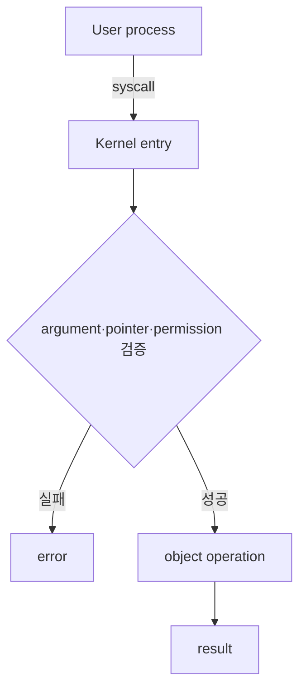
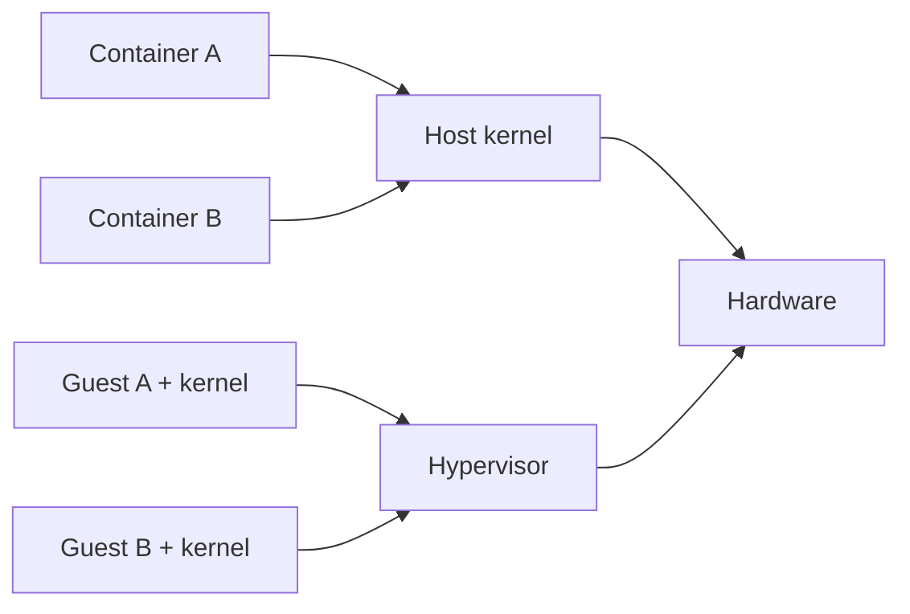

# 10. 보호와 가상화

[이 책 목차](README.md) · [이전](09-persistence-crash-recovery.md) · [다음](11-platform-connections.md)

## protection domain

보호는 “누가 어떤 object에 어떤 operation을 할 수 있는가”를 정한다.
subject는 process/user/task다.
object는 memory, file, socket, device다.
operation은 read, write, execute, map, control이다.

## privilege level

user mode는 privileged instruction과 kernel memory 접근을 제한한다.
syscall은 검증된 kernel entry다.
kernel mode라고 모든 요청을 허용하는 것은 아니다.
kernel이 caller identity와 object permission을 다시 검사한다.



## capability와 ACL 모형

ACL은 object에서 누가 무엇을 할 수 있는지 나열하는 관점이다.
capability는 subject가 가진 위조 불가능한 권한 token 관점이다.
실제 OS의 capability라는 용어는 서로 다른 세부 의미를 가질 수 있다.

## isolation의 한계

process address space는 accidental overwrite 경계를 만든다.
kernel bug, side channel, shared resource DoS까지 모두 막지는 않는다.
CPU cache와 memory bandwidth는 격리된 process도 공유할 수 있다.

## virtual machine

VM은 guest OS가 virtual CPU, memory, device를 가진 것처럼 보이게 한다.
hypervisor는 guest privileged operation과 resource mapping을 중재한다.

| 층 | 보는 추상화 | 실제 담당 |
|---|---|---|
| guest app | process, VA, file | guest OS |
| guest OS | vCPU, guest physical, virtual device | hypervisor |
| hypervisor | host CPU/RAM/device | host hardware/OS |

guest VA는 guest page table로 guest physical에 간다.
다시 hypervisor의 second-level mapping으로 host physical에 갈 수 있다.
translation 계층이 하나 늘 수 있다.

## 작은 주소 예

guest VA page 0x12가 guest frame 0x30에 매핑된다.
second-level table이 guest frame 0x30을 host frame 0xA0에 매핑한다.
offset 0x44는 유지된다.
최종 host physical은 `0xA044` 모형이다.

## trap과 emulate

guest의 privileged operation이 trap되면 hypervisor가 의미를 검사하고 emulate할 수 있다.
hardware virtualization은 많은 guest instruction을 직접 실행하게 해 overhead를 줄인다.
device는 emulation, paravirtual driver, passthrough 방식으로 제공할 수 있다.

## container와 비교

container는 보통 host kernel을 공유한다.
namespace는 이름과 관점을 나눈다.
cgroup은 resource accounting/limit을 제공한다.
VM은 guest kernel을 별도로 둘 수 있다.



container가 항상 VM보다 불안전하거나 VM이 완전한 경계라는 단정은 피한다.
threat model, attack surface, configuration이 결과를 바꾼다.

## device passthrough

IOMMU는 device DMA address를 host physical memory에 제한·변환할 수 있다.
passthrough는 성능을 높일 수 있지만 migration, sharing, fault containment 조건이 달라진다.
SR-IOV virtual function 같은 기작은 하나의 device 기능을 나누어 노출할 수 있다.

## 주체와 시점

| 사건 | guest/app | kernel/hypervisor | hardware |
|---|---|---|---|
| syscall | service 요청 | guest kernel 처리 | privilege 전환 |
| guest page access | GVA 사용 | page tables 준비 | nested translation |
| virtual I/O | descriptor 제출 | backend 중재 | DMA/device |
| violation | 중단 | fault 처리 | trap |

## 반례

root user도 hardware privilege level의 kernel과 같지 않다.
namespace가 PID를 숨겨도 CPU 시간을 자동 보장하지 않는다.
cgroup limit이 pathname 격리를 제공하지 않는다.
VM snapshot은 application-consistent backup과 같지 않을 수 있다.

## 위협 모형으로 판단하기

보호 기작은 막으려는 공격자를 먼저 정해야 한다.

| 위협 | 필요한 질문 |
|---|---|
| 실수한 application | 다른 address space를 덮어쓸 수 있는가 |
| 악성 process | syscall과 object permission을 우회할 수 있는가 |
| 악성 device | DMA 범위를 벗어날 수 있는가 |
| 악성 guest | hypervisor와 다른 guest를 침범할 수 있는가 |
| resource hog | CPU·RAM·I/O를 고갈시킬 수 있는가 |

confidentiality는 읽지 못하게 하는 성질이다.
integrity는 허가 없이 바꾸지 못하게 하는 성질이다.
availability는 필요한 service를 계속 받을 수 있는 성질이다.
하나의 설정이 세 성질을 모두 같은 정도로 제공하지 않는다.

least privilege는 필요한 권한만 필요한 시간 동안 준다는 원칙이다.
권한을 줄이면 침해 범위가 줄지만 운영 복잡성이 생긴다.
audit log는 사건을 설명하지만 접근 자체를 막는 기작은 아니다.

## 문제와 해설

## pointer 검사 뒤 mapping이 바뀌는 사례

user가 buffer VA `0x4000`, 길이 4096을 syscall에 전달한다.
kernel은 주소 범위와 write permission을 검사한다.
검사와 실제 copy 사이에 다른 thread가 mapping을 바꿀 수 있는 설계를 생각해 보자.

```text
t0 Thread A: syscall, 0x4000 검사 통과
t1 Thread B: 0x4000 mapping 제거/교체
t2 Kernel: 옛 가정을 믿고 copy 시도
```

검사 한 번만으로 이후 수명을 보장하지 못한다.
kernel은 user-copy API, fault 처리, pin/reference 또는 재검사처럼 구현이 정한 안전 기작을 사용해야 한다.

| 보호 질문 | 필요한 보장 |
|---|---|
| 범위가 user 영역인가 | kernel 주소를 caller가 지정하지 못함 |
| permission이 맞는가 | 요청 방향과 mapping 권한 일치 |
| copy 중 fault 가능한가 | 안전한 recovery 경로 |
| object 수명이 남는가 | concurrent unmap/free와 조정 |

반례로 작은 syscall argument가 register 값이면 user pointer 수명 문제는 없다.
하지만 값 자체의 범위와 권한 검사는 여전히 필요하다.

1. syscall entry 뒤에도 permission 검사가 필요한 이유는 caller를 신뢰할 수 없기 때문이다.
2. container는 host kernel을 공유하고 VM은 guest kernel을 가질 수 있다.
3. IOMMU는 DMA 보호를 돕지만 application 권한 정책 전체를 대신하지 않는다.

## 근거

- [MIT xv6 isolation/VM 강의 자료](https://pdos.csail.mit.edu/6.S081/)
- [Linux virtualization 문서](https://docs.kernel.org/virt/)
