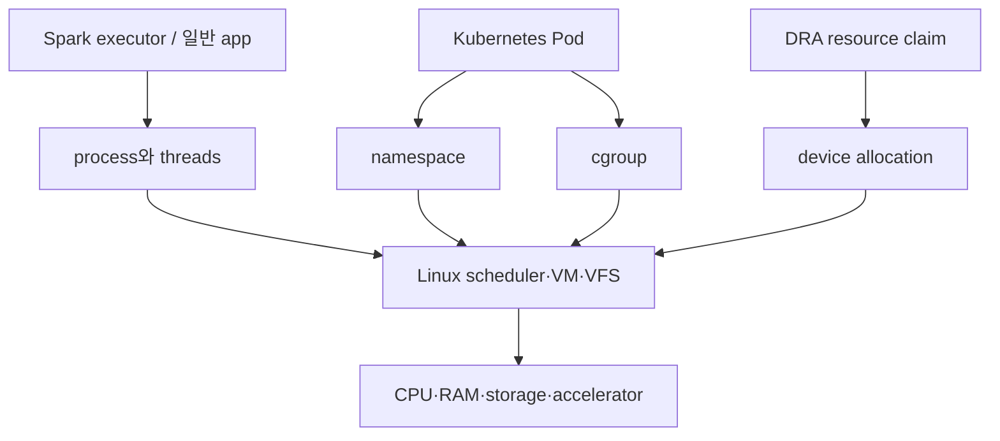
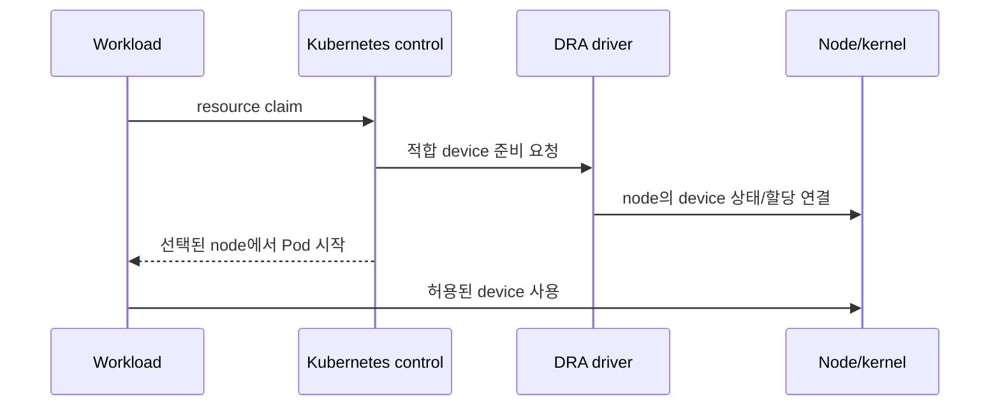

# 11. Linux·Kubernetes·Spark·DRA 연결

[이 책 목차](README.md) · [이전](10-protection-and-virtualization.md) · [다음](12-local-model-labs.md)

## 공통 원리에서 실제 platform으로

이 장은 Linux 구현 세부를 다시 가르치지 않는다.
앞 장의 자원·보호·queue·주소·지속성 모형이 platform에서 어디에 나타나는지 연결한다.



## Linux 연결

process/thread는 Linux scheduler가 다루는 task 구현과 연결된다.
그러나 교재의 RR/SJF/MLFQ가 현재 Linux 일반 scheduler라는 뜻은 아니다.
현재 EEVDF는 eligible task 중 virtual deadline을 기준으로 선택하는 현실 정책이다.

virtual memory 모형은 page table, TLB, fault handler와 연결된다.
reclaim 모형은 file cache, anonymous page, swap, cgroup memory pressure와 연결된다.
file 모형은 fd, VFS, inode, block layer와 연결된다.

## Kubernetes Pod

Pod는 새로운 kernel이 아니다.
container process들이 host kernel 기능을 사용한다.
namespace가 PID, mount, network 등의 관점을 나눈다.
cgroup이 CPU, memory 같은 resource를 회계·제한한다.

| 선언 | OS 원리 | 빠진 보장 |
|---|---|---|
| CPU request/limit | scheduling share/quota | 전용 core 보장과 동일하지 않음 |
| memory limit | accounting과 reclaim/OOM 범위 | host RAM 예약과 항상 같지 않음 |
| volume mount | namespace와 filesystem | application durability 자동 보장 아님 |
| device allocation | permission·topology | workload locality 자동 최적화 아님 |

## memory limit 사건

host에 free RAM이 남아도 Pod cgroup limit에 닿을 수 있다.
그 범위에서 reclaim이 일어나고 해결되지 않으면 cgroup OOM이 날 수 있다.
“node memory가 남았다”와 “이 workload가 더 할당할 수 있다”는 다른 질문이다.

## Spark 연결

Spark executor는 process와 thread, heap/off-heap memory, file/network I/O를 사용한다.
partition은 OS page가 아니다.
executor task는 kernel scheduler task와 같은 객체가 아니다.
서로 다른 추상화 계층의 task라는 단어다.

shuffle은 다음 경로를 가질 수 있다.

```text
Spark record
→ serialization buffer
→ socket/file API
→ page cache 또는 network stack
→ NIC/storage queue
→ remote executor
```

GC pause, CPU quota, page fault, storage queue, network backpressure가 모두 stage latency에 영향을 줄 수 있다.
한 지표만 보고 scheduler 문제라고 단정하지 않는다.

## DRA 연결

Dynamic Resource Allocation(DRA)은 Kubernetes가 device resource 요구와 할당을 표현하는 framework다.
OS 원리로 보면 device identity, permission, lifecycle, topology를 workload scheduling과 연결한다.



DRA가 IOMMU와 같은 hardware address translation을 직접 대체하지 않는다.
kernel driver와 device firmware의 안전성도 대신하지 않는다.
선언한 resource와 실제 data path locality는 별도 검증한다.

## NUMA와 accelerator

Pod가 device를 받았어도 CPU와 RAM이 먼 NUMA node에 있을 수 있다.
CPU affinity, memory placement, PCIe root가 함께 data path를 만든다.
topology-aware 배치가 성능을 돕지만 모든 workload에서 같은 효과를 보장하지 않는다.

## persistence 연결

PersistentVolume이라는 이름은 application transaction이 durable하다는 뜻이 아니다.
filesystem, network storage, replica, flush semantics를 따라야 한다.
Spark checkpoint도 저장 위치와 atomic publish protocol에 따라 복구 의미가 달라진다.

## 주체 표

| 층 | 정책 주체 | 기작 주체 |
|---|---|---|
| application | partition/task 배치 | thread, file/socket call |
| Kubernetes | Pod/node/device 선택 | runtime·plugin 호출 |
| Linux | CPU/page/I/O 정책 | context switch, mapping, driver |
| hardware | queue arbitration 일부 | execution, DMA, media write |

## 반례

Pod 하나가 process 하나라는 보장은 없다.
Spark task 하나가 OS thread 하나와 항상 1:1은 아니다.
device가 Pod에 보여도 필요한 library/firmware/API가 맞는다는 보장은 없다.
volume write 성공이 remote replica durable commit과 같지 않을 수 있다.

## 사건 하나를 여러 층에서 읽기

“Spark executor가 느리고 재시작됐다”를 층별로 분해한다.

| 층 | 확인할 상태 | OS 원리 |
|---|---|---|
| Spark | stage, task retry, shuffle wait | application queue와 dependency |
| container | process exit와 log | process lifecycle |
| cgroup | CPU throttle, memory event | scheduling/accounting |
| VM | fault, reclaim, swap | address space와 backing |
| storage/network | queue와 completion | asynchronous I/O |
| Kubernetes | eviction, restart policy | higher-level reconciliation |

한 층의 “task”와 다른 층의 “task”를 같은 ID로 추적하지 않는다.
timestamp와 correlation ID로 사건을 연결한다.
재시작은 원인을 고친 것이 아니라 desired state를 다시 맞춘 결과일 수 있다.
OOM, signal, node loss, application exception은 서로 다른 종료 원인이다.

원인 분석은 위에서 아래로만 하지 않는다.
device error가 filesystem error, executor failure, Pod restart로 올라올 수 있다.
동시에 application burst가 아래 계층 queue를 포화시킬 수 있다.

## 문제와 해설

## 한 Pod의 memory 사건을 시간순으로 연결하기

Pod memory limit은 1GiB이고 현재 사용량은 900MiB다.
Spark executor가 200MiB buffer를 추가로 요구한다.

| 순서 | application | cgroup/kernel | node |
|---:|---|---|---|
| 1 | 200MiB allocation 예약 | 아직 page 미할당 가능 | free 8GiB |
| 2 | page를 실제 touch | charge가 limit 접근 | free 충분 |
| 3 | 사용량 1GiB 초과 시도 | cgroup reclaim | 다른 workload 정상 |
| 4 | 회수 실패 | cgroup OOM victim 선택 가능 | host OOM은 아닐 수 있음 |
| 5 | executor 종료 | Kubernetes가 restart 관측 | node는 계속 동작 |

host free 8GiB는 이 Pod가 1GiB limit을 넘을 권한을 주지 않는다.
address reservation과 resident/charged memory도 같은 시점에 늘지 않을 수 있다.

반례로 reclaim 가능한 file cache 150MiB가 Pod 안에 있으면 이를 회수한 뒤 allocation 일부가 성공할 수 있다.
또 Spark의 자체 memory manager가 먼저 요청을 거절하거나 spill하면 kernel OOM까지 가지 않을 수 있다.
어느 층이 먼저 제한했는지 event와 timestamp로 구분한다.

1. cgroup memory limit은 host free RAM과 다른 accounting 경계다.
2. Spark task와 kernel task는 서로 다른 추상화다.
3. DRA는 device lifecycle을 연결하지만 IOMMU·driver 검증을 대체하지 않는다.

## 근거

- [Linux EEVDF](https://docs.kernel.org/scheduler/sched-eevdf.html)
- [Kubernetes DRA](https://kubernetes.io/docs/concepts/scheduling-eviction/dynamic-resource-allocation/)
