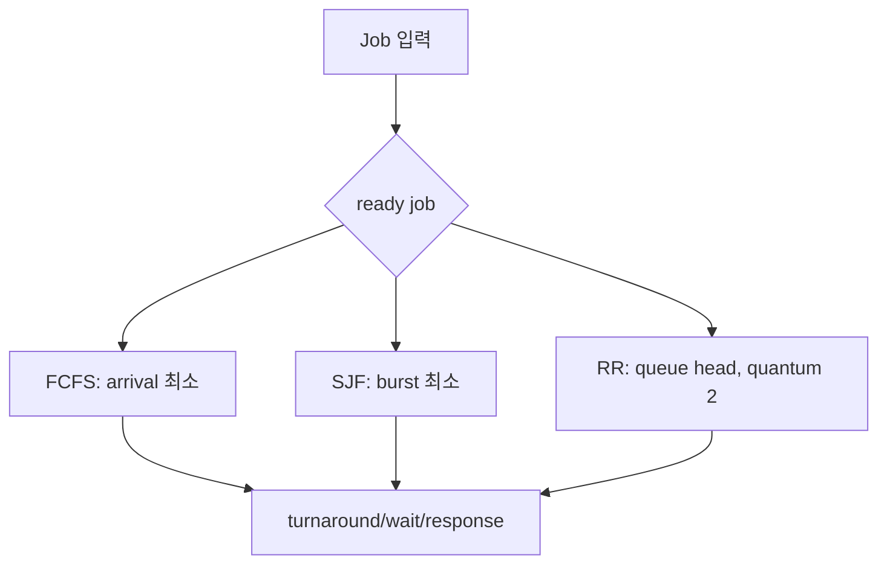
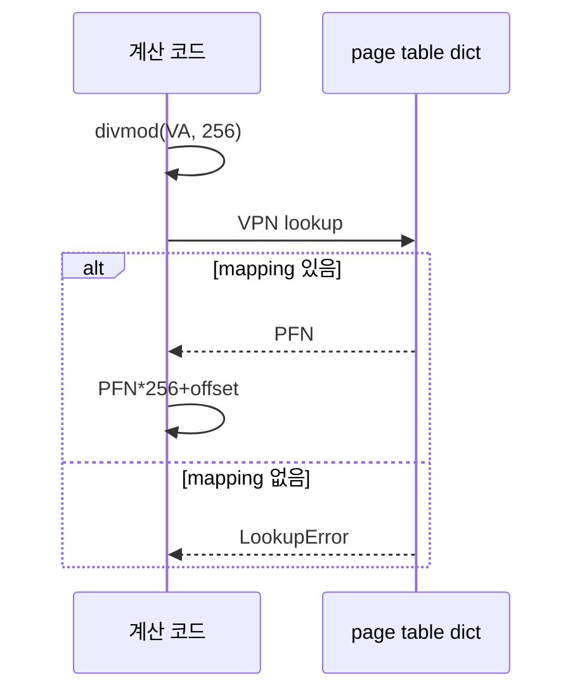

# 12. 로컬 모형 실습

[이 책 목차](README.md) · [이전](11-platform-connections.md) · [다음](13-exercises-and-glossary.md)

## 목적과 안전 경계

실습은 순수 계산 모형 두 개를 읽는 활동이다.
실제 scheduler, page table, kernel setting을 바꾸지 않는다.
두 script는 Python 표준 라이브러리만 사용한다.
성능 benchmark가 아니다.

저장소 root에서 Python 3으로 다음 명령을 각각 한 번 실행했다. 별도 package 설치가 필요 없다.

```bash
python3 -B learning/operating-systems/examples/scheduler.py
python3 -B learning/operating-systems/examples/address_translation.py
```

`-B`는 bytecode cache 파일 생성을 막는 옵션이다. 다른 환경에서는 `python3 --version`으로 버전을 확인하고, 아래 작은 입력의 결과를 비교한다. Scheduler 코드의 `-` 기호는 실행 가능한 job이 없어 CPU가 빈 tick을 나타낸다.

## 실습 1: scheduler

파일: [`examples/scheduler.py`](examples/scheduler.py)

입력:

| Job | arrival | burst |
|---|---:|---:|
| A | 0 | 5 |
| B | 1 | 2 |
| C | 2 | 1 |

예상 FCFS:

```text
timeline: A A A A A B B C
A turnaround 5 waiting 0 response 0
B turnaround 6 waiting 4 response 4
C turnaround 6 waiting 5 response 5
```

예상 SJF는 arrival를 존중하는 비선점 SJF다.
t0에는 A만 ready이므로 A를 먼저 끝낸다.
그 뒤 C, B 순서다.
모든 job이 t0 도착한 고전 SJF 예와 결과가 다르다.

예상 RR q=2:

```text
timeline: A A B B C A A A
A turnaround 8 waiting 3 response 0
B turnaround 3 waiting 1 response 1
C turnaround 3 waiting 2 response 2
```



관찰 질문:

1. B와 C의 response가 RR에서 왜 줄었는가?
2. context-switch cost를 넣으면 어느 결과가 달라지는가?
3. 미래 burst를 모르는 실제 OS가 SJF를 그대로 쓰기 어려운 이유는?

## 실습 2: 주소 변환

파일: [`examples/address_translation.py`](examples/address_translation.py)

상수:

```text
address bits = 16
page size = 256 = 2^8
VPN bits = 8
offset bits = 8
page table: 0x12→0x3A, 0x7F→0x04
```

예상:

```text
VA 0x1234 -> VPN 0x12, offset 0x34 -> PA 0x3a34
VA 0x7ffe -> VPN 0x7f, offset 0xfe -> PA 0x04fe
VA 0x2201 -> VPN 0x22: page fault 모형
```

계산:

```text
0x1234 div 0x100 = VPN 0x12, remainder 0x34
PFN 0x3A × 0x100 + 0x34 = 0x3A34
```



## 예상과 실행 결과

| 항목 | 예상 | 실행 결과 | 비교 |
|---|---|---|---|
| FCFS timeline | `A A A A A B B C` | `A A A A A B B C` | 일치 |
| RR timeline | `A A B B C A A A` | `A A B B C A A A` | 일치 |
| 0x1234 PA | `0x3A34` | `0x3a34` | 같은 값, 출력은 소문자 |
| 0x2201 | VPN 0x22의 fault 모형 | `VPN 0x22: page fault 모형` | 일치 |

확인일은 2026-10-10이다. 코드의 지정 입력을 실행한 기록이며, 실제 OS의 scheduling·page fault를 관측한 기록과 구분한다.

## 변형 문제

1. RR quantum을 1로 바꾸고 손으로 timeline을 쓴다.
2. Job D(arrival 8, burst 1)를 추가한다.
3. page size를 512로 바꾸면 offset bit는 9다.
4. VPN `0x22→PFN 0x01`을 추가하면 PA를 계산한다.

## 해설

quantum 1은 response를 세밀하게 나누지만 switch 횟수를 늘린다.
D는 CPU가 비는 시점과 ready queue 규칙에 따라 들어간다.
512B는 `2^9`이므로 16-bit VA의 VPN은 7-bit다.
VA 0x2201, 256B page, PFN 1이면 PA는 0x0101이다.

## 한계

script는 I/O burst, preemption cost, multi-core, cache, priority를 생략한다.
address script는 TLB, multi-level walk, permission, swap을 생략한다.
생략을 숨기지 않고 모형의 경계로 기록한다.

## 보고서 양식

```text
가설:
입력:
손 계산:
예상 출력:
actual 출력:
차이:
모형이 생략한 조건:
다음 질문:
```

숫자만 붙이지 말고 단위를 쓴다.
tick과 millisecond를 섞지 않는다.
timeline은 실행 순서를 말하고 실제 wall-clock 성능을 말하지 않는다.
fault 모형은 mapping 없음만 표현하고 disk I/O 여부를 말하지 않는다.

## 추가 사고 문제

RR에 switch cost 1 tick을 넣으면 useful CPU 비율은 어떻게 바뀌는가?
arrival가 모두 0이면 비선점 SJF 결과가 어떻게 달라지는가?
page table entry에 writable bit를 추가하면 어떤 fault를 표현할 수 있는가?
TLB를 네 entry dict로 모형화하면 replacement policy가 왜 필요한가?
두 실습을 결합할 때 page fault로 task가 blocked되는 상태를 어떻게 표현할 것인가?

정답은 하나의 code 형태로 제한되지 않는다.
먼저 상태와 전이, 불변조건을 문장으로 정의한다.

## 손으로 한 번 더 계산하는 결합 사례

A가 VA `0x2201`을 읽다가 mapping이 없어 blocked된다고 하자.
동시에 B는 CPU burst 2 tick이 ready다.

| tick | A | B | CPU/사건 |
|---:|---|---|---|
| 0 | running | ready | A의 load가 page fault |
| 1 | blocked | running | B 첫 tick, page I/O 진행 |
| 2 | blocked | running | B 둘째 tick |
| 3 | ready | finished | page completion이 A wake |
| 4 | running | finished | A가 같은 load 재시도 |

주소 변환 모형만 보면 mapping 없음에서 끝난다.
scheduler 모형과 결합하면 A가 blocked인 동안 B가 CPU를 사용할 수 있다.
completion은 A를 ready로 만들지만 즉시 실행을 보장하지 않는다.

반례로 demand-zero fault면 storage I/O가 없고 A가 더 빨리 ready가 될 수 있다.
CPU가 둘이면 B 실행과 A의 kernel fault 처리가 일부 겹칠 수 있다.
이 결합 사례도 실제 kernel timing을 예측하지 않는다.
