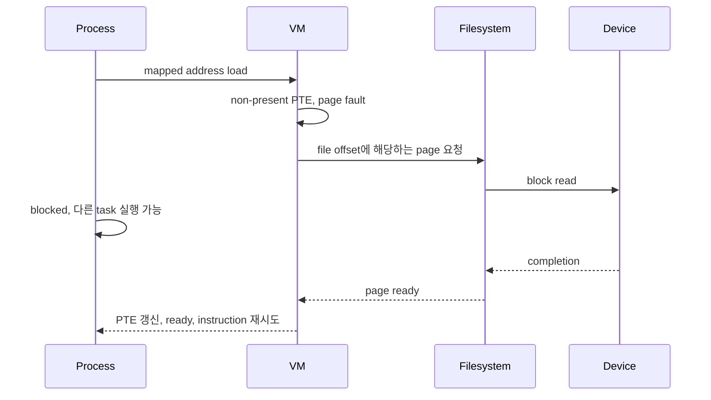
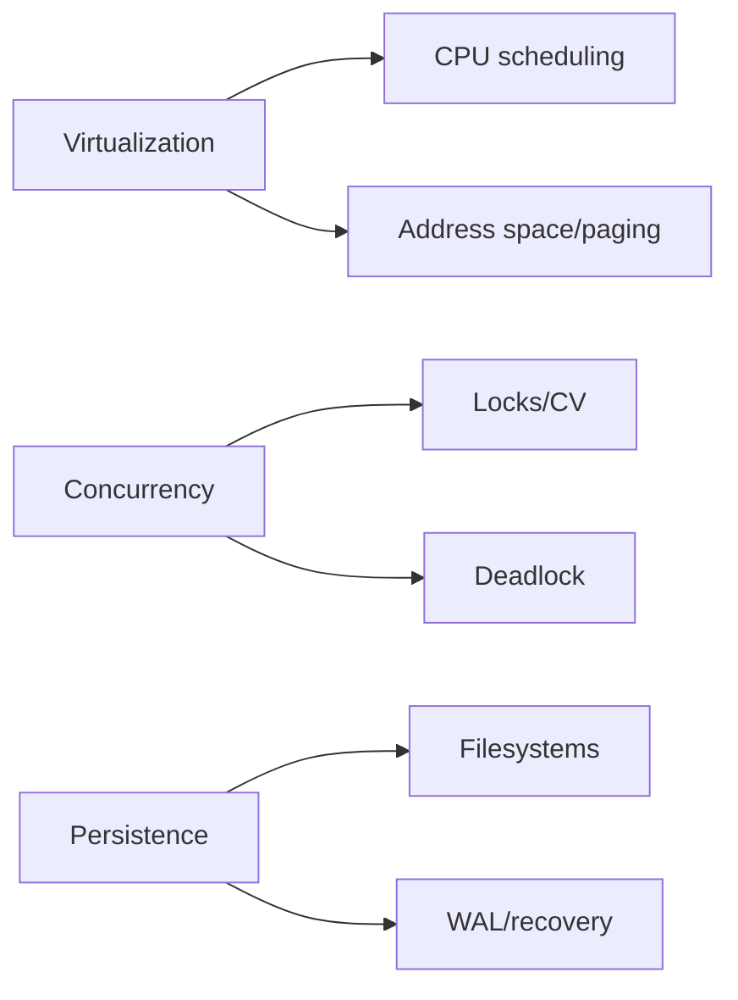

# 13. 종합 문제와 용어집

[이 책 목차](README.md) · [이전](12-local-model-labs.md)

## 종합 문제 12개

1. syscall과 context switch를 각각 정의하고 함께 일어나는 예를 쓰라.
2. A=6, B=2, C=1이 모두 t0 도착할 때 SJF 순서와 평균 turnaround를 계산하라.
3. RR quantum을 줄일 때 좋아지는 지표와 나빠질 수 있는 비용을 쓰라.
4. `counter += 1` 두 번이 1이 되는 interleaving을 쓰라.
5. lock A/B 교착상태의 wait-for cycle을 그려라.
6. safe state와 unsafe state 차이를 설명하라.
7. 16-bit VA, 256B page에서 VA 0xABCD를 VPN과 offset으로 나눠라.
8. TLB miss와 page fault의 차이를 쓰라.
9. clean file page와 dirty file page 회수 방법을 비교하라.
10. fd, open file description, inode, data block을 순서대로 연결하라.
11. WAL에서 commit record 전후 crash 결과를 비교하라.
12. Kubernetes memory limit과 host free RAM이 다른 이유를 OS 원리로 설명하라.

## 해설

1. syscall은 의도적 kernel service 진입이고 context switch는 실행 task 교체다. blocking read에서 둘 다 일어날 수 있다.
2. C→B→A, 완료 1·3·9, 평균 `13/3≈4.33`이다.
3. response가 좋아질 수 있고 switch/cache overhead가 늘 수 있다.
4. A read0, B read0, A write1, B write1이다.
5. T1→B→T2→A→T1 cycle이다.
6. safe는 완료 순서가 하나 이상 있고 unsafe는 그 보장을 잃은 상태다. unsafe가 즉시 deadlock은 아니다.
7. VPN=0xAB, offset=0xCD다.
8. TLB miss는 변환 cache miss이고 page fault는 mapping/permission으로 접근 완료가 불가능한 exception이다.
9. clean은 drop 가능하고 dirty는 보통 writeback 뒤 회수한다.
10. process fd→열린 file 상태→inode mapping→filesystem block이다.
11. commit 전 incomplete log는 무시할 수 있고 commit 뒤에는 replay해 home update를 완성한다.
12. cgroup은 workload 범위 accounting과 limit을 적용하므로 host 전체 여유와 별도 경계다.

## 풀이 과정을 다시 펼치기

### 1. syscall과 context switch

먼저 “경계 진입”과 “실행 주체 교체”를 별도 칸에 쓴다.
`getpid()` 같은 짧은 syscall은 같은 thread가 kernel에 들어갔다 돌아올 수 있다.
빈 pipe의 blocking `read()`는 wait queue에 들어가 다른 task로 바뀔 수 있다.
따라서 syscall은 context switch의 필요조건도 충분조건도 아니다.

### 2. SJF 계산

모든 job이 t0 도착했으므로 burst만 비교한다.
C=1, B=2, A=6 순이다.
완료 시점은 C 1, B `1+2=3`, A `3+6=9`다.
turnaround는 arrival가 모두 0이라 완료 시점과 같다.
평균은 `(1+3+9)/3 = 13/3 ≈ 4.33`이다.

### 3. RR trade-off

quantum을 줄이면 긴 A 사이에 B와 C가 빨리 첫 CPU를 얻는다.
response time은 줄 수 있다.
그러나 같은 9 tick 일을 더 많은 조각으로 나눈다.
각 경계에 switch cost와 cache 손실이 있으면 useful CPU 비율이 낮아진다.

### 4. lost update

각 증가를 load, add, store로 쪼갠다.
두 load가 모두 0을 읽은 뒤 각자 1을 계산한다.
두 store 중 마지막 값도 1이다.
문제는 add 산술이 아니라 read-modify-write 전체의 atomicity다.

### 5~6. deadlock과 safe state

edge를 task→기다리는 resource→현재 owner 순으로 그린다.
T1→B→T2→A→T1이면 cycle이다.
Banker 문제는 available로 끝낼 process를 하나 찾고 반환 resource를 더한다.
끝낼 순서가 하나라도 있으면 safe다.
못 찾았다고 현재 모든 구현이 즉시 deadlock인 것은 아니며 최대 요구 가정을 확인한다.

### 7~8. 주소와 fault

256B는 `2^8`이므로 아래 두 hex digit가 offset이다.
`0xABCD`에서 VPN은 `0xAB`, offset은 `0xCD`다.
TLB에 없으면 page table을 찾는다.
PTE가 valid면 TLB miss로 끝나고, 없거나 권한이 틀리면 page fault 경로다.

### 9. reclaim

clean file page는 backing store에 같은 원본이 있다.
따라서 mapping/reference를 정리하고 drop한 뒤 필요하면 재읽는다.
dirty page는 RAM이 더 새로우므로 먼저 writeback해야 변경을 잃지 않는다.
anonymous page는 swap 같은 backing 여부를 따로 본다.

### 10~11. file과 WAL

fd는 process table의 index이고 열린 file 상태를 거쳐 inode로 간다.
inode mapping이 file offset을 block에 연결한다.
WAL은 record와 commit marker를 home update보다 먼저 durable하게 한다.
commit 전 crash는 버리고 commit 뒤 crash는 replay한다.

### 12. cgroup limit

host free는 node 전체 물리 여유다.
cgroup limit은 특정 workload가 charge할 수 있는 범위다.
host에 여유가 있어도 cgroup reclaim과 OOM은 일어날 수 있다.
두 숫자는 질문의 범위가 다르다.

## 종합 상태 추적

한 process가 file page를 읽어 fault가 나고 I/O를 기다린다고 하자.

이 한 사건에는 address space, scheduling, I/O, filesystem 개념이 모두 들어간다.
TLB miss만으로 설명하면 storage wait를 놓친다.
I/O completion만으로 설명하면 faulting instruction 재시도를 놓친다.
반례로 page cache에 이미 data가 있으면 device read 없이 fault를 해결할 수 있다.

## 용어집

1. **ABI**: binary 수준의 호출·자료 배치 약속.
2. **address space**: 주체가 볼 수 있는 주소와 권한의 범위.
3. **anonymous page**: file 원본 없이 heap/stack 등에 쓰이는 page.
4. **atomic operation**: 정의된 관찰 범위에서 쪼개지지 않는 연산.
5. **Banker's algorithm**: 최대 요구로 safe state를 검사하는 회피 모형.
6. **blocked**: 사건을 기다려 CPU에서 실행할 수 없는 상태.
7. **capability**: 세분화한 권한 또는 권한 token 관점.
8. **cgroup**: Linux resource 계층·회계·제한 기작.
9. **checkpoint**: log 변경을 home state에 반영한 지점.
10. **clean page**: backing store와 같은 내용의 page.
11. **condition variable**: predicate 변화까지 sleep/wake를 연결하는 도구.
12. **context switch**: CPU의 실행 task 상태를 저장·복원해 교체하는 일.
13. **critical section**: 공유 불변조건을 바꾸므로 동기화가 필요한 구간.
14. **deadlock**: 기다림 cycle 등으로 외부 개입 없이 진행 불가한 상태.
15. **dirty page**: backing store보다 새로운 변경이 있는 page.
16. **DMA**: device가 memory와 data를 전송하는 기작.
17. **DRA**: Kubernetes의 동적 device resource 할당 framework.
18. **exception**: 현재 instruction 실행 때문에 생긴 CPU 제어 전환.
19. **external fragmentation**: free 공간이 떨어진 조각으로 남는 현상.
20. **fd**: process가 열린 I/O object를 참조하는 정수 handle.
21. **frame/PFN**: physical memory의 page 크기 칸과 그 번호.
22. **fsync**: file의 in-core 변경을 storage와 동기화하도록 요청하는 API.
23. **heap**: 동적 allocation에 흔히 쓰는 address-space 영역.
24. **inode**: file identity, metadata, block mapping을 나타내는 filesystem 객체.
25. **internal fragmentation**: 할당 단위 내부의 미사용 공간.
26. **interrupt**: device/timer 등 외부 원인의 비동기 CPU 알림.
27. **IOMMU**: device DMA 주소를 변환·제한하는 장치.
28. **journal**: crash recovery를 위해 변경 transaction을 먼저 기록하는 log.
29. **livelock**: 상태는 바뀌지만 유용한 진전이 없는 상태.
30. **logical address**: 실행 주체가 사용하는 변환 전 주소.
31. **MLFQ**: 관측 행동을 priority queue에 feedback하는 scheduling 모형.
32. **mutex**: 한 owner의 critical-section 진입을 배제하는 lock.
33. **namespace**: process가 보는 이름·resource 관점을 분리하는 기작.
34. **page**: virtual memory 관리의 고정 크기 단위.
35. **page fault**: 현재 mapping/permission으로 memory access를 완료할 수 없는 exception.
36. **page table**: VPN을 PFN과 권한에 연결하는 구조.
37. **policy**: 여러 가능한 행동 중 무엇을 선택할지 정하는 규칙.
38. **process**: 실행 중 program의 자원·보호·실행 상태 묶음.
39. **quantum**: RR 등에서 한 번에 허용하는 CPU 시간 조각.
40. **race condition**: 결과가 의도하지 않은 실행 순서에 의존하는 상태.
41. **ready**: CPU만 받으면 실행할 수 있는 상태.
42. **reclaim**: RAM frame을 다시 쓸 수 있게 회수하는 일.
43. **RR**: ready task를 정해진 quantum으로 순환하는 정책 모형.
44. **safe state**: 모든 작업이 완료 가능한 순서가 남은 상태.
45. **scheduler**: ready 실행 단위 중 CPU에 올릴 대상을 고르는 구성요소.
46. **semaphore**: permit 수를 세며 wait/signal을 제공하는 동기화 도구.
47. **SJF**: 예상 실행 시간이 짧은 job을 먼저 고르는 정책 모형.
48. **starvation**: 특정 작업이 계속 service를 받지 못하는 상태.
49. **swap**: anonymous page의 storage backing 공간/기작.
50. **syscall**: user program이 kernel service를 요청하는 보호된 진입.
51. **thread**: register·stack·scheduling 상태를 가진 실행 흐름.
52. **thrashing**: page 이동과 fault가 유용한 실행을 압도하는 상태.
53. **TLB**: 최근 virtual-to-physical 변환을 저장하는 CPU cache.
54. **turnaround time**: arrival부터 finish까지 걸린 시간.
55. **unsafe state**: 완료 순서를 보장할 수 없는 resource 상태.
56. **VFS**: 여러 filesystem을 공통 file API로 연결하는 계층.
57. **VPN**: virtual page number.
58. **WAL**: home update보다 복구 log를 먼저 durable하게 하는 원칙.
59. **wakeup**: blocked task를 ready 후보로 바꾸는 사건.
60. **working set**: 한 기간에 활발히 재사용하는 page 집합.

## 마지막 점검

용어를 외우는 것보다 사건의 주체와 시간을 말할 수 있어야 한다.
모형의 가정을 먼저 쓰고 계산한다.
현재 Linux 구현과 교육용 정책을 구분한다.
완료라는 단어에는 항상 “어느 계층에서”를 붙인다.

## 근거

- [OSTEP 공식 자료](https://pages.cs.wisc.edu/~remzi/OSTEP/)
- [MIT xv6 자료](https://pdos.csail.mit.edu/6.S081/)
- [Linux kernel docs](https://docs.kernel.org/)
