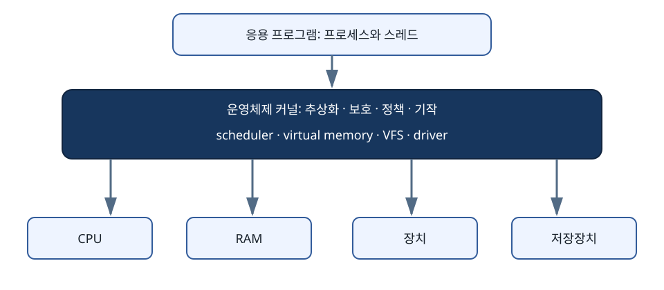

# 운영체제 공통 원리: 자원, 동시성, 가상화, 지속성

운영체제는 실행 중인 프로그램에 CPU 시간을 배정하고, 메모리와 파일을 관리하며, 프로그램 사이의 접근을 보호한다. 이 책은 그 동작을 작은 시간표·주소 계산·공유 변수·저장 순서로 따라간다. Linux, xv6, Windows, BSD와 가상머신을 볼 때 공통 질문을 세우는 것이 목표다. Linux의 구체적인 구현은 [Linux·커널 교재](../../linux/learning/linux-kernel/README.md)와 이어 읽는다.

## 선수 지식

- 2진수와 16진수를 천천히 변환할 수 있다.
- 변수, 함수, 조건문, 반복문의 뜻을 안다.
- CPU, RAM, 저장장치가 서로 다른 자원임을 안다.
- Python 실행 경험은 없어도 된다. 예제는 계산 모형으로 읽을 수 있다.

기본 단어부터 필요하면 [첫 지도](../START-HERE.md), 숫자의 표현부터 필요하면 [비트와 컴퓨터의 시작](../../hardware/learning/server-hardware/00-physical-bits-to-computer.md)을 먼저 읽는다. 본문의 `instruction`은 CPU가 수행하는 명령, `register`는 CPU 내부의 작은 저장 공간, `memory`는 계산 중인 데이터를 놓는 공간을 뜻한다.

## 학습 순서

1. [운영체제가 하는 일](00-what-an-os-does.md)
2. [프로세스·스레드·시스템 호출](01-processes-threads-syscalls.md)
3. [CPU 스케줄링](02-cpu-scheduling.md)
4. [동기화](03-synchronization.md)
5. [교착상태](04-deadlocks.md)
6. [주소 공간](05-address-spaces.md)
7. [페이징과 가상 메모리](06-paging-virtual-memory.md)
8. [할당과 회수](07-allocation-and-reclaim.md)
9. [I/O·파일·파일시스템](08-io-files-filesystems.md)
10. [지속성과 크래시 복구](09-persistence-crash-recovery.md)
11. [보호와 가상화](10-protection-and-virtualization.md)
12. [Linux·Kubernetes·Spark·DRA 연결](11-platform-connections.md)
13. [로컬 모형 실습](12-local-model-labs.md)
14. [종합 문제와 용어집](13-exercises-and-glossary.md)

## 이 책을 마치면 정확히 이해할 것

- 프로그램, 프로세스, 스레드, task, 주소 공간, stack의 경계를 설명한다.
- syscall, interrupt, exception, context switch가 같은 사건이 아님을 추적한다.
- RR, SJF, MLFQ를 손으로 계산하고 현재 Linux EEVDF와 혼동하지 않는다.
- lost update, lost wakeup, deadlock을 공유 상태와 시간순서로 설명한다.
- VPN, offset, page frame, TLB miss, page fault를 숫자로 계산한다.
- clean/dirty file page, anonymous page, reclaim, swap을 구분한다.
- fd에서 inode와 block I/O까지 경로를 추적한다.
- `write()` 성공, `fsync()` 성공, 디렉터리 항목 지속성, 애플리케이션 commit을 구분한다.
- namespace/cgroup/KVM과 Kubernetes/Spark/DRA가 OS 원리 위에 놓이는 위치를 설명한다.

## 그림

- [전체 지도](assets/os-map.svg)
- [프로세스 상태](assets/process-states.svg)
- [스케줄링](assets/scheduling.svg)
- [가상 메모리](assets/virtual-memory.svg)
- [동시성](assets/concurrency.svg)
- [지속성](assets/persistence.svg)

모든 SVG는 자체 제작한 개념도이며 `title`, `desc`, `role="img"`를 포함한다.

## 모형 코드

- [scheduler.py](examples/scheduler.py): FCFS, SJF, RR의 작은 결정적 계산
- [address_translation.py](examples/address_translation.py): 16-bit 주소와 256-byte page 변환

두 프로그램은 표준 라이브러리만 사용한다.
실제 OS scheduler나 MMU 성능을 검증하지 않는다.
교재의 손 계산과 프로그램 출력을 비교하는 방법은 [12장](12-local-model-labs.md)에 있다. 준비한 예제 입력에 대한 결과를 확인하며, 실제 OS의 성능이나 모든 입력에 대한 정확성을 주장하지 않는다.

## 근거

- [OSTEP 공식 저자 공개 페이지](https://pages.cs.wisc.edu/~remzi/OSTEP/)
- [MIT 6.S081/6.1810 xv6 자료](https://pdos.csail.mit.edu/6.S081/)
- [Linux kernel 문서](https://docs.kernel.org/)
- [Linux man-pages](https://man7.org/linux/man-pages/)

설명과 예제는 이 교재를 위해 새로 작성했다.
외부 교재의 문장이나 그림을 복사하지 않는다.

[통합 학습 목차](../README.md) · [첫 장 시작](00-what-an-os-does.md) · [그림 목록](assets/README.md)
