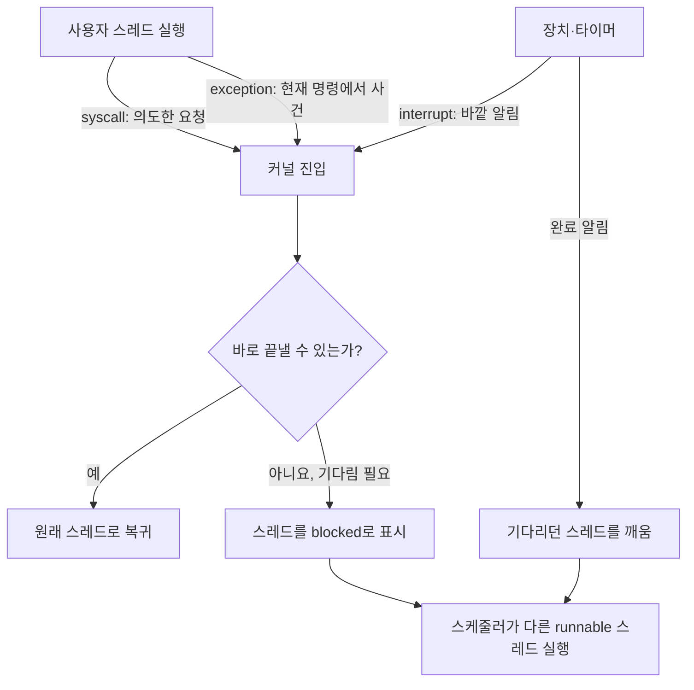
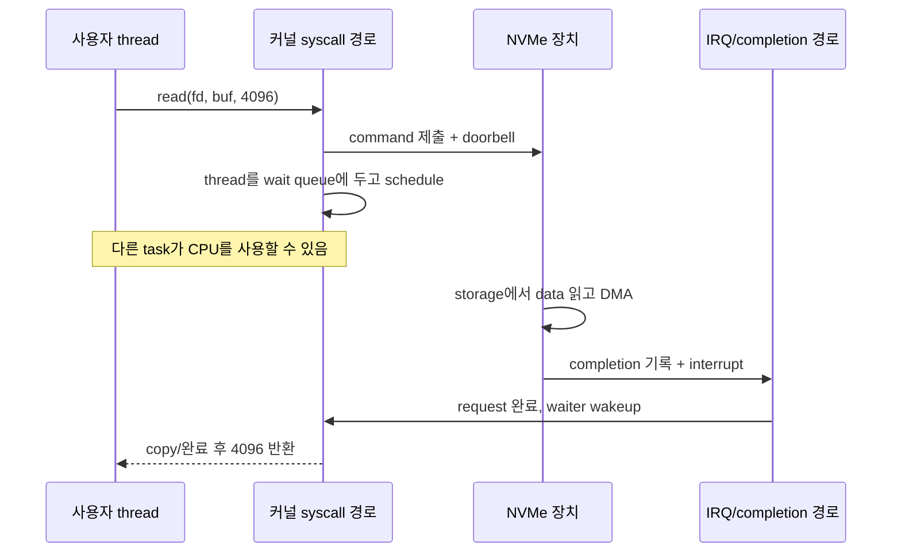

# 02. 부팅, 시스템콜, 인터럽트: 커널로 들어가는 문

이전: [운영체제는 왜 필요한가](00-why-operating-systems.md) · 다음: [스케줄링과 동시성](03-scheduling-and-concurrency.md)

보강·근거 확인일: **2026-09-22**. 이 장은 전원이 들어온 뒤 Linux가 어떻게 시작되고, 실행 중인 프로그램과 장치가 어떤 문으로 커널에 들어오는지 설명한다. CPU 아키텍처(명령과 레지스터의 기본 설계)마다 커널 진입 때 상태를 저장하는 트랩 프레임(trap frame), 처리 위치를 찾는 벡터 테이블(vector table), 높은 권한에서만 실행할 수 있는 명령이 다르다. 여기서는 공통 개념을 잡고 x86의 IDT(Interrupt Descriptor Table, 인터럽트 처리 위치 표) 같은 이름은 대표 예로만 쓴다.

### 왜 배우며, 어떤 단어부터 잡아야 하는가

컴퓨터가 켜지지 않거나 `read()`가 오래 걸릴 때는 “어느 문 앞에서 멈췄는가”를 찾아야 한다. 부팅과 실행 중 사건은 겉보기에는 달라도, 제어권이 누구에게 넘어가는지를 추적한다는 점에서 같다.

- **부팅(boot)**: 전원이 들어온 뒤 펌웨어·커널·첫 사용자 프로세스를 차례로 준비하는 과정이다.
- **시스템 호출(system call, syscall)**: 사용자 프로그램이 파일 읽기처럼 권한이 필요한 일을 커널에 요청하는 공식 입구다.
- **예외(exception)**: 현재 CPU 명령을 실행하다 생긴 사건이다. 0으로 나누기, 아직 준비되지 않은 메모리 접근 등이 예다.
- **인터럽트(interrupt)**: 장치 완료나 타이머처럼 현재 명령 흐름 바깥에서 CPU에 도착하는 알림이다.
- **사용자 모드/커널 모드(user/kernel mode)**: CPU가 허용하는 권한 수준이다. 모드 전환은 같은 스레드가 커널 코드를 실행하는 일이며, 다른 스레드로 바뀌는 **문맥 교환(context switch)**과는 다르다.
- **DMA(Direct Memory Access, 직접 메모리 접근)**: 장치가 CPU로 바이트 하나씩 복사시키지 않고 메모리와 데이터를 주고받는 기능이다.

그림의 핵심은 커널 진입과 문맥 교환이 같은 사건이 아니라는 점이다. 짧은 시스템 호출은 같은 스레드로 바로 돌아올 수 있고, I/O를 기다려야 할 때에야 그 스레드가 잠들고 다른 스레드가 실행될 수 있다.

## 1. reset에서 PID 1까지 한 줄 지도

서버가 켜지면 처음부터 Linux가 실행되는 것이 아니다. 매우 단순화하면 흐름은 다음과 같다.

~~~text
전원/리셋
  → CPU가 firmware의 초기 코드 실행
  → UEFI firmware가 하드웨어와 부팅 항목 준비
  → bootloader 또는 EFI stub가 Linux kernel image와 initramfs 로드
  → kernel decompression과 초기화
  → initramfs에서 early userspace 실행
  → 실제 root filesystem 발견·마운트
  → PID 1 실행
  → systemd 같은 init system이 서비스 시작
~~~

이 순서는 모든 장비에서 같은 파일명과 같은 화면으로 보인다는 뜻이 아니다. firmware 설정, Secure Boot, bootloader, initramfs 생성 도구, root filesystem 위치, 배포판 정책에 따라 달라진다. 그래도 “firmware → loader → kernel → early userspace → real root → PID 1”이라는 뼈대는 Linux 장애 분석에서 자주 반복된다.

## 2. UEFI는 운영체제 이전의 표준 실행 환경이다

**UEFI(Unified Extensible Firmware Interface)**는 운영체제가 시작되기 전 firmware와 OS loader가 상호작용하는 인터페이스를 정의한다. UEFI specification은 boot services와 runtime services, configuration table, image loading 같은 개념을 제공한다. boot services는 OS loader가 플랫폼을 조사하고 장치를 사용해 커널을 불러오는 동안 쓴다. OS loader가 충분히 준비되면 `ExitBootServices()`로 firmware의 boot services 소유권을 내려놓고 운영체제가 계속 진행한다.

**bootloader**는 커널 이미지를 메모리에 올리고, kernel command line과 initramfs 위치 같은 정보를 넘긴다. GRUB 같은 전통적 bootloader가 있을 수도 있고, Linux EFI stub를 통해 커널 이미지 자체가 UEFI application처럼 로드될 수도 있다.

## 3. initramfs는 진짜 root로 가기 위한 임시 작업장이다

**initramfs**는 kernel image와 함께 로드되는 초기 root filesystem 역할의 cpio archive다. kernel.org의 ramfs/rootfs/initramfs 문서는 initramfs가 boot 과정에서 압축 해제되어 early userspace를 제공한다고 설명한다.

왜 필요할까? 실제 root filesystem이 LUKS 암호화 볼륨, LVM, RAID, iSCSI, NVMe over Fabrics, 특정 driver module 뒤에 있을 수 있기 때문이다. 커널이 모든 환경을 처음부터 built-in으로 알 수 없으므로, initramfs가 필요한 module과 도구를 갖고 실제 root를 찾는다.

손으로 추적하면 다음과 같다.

~~~text
kernel: 내장 rootfs 위에 initramfs 압축 해제
kernel: /init 실행
/init: 필요한 module 로드, 장치 발견 대기, root device 찾기
/init: 실제 root filesystem을 /sysroot 같은 위치에 mount
/init: switch_root 또는 pivot_root 계열 절차로 실제 root로 이동
kernel/userspace: 새 root의 /sbin/init 또는 systemd가 PID 1 역할 수행
~~~

오개념: initramfs는 “작은 Linux 배포판”일 수 있지만 영구 운영 환경은 아니다. 보통 부팅을 완료하기 위한 임시 구조다.

## 4. PID 1은 첫 user space 프로세스이자 특별한 책임을 가진다

Linux가 user space로 넘어가면 처음 실행되는 일반 프로세스가 PID 1이다. 현대 배포판에서는 대개 systemd가 PID 1이다. PID 1은 서비스를 시작할 뿐 아니라 고아 프로세스 수거, shutdown 처리, service supervision 등 특별한 역할을 맡는다.

커널이 부팅에 성공했는데 root filesystem이 없거나 PID 1 실행에 실패하면 “커널은 살았지만 시스템은 usable state에 못 갔다”가 된다. 부팅 장애를 볼 때 kernel panic, initramfs shell, emergency target, normal multi-user target을 구분해야 한다.

## 5. 커널로 들어가는 세 문: syscall, exception, interrupt

실행 중인 CPU가 커널 코드로 들어오는 대표 경로는 세 가지다.

| 경로 | 누가 원인인가? | 예 | 동기/비동기 |
| --- | --- | --- | --- |
| system call | user program이 요청 | `read`, `write`, `mmap`, `clone` | 현재 instruction 흐름과 동기 |
| exception/fault/trap | CPU가 instruction 실행 중 발견 | page fault, divide by zero, breakpoint | 대체로 현재 instruction과 동기 |
| interrupt | 외부 장치나 timer가 알림 | NIC packet, NVMe completion, timer tick | 비동기 |

MIT xv6 교재는 trap을 system call, exception, device interrupt를 포괄하는 일반 용어로 사용한다. Linux와 특정 architecture 문서에서는 용어 경계가 더 세밀하다. 중요한 것은 “왜 들어왔는가”와 “돌아가면 같은 instruction을 재시도하는가”를 나누는 것이다.

## 6. 시스템콜은 함수 호출처럼 보이지만 privilege transition이다

사용자 프로그램은 kernel memory와 device register를 직접 만질 수 없다. 대신 syscall ABI에 맞춰 번호와 인자를 준비하고, architecture별 syscall instruction으로 커널 진입을 요청한다.

~~~text
user mode
  1. libc wrapper가 syscall 번호와 인자를 ABI에 맞게 배치
  2. CPU instruction이 privilege level을 kernel mode로 전환
  3. kernel entry code가 register/state를 저장하고 검증 가능한 형태로 정리
  4. syscall table을 통해 구현 함수로 dispatch
  5. copy_from_user/copy_to_user 등으로 user pointer를 조심해서 접근
  6. return value 또는 -errno를 준비
  7. user mode로 복귀
~~~

**privilege transition**과 **context switch**는 같은 말이 아니다. syscall은 같은 thread가 user mode에서 kernel mode로 들어갔다가 돌아올 수 있다. context switch는 CPU가 실행 중인 task 자체를 다른 task로 바꾸는 일이다. syscall 도중 blocking I/O를 만나면 scheduler가 다른 task로 context switch할 수 있지만, syscall이 곧 context switch라는 뜻은 아니다.

### 같은 `read()` 안에서 syscall과 interrupt가 만나는 지점

syscall과 interrupt를 표로만 나누면 둘이 실제 I/O에서 어떻게 이어지는지 놓치기 쉽다. NVMe에서 4KiB를 읽는 상황을 시간축에 놓아 보자. 숫자는 구조를 설명하기 위한 예이며 장치별 지연 보장은 아니다.

각 단계의 주체를 분리한다.

| 시점 | 주체 | 사건 | syscall인가, interrupt인가 |
|---:|---|---|---|
| t0 | 사용자 thread | `read()` wrapper가 번호·인자를 register에 둠 | syscall 준비 |
| t1 | 같은 thread | syscall instruction으로 kernel mode 진입 | 동기 syscall entry |
| t2 | kernel/driver | queue에 command를 쓰고 MMIO doorbell | syscall을 처리하는 kernel code |
| t3 | scheduler | 현재 thread가 data를 기다리며 sleep, 다른 task 실행 | 필요하면 context switch |
| t4 | NVMe | DMA로 지정 RAM buffer에 4KiB 기록 | CPU instruction 흐름 밖의 장치 동작 |
| t5 | 장치/CPU | 장치가 completion을 기록하고 IRQ 알림 | 비동기 interrupt entry |
| t6 | kernel | 완료 처리 후 wait queue의 thread를 runnable로 바꿈 | interrupt/deferred work |
| t7 | scheduler/thread | 다시 선택된 thread가 syscall의 남은 경로를 마치고 복귀 | syscall return |

예를 들어 t0부터 t7까지 120µs가 걸렸고 CPU가 이 thread의 kernel code를 실제로 실행한 합계가 8µs라면, 나머지 약 112µs는 전부 “CPU가 read 코드를 실행한 시간”이 아니다. 장치, queue, sleep, scheduler 대기가 섞여 있다. 그래서 `strace`의 syscall 경과 시간만 보고 커널이 120µs 동안 CPU를 계속 썼다고 해석하면 안 된다.

여기서 interrupt가 현재 `read()`를 호출한 바로 그 CPU에 들어온다고 보장되지 않는다. MSI-X affinity, queue 배치, polling 여부에 따라 다른 CPU가 completion을 처리하고 원래 thread를 깨울 수 있다. 또 빠른 장치와 polling 구성에서는 매 요청마다 interrupt를 받지 않을 수 있다. 반례로 page cache hit인 regular-file `read()`는 장치 command나 interrupt 없이 syscall 안에서 data를 복사해 바로 끝날 수 있다.

“syscall이면 동기, interrupt이면 비동기”라는 문장도 API 의미와 진입 원인을 섞는다. blocking `read()` API는 호출자 관점에서 동기지만 내부 완료는 비동기 interrupt로 올 수 있다. 반대로 timer interrupt가 깨운 thread가 나중에 실행되는 시점은 scheduler가 정한다. 원인을 찾을 때는 **누가 커널에 들어왔는가 → 현재 thread가 계속 실행 가능한가 → 완료를 누가 알려 주는가 → 어느 thread를 깨우는가** 순서로 본다.

## 7. fault와 interrupt를 헷갈리면 page fault를 오해한다

**page fault**는 이름에 fault가 들어가지만 항상 “오류”가 아니다. 사용자가 처음 만지는 anonymous page에 대해 커널이 demand-zero page를 할당하는 정상 경로일 수 있다. 파일을 `mmap()`한 뒤 처음 읽을 때 해당 file page를 page cache에서 가져오거나 디스크에서 읽는 경로일 수도 있다.

반면 장치 인터럽트(device interrupt)는 현재 실행 중인 사용자 명령과 직접 관계가 없을 수 있다. 네트워크 카드(NIC)가 패킷 수신을 알릴 때 CPU는 전혀 다른 프로세스를 실행 중일 수 있다. 커널은 인터럽트 처리기에서 최소한의 일만 하고 나머지는 뒤의 지연 처리 경로로 미룬다. 구체적인 방식의 뜻과 실행 주체는 10절에서 처음부터 나눈다.

## 8. vector table과 IDT는 “어디로 뛸지” 찾는 표다

CPU는 사건이 생겼을 때 임의의 커널 함수 이름을 문자열로 찾아가지 않는다. architecture는 사건 번호와 handler 주소를 연결하는 표를 둔다. x86에서는 **IDT(Interrupt Descriptor Table)**라는 개념이 대표적이다. 다른 architecture는 다른 이름과 구조를 쓴다.

핵심은 다음 세 가지다.

| 단계 | 하는 일 |
| --- | --- |
| hardware entry | CPU가 privilege, stack, 일부 register/state 전환 |
| low-level entry code | 커널이 나머지 상태 저장, C 코드가 다룰 형태로 정리 |
| high-level handler | syscall dispatch, page fault 처리, IRQ 처리 등 실제 판단 |

아키텍처 일반화의 함정은 여기서 생긴다. “IDT가 있다”는 x86 중심 표현이고, 모든 CPU가 IDT라는 이름을 쓰지 않는다. 하지만 “사건 번호에서 handler로 가는 공식 진입표가 있다”는 모델은 유용하다.

## 9. DMA, MMIO, driver queue는 장치 I/O의 기본 단어다

장치는 CPU가 byte를 하나씩 손으로 옮겨 주기만 기다리지 않는다.

| 용어 | 뜻 | 예 |
| --- | --- | --- |
| MMIO | device register를 memory address처럼 보이는 영역에 매핑 | NIC queue doorbell register에 쓰기 |
| DMA | device가 system memory와 직접 data transfer | NVMe가 read data를 RAM buffer에 채움 |
| descriptor ring/queue | driver와 device가 작업 항목을 주고받는 원형/큐 구조 | NIC RX/TX ring, NVMe submission/completion queue |
| interrupt/completion | device가 작업 완료나 새 data를 알림 | NVMe completion interrupt |

흐름은 보통 이렇다.

~~~text
driver가 DMA 가능한 buffer 준비
driver가 device queue에 descriptor 제출
driver가 MMIO register에 doorbell write
device가 DMA로 memory 읽기/쓰기
device가 completion queue에 결과 기록
device가 interrupt 발생
kernel interrupt path가 completion을 처리하고 대기 task를 깨움
~~~

DMA는 강력하지만 위험하다. 장치가 잘못된 주소에 DMA하면 커널이나 다른 프로세스 메모리를 망가뜨릴 수 있다. **IOMMU(Input-Output Memory Management Unit, 입출력 주소 변환 장치)**는 장치가 사용하는 주소를 실제 메모리 주소로 변환하고 접근 범위를 제한한다. **DMA 매핑(mapping)**은 드라이버가 “이 버퍼를 이 방향의 장치 전송에 사용한다”고 커널에 등록해 장치가 쓸 주소와 일관성 규칙을 얻는 과정이다. CPU 포인터 값을 그대로 장치에 넘긴다는 뜻이 아니다.

## 10. 인터럽트 일을 “즉시”와 “나중”으로 나누는 이유

장치 인터럽트가 들어온 순간의 **하드 IRQ 문맥(hard IRQ context)**에서는 현재 실행 중이던 코드가 중단돼 있다. 여기서 오래 머물면 같은 CPU의 다른 작업과 추가 인터럽트 처리가 늦어진다. 반면 장치가 보낸 원인을 확인하거나 인터럽트를 확인했다는 **acknowledge(ack, 수신 확인)**를 하지 않으면 장치가 계속 알림을 보내거나 다음 작업을 진행하지 못할 수 있다. 그래서 꼭 필요한 일만 즉시 처리하고, 오래 걸릴 일은 나중 실행 경로로 넘긴다.

전통적으로 즉시 처리 부분을 **top half(상반부)**, 미룬 부분을 **bottom half(하반부)**라고 부른다. 이는 설계 개념이고, 현재 Linux의 구체적인 실행 수단은 다음처럼 나뉜다.

| 실행 방식 | 누가 실행하는가 | 잠들 수 있는가 | 대표 역할 |
| --- | --- | --- | --- |
| hard IRQ handler(하드 인터럽트 처리기) | 인터럽트가 끊어 들어온 CPU가 즉시 실행 | 아니요 | 원인 확인, 장치 ack, 완료 정보 최소 수거, 후속 작업 예약 |
| softirq(소프트 인터럽트) | 커널의 지연 처리 경로가 CPU별로 실행 | 일반적으로 잠드는 코드를 쓰지 않음 | 네트워크 수신처럼 양이 많고 빠른 후속 처리 |
| workqueue(작업 대기열) | 커널 워커 스레드가 스케줄되어 실행 | 예 | 잠금 대기나 메모리 할당처럼 sleep 가능한 후속 작업 |
| threaded IRQ(스레드형 인터럽트) | 해당 인터럽트용 커널 스레드가 실행 | 예 | 긴 장치 처리를 스케줄 가능한 문맥으로 이동 |

여기서 **문맥(context)**은 “지금 어떤 실행 규칙과 권한 아래에서 코드가 도는가”를 뜻한다. 하드 IRQ 문맥은 일반 프로세스 문맥과 달리 잠들 수 없고, workqueue와 threaded IRQ는 커널 스레드 문맥이라 스케줄러가 다룰 수 있다.

사건 흐름은 `장치 인터럽트 → hard IRQ에서 원인 확인·ack → softirq/workqueue/threaded IRQ 중 알맞은 경로 예약 → 미룬 작업 수행 → 기다리던 task 깨움`으로 읽는다. 모든 드라이버가 모든 단계를 쓰는 것은 아니다.

**PREEMPT_RT(실시간 선점 설정)**는 커널의 긴 비선점 구간을 줄여 최악 지연을 낮추려는 구성이다. 이 구성에서는 많은 인터럽트 처리가 스레드화되고 softirq 실행 방식도 일반 커널과 달라질 수 있다. 따라서 “softirq는 언제나 선점 불가”처럼 설정을 무시한 문장은 피한다. kernel.org generic IRQ 문서는 드라이버가 `request_threaded_irq()`로 인터럽트와 스레드 처리 함수를 등록하는 방식을 설명한다.

## 11. 손으로 추적하는 예: `read()`가 blocking 되는 순간

프로그램이 pipe에서 읽는데 아직 data가 없다고 하자.

~~~text
1. user program이 read(fd, buf, 4096) 호출
2. libc wrapper가 read syscall 진입
3. kernel이 fd table에서 file object를 찾음
4. pipe buffer가 비어 있음을 확인
5. nonblocking이 아니므로 현재 task state를 sleeping 계열로 바꾸고 wait queue에 등록
6. scheduler가 다른 runnable task로 context switch
7. 다른 task가 pipe에 write
8. kernel이 wait queue의 reader를 wake up
9. reader가 다시 runnable이 되고 scheduler가 선택하면 read syscall 계속 진행
10. data를 user buffer로 copy하고 user mode로 return
~~~

이 예에서 syscall 진입은 privilege transition이고, 6단계에서 실제 context switch가 일어난다. 두 사건을 분리해야 perf trace, strace, scheduler latency를 해석할 수 있다.

## 12. 안전한 관찰 실습

아래 명령은 host 설정을 바꾸지 않고 현재 shell에서 시스템콜이 user/kernel 경계를 지난다는 감각만 확인한다. `strace`가 없는 환경도 있으므로 필수 실습은 Python 표준 라이브러리만 쓴다.

~~~bash
python3 - <<'PY'
import os
r, w = os.pipe()
os.write(w, b"kernel boundary\n")
print(os.read(r, 1024).decode().strip())
os.close(r)
os.close(w)
PY
~~~

해석: Python 함수처럼 보이지만 `os.pipe`, `os.write`, `os.read`, `os.close`는 내부에서 운영체제 서비스를 요청한다. 출력 문자열 자체보다 중요한 것은 “파일 디스크립터라는 정수 핸들을 통해 커널 객체를 다룬다”는 점이다.

## 13. 오개념 정리

| 오개념 | 바로잡기 |
| --- | --- |
| 부팅은 BIOS/UEFI가 Linux를 끝까지 실행하는 일이다 | firmware는 loader와 초기 환경을 제공하고, 어느 시점부터 kernel이 플랫폼을 소유한다. |
| syscall은 항상 context switch다 | 같은 task가 kernel mode로 들어갔다 돌아올 수 있다. blocking이나 preemption이 있어야 다른 task로 바뀐다. |
| page fault는 항상 crash다 | demand paging, COW, mmap 로딩의 정상 경로일 수 있다. |
| interrupt handler에서 오래 일해도 된다 | 긴 작업은 보통 미뤄야 latency와 interrupt masking을 줄인다. |
| DMA는 CPU보다 안전하다 | 잘못된 DMA는 더 위험할 수 있어 IOMMU와 mapping 규칙이 필요하다. |

## 14. 해설 문제

1. `open()` syscall 중 disk I/O가 항상 발생하는가?
   - 아니다. pathname lookup이 dcache/inode cache에서 해결될 수 있다. 권한 검사와 file object 생성은 필요하지만 data block read가 항상 필요한 것은 아니다.

2. timer interrupt가 왜 time-sharing에 필요한가?
   - 실행 중인 task가 자발적으로 CPU를 내놓지 않아도 kernel이 주기적으로 제어권을 회복해 scheduler를 실행할 수 있기 때문이다.

3. NVMe read에서 completion interrupt가 오면 data는 interrupt payload 안에 들어오는가?
   - 보통 아니다. data는 DMA로 memory buffer에 들어가고, interrupt/completion은 작업 완료와 상태를 알린다.

## 15. 1차 참고 자료

- UEFI Forum: [UEFI Specification 2.10 Boot Services](https://uefi.org/specs/UEFI/2.10/07_Services_Boot_Services.html), [UEFI Overview](https://uefi.org/specs/UEFI/2.10/02_Overview.html)
- Linux Kernel Documentation: [Ramfs, rootfs and initramfs](https://docs.kernel.org/filesystems/ramfs-rootfs-initramfs.html), [Generic IRQ handling](https://docs.kernel.org/core-api/genericirq.html), [Real-time differences](https://docs.kernel.org/core-api/real-time/differences.html)
- Linux man-pages: [syscalls(2)](https://man7.org/linux/man-pages/man2/syscalls.2.html), [syscall(2)](https://man7.org/linux/man-pages/man2/syscall.2.html)
- MIT PDOS xv6 book: [Traps and system calls](https://mit-pdos.github.io/xv6-riscv-book/trap.html)
