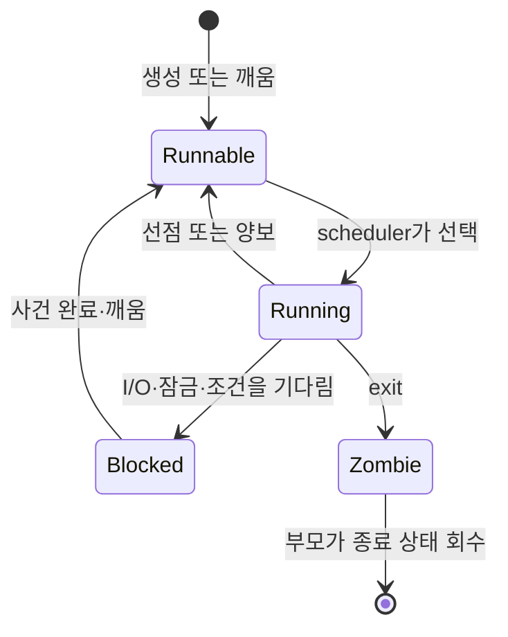

# 03. 스케줄링과 동시성: 누가 언제 실행되고, 왜 꼬이는가

이전: [부팅·시스템콜·인터럽트](02-boot-syscalls-and-interrupts.md) · 다음: [가상 메모리와 reclaim](04-virtual-memory-and-reclaim.md)

보강·근거 확인일: **2026-09-22**. Linux 스케줄러는 버전에 따라 세부 정책이 바뀐다. 이 장은 개념을 먼저 세우고, 최신 kernel.org 문서가 설명하는 **EEVDF(Earliest Eligible Virtual Deadline First, 실행 자격이 있는 작업 중 가상 마감 시각이 빠른 것을 우선하는 정책)** 흐름을 기준으로 한다. 과거의 대표 공정 스케줄러인 **CFS(Completely Fair Scheduler)**만 알면 된다는 설명은 현재 커널을 읽을 때 부족하다.

### 먼저 알아둘 말: 실행 순서와 공유 데이터는 다른 문제다

이 장은 두 질문을 함께 다룬다. **스케줄링**은 “다음에 누가 CPU를 쓰는가”, **동시성 제어**는 “여러 실행 흐름이 같은 데이터를 만질 때 어떻게 일관성을 지키는가”의 문제다.

- **스케줄러(scheduler, 실행 순서 선택기)**: 실행할 준비가 된 스레드 가운데 다음 CPU 사용자를 고르는 커널 구성요소다.
- **실행 대기열(run queue)**: 특정 CPU에서 실행할 수 있는 작업을 관리하는 커널 자료구조다. 단순한 선착순 줄 하나라고 생각하면 안 된다.
- **시간 할당량(time slice)**: 한 작업이 계속 실행할 수 있도록 배정받은 시간이라는 학습용 표현이다. 실제 정책은 고정 조각만 반복하는 것보다 더 복잡하다.
- **선점(preemption)**: 실행 중인 작업이 스스로 양보하지 않아도 커널이 멈추고 다른 작업에 CPU를 줄 수 있는 능력이다.
- **경쟁 상태(race condition)**: 여러 실행 흐름의 순서에 따라 결과가 달라지는 잘못된 상태다.
- **원자 연산(atomic operation)**: 다른 실행 흐름이 중간 상태를 볼 수 없도록 하나의 단위처럼 완료되는 연산이다.
- **뮤텍스(mutex, 상호 배제 잠금)**: 한 번에 한 실행 흐름만 공유 구역에 들어가도록 하고, 못 들어간 흐름은 기다리게 하는 도구다.
- **RCU(Read-Copy-Update)**: 읽는 쪽을 가볍게 하고, 갱신 쪽이 새 버전을 게시한 뒤 이전 독자가 끝날 때까지 폐기를 미루는 커널 동기화 방식이다.



여기서 `runnable`은 “지금 실행 중”이 아니라 “CPU만 주어지면 실행할 수 있음”이다. 부하가 높을 때 runnable 작업이 늘어나는 것과 I/O를 기다려 blocked 작업이 늘어나는 것은 원인도 해결책도 다르다.

## 1. 스케줄러는 CPU 시간을 나누는 정책 엔진이다

**task**는 Linux scheduler가 다루는 실행 단위다. user 입장에서는 process와 thread를 구분하지만, kernel 내부에서는 `task_struct`가 핵심 단위다. 여러 thread는 주소 공간을 공유할 수 있지만, scheduler는 각각을 독립적으로 실행 가능한 단위로 본다.

task 상태를 단순화하면 다음과 같다.

| 상태 | 뜻 | 예 |
| --- | --- | --- |
| running | 지금 CPU에서 실행 중 | 현재 core에서 명령 실행 |
| runnable | 실행 가능하지만 CPU를 기다림 | run queue에서 선택 대기 |
| blocked/sleeping | 어떤 사건을 기다려 실행 불가 | pipe data, disk I/O, mutex |
| stopped/traced | signal/debugger 등으로 멈춤 | `SIGSTOP`, ptrace |
| zombie | 종료했지만 부모가 status를 수거하지 않음 | PID와 exit status만 남음 |

스케줄러는 blocked task를 억지로 실행하지 않는다. 실행할 일이 없는 task에 CPU를 주면 아무 것도 못 하고 다시 잠들 뿐이다. 그래서 성능 분석에서 “CPU가 부족한가, I/O나 lock을 기다리는가”를 먼저 나눈다.

## 2. preemption은 커널이 실행 중인 task를 멈출 수 있는 능력이다

**preemption**은 현재 task가 자발적으로 양보하지 않아도 kernel이 다른 task를 실행하도록 바꿀 수 있는 능력이다. time-sharing에는 timer interrupt와 preemption이 중요하다.

하지만 preemption은 아무 때나 무한정 가능한 것이 아니다. kernel 내부에는 spinlock 보유, interrupt disabled 구간, architecture entry/exit code처럼 preemption을 제한해야 하는 구간이 있다. RCU read-side critical section은 설정에 따라 설명을 조심해야 한다. 오래된 non-preemptible RCU 모델에서는 reader가 preempt되지 않는다는 감각이 중요했지만, `CONFIG_PREEMPT_RCU`가 켜진 커널에서는 RCU reader가 preempt될 수 있다. 이때 핵심 보장은 “preemption 금지”가 아니라 grace period가 그런 reader를 추적해, reader가 참조할 수 있는 객체의 lifetime을 보호한다는 점이다. PREEMPT_RT 같은 설정은 많은 interrupt 처리와 lock 동작을 thread화해 latency를 줄이지만, 모든 제약이 사라지는 것은 아니다.

**context switch** 비용은 단순히 register 저장 몇 개가 아니다.

| 비용 | 설명 |
| --- | --- |
| register/state 저장 | CPU register, FPU/SIMD state 등 |
| cache locality 손실 | 이전 task의 hot data가 cache에서 밀릴 수 있음 |
| TLB 영향 | 주소 공간이 바뀌면 translation cache 영향 |
| scheduler bookkeeping | run queue update, accounting |
| lock/cacheline 이동 | multi-core에서 공유 자료구조 cacheline bounce |

따라서 “context switch가 많다”는 말은 CPU 시간을 직접 많이 쓴다는 뜻도 있지만, cache와 TLB 효율을 낮춘다는 뜻도 된다.

## 3. nice, priority, cgroup quota는 서로 다른 조절 장치다

| 장치 | 무엇을 조절하나 | 직관 |
| --- | --- | --- |
| nice | 일반 task 사이의 상대적 가중치 | “덜 중요한 일은 양보” |
| real-time priority | RT scheduling class 안의 우선순위 | “deadline/latency가 중요한 일” |
| cgroup CPU weight | group 사이의 상대적 비율 | “서비스 A와 B의 몫” |
| cgroup CPU quota | 일정 기간에 쓸 수 있는 최대 CPU 시간 | “이 group은 100ms 중 40ms까지만” |
| CPU affinity | 실행 가능한 CPU 집합 | “이 task는 이 core들에서만” |

nice가 낮다고 항상 즉시 실행되는 것은 아니다. task가 blocked이면 priority와 무관하게 실행할 수 없다. cgroup quota가 차면 group 안 task가 runnable이어도 throttling될 수 있다. Kubernetes에서 CPU limit을 걸었을 때 latency가 튀는 이유 중 하나가 이 quota throttling이다.

## 4. EEVDF: lag와 virtual deadline으로 공정성과 반응성을 맞춘다

kernel.org EEVDF 문서는 Linux가 6.6부터 fair scheduling class에서 EEVDF로 전환하기 시작했다고 설명한다. EEVDF는 **Earliest Eligible Virtual Deadline First**의 약자다. 목표는 fair class의 runnable task 사이에서 공정하게 CPU 시간을 나누면서, latency-sensitive task가 너무 늦게 반응하지 않도록 하는 것이다. 이는 real-time scheduling class, deadline scheduling class, cgroup quota throttling 문제를 대신 해결하는 만능 정책이 아니다. RT/deadline task 선택과 cgroup bandwidth 제한은 별도 규칙으로 이해해야 한다.

아주 단순화한 모델은 다음과 같다.

| 개념 | 뜻 |
| --- | --- |
| virtual runtime | task가 받은 CPU 시간을 가중치로 보정한 값 |
| lag | task가 공정한 몫보다 덜 받았는지 더 받았는지 나타내는 값 |
| eligible | 현재 실행 후보가 될 수 있음 |
| virtual deadline | 선택 우선순위를 정하기 위한 가상의 마감 시각 |

EEVDF는 lag가 0 이상인 eligible task 중 virtual deadline이 가장 이른 task를 고르는 식의 모델로 설명할 수 있다. 짧은 slice를 요청한 latency-sensitive task는 더 이른 virtual deadline을 받아 반응성이 좋아질 수 있다.

손계산 예시는 교육용 단순화다.

~~~text
두 task A, B의 weight가 같고 둘 다 runnable이다.
공정한 몫은 50:50이다.

처음 10ms 동안 A만 실행됐다.
  A: 몫보다 5ms 더 받음 → lag 음수 방향
  B: 몫보다 5ms 덜 받음 → lag 양수 방향

다음 선택에서 B가 eligible이면 B가 CPU를 받을 가능성이 커진다.
~~~

실제 kernel 코드는 run queue, entity, vruntime, lag decay, slice request, cgroup 계층 등을 포함한다. 핵심은 “가장 오래 기다린 task를 단순 FIFO로 고른다”가 아니라, 가중치와 가상 시간으로 공정성을 계산한다는 점이다.

## 5. race condition은 결과가 실행 순서에 따라 달라지는 버그다

가장 작은 예는 `counter++`다. 한 줄처럼 보이지만 CPU 수준에서는 보통 load, add, store로 쪼개진다.

~~~text
초기 counter = 0

Thread A: load counter → 0
Thread B: load counter → 0
Thread A: add 1 → 1
Thread B: add 1 → 1
Thread A: store 1
Thread B: store 1

기대: 2
실제: 1
~~~

이것이 **lost update**다. “Python, Java, C에서 한 줄이라 괜찮다”는 일반화는 위험하다. 언어마다 memory model과 atomicity 보장이 다르고, kernel C 코드는 더 직접적으로 CPU와 compiler reorder 영향을 받는다.

## 6. atomic, mutex, spinlock, semaphore, condition variable, futex

동시성 도구는 목적이 다르다.

| 도구 | 핵심 의미 | 잠들 수 있나 | 적합한 경우 |
| --- | --- | --- | --- |
| atomic operation | 한 memory 위치의 read-modify-write를 쪼개지 않음 | 보통 아님 | counter, flag, reference count |
| mutex | 한 번에 한 thread만 critical section 진입 | 예 | user space와 kernel sleep 가능한 context |
| spinlock | lock이 풀릴 때까지 CPU에서 바쁘게 대기 | 아니오 | 매우 짧은 kernel critical section |
| semaphore | N개의 허가증을 관리 | 예 | 제한된 동시성, resource count |
| condition variable | 조건이 될 때까지 기다림 | 예 | “queue가 비어 있지 않다” 같은 predicate |
| futex | user space lock의 느린 경로를 kernel이 sleep/wake로 지원 | 예 | pthread mutex/condvar의 기반 |

futex는 “빠른 userspace mutex”에서 온 이름이지만, 직접 쓰는 저수준 syscall이다. man-pages는 futex를 higher-level lock을 만들기 위한 building block으로 설명한다. 일반 개발자는 보통 pthread mutex나 runtime lock을 사용하고, container runtime이나 libc 구현처럼 낮은 층에서 futex를 직접 다룬다.

### futex 기반 mutex의 빠른 길과 느린 길을 추적하기

futex를 “빠른 user space mutex”라고만 외우면 언제 syscall이 필요한지 알 수 없다. 교육용 mutex word를 `0=unlocked`, `1=locked/no known waiter`, `2=locked/possibly waiting`으로 단순화하자. 실제 pthread 구현의 bit 배치와 상태는 libc와 mutex 종류에 따라 다르다.

경쟁이 없을 때 thread A는 atomic compare-and-swap(CAS)으로 `0 → 1`을 시도한다.

```text
초기 word = 0
A: CAS(0, 1) 성공 → critical section 진입
A: atomic store/release로 word = 0 → 종료
```

이 경로에는 futex syscall이 없다. lock의 공유 상태는 user memory에 있고 CPU atomic instruction만으로 소유권을 얻고 놓는다. “futex mutex를 쓸 때마다 kernel이 lock을 관리한다”는 설명은 틀리다.

이제 A가 lock을 잡은 동안 B가 온다.

| 순서 | thread A | thread B | kernel/wait queue |
|---:|---|---|---|
| 1 | word를 1로 바꾸고 critical section 실행 | 아직 실행 전 | 관여 없음 |
| 2 | 계속 공유 data 수정 | CAS 실패, word가 0이 아님을 확인 | 관여 없음 |
| 3 | 계속 실행 | waiter 상태를 표시하고 `futex_wait(addr, expected)` 진입 | 값이 expected인지 다시 확인 |
| 4 | 실행 완료 | 값이 그대로면 sleep | B를 해당 futex key의 wait queue에 둠 |
| 5 | unlock하며 waiter 가능성을 봄 | sleeping | A의 `futex_wake`가 waiter를 깨움 |
| 6 | 다른 일을 진행 | runnable이 된 뒤 다시 lock 획득을 경쟁 | wake는 lock 소유권 자체를 주지 않음 |

kernel이 3단계에서 값을 다시 확인하는 이유가 중요하다. B가 user space에서 locked를 확인한 직후, syscall에 들어가기 전에 A가 unlock할 수 있다. 커널이 expected 값 검사를 하지 않고 B를 재우면 이미 끝난 wake를 놓치는 lost wakeup이 된다. 값이 달라졌다면 wait는 잠들지 않고 돌아가며 B는 조건을 다시 검사한다.

작은 비용 비교를 하자. 한 thread가 100만 번 mutex를 얻는데 99.9%가 uncontended라면 fast path는 약 999,000번이고 경쟁 때문에 kernel wait 후보가 되는 횟수는 약 1,000번이다. 실제 syscall 수는 spin, adaptive mutex, wake 결합에 따라 달라지지만 왜 user-space fast path가 중요한지는 보인다.

예상 결과는 경쟁이 거의 없을 때 mutex 사용량이 많아도 futex syscall 수가 낮을 수 있다는 것이다. 반례로 process-shared mutex는 서로 다른 프로세스의 같은 shared mapping을 futex key로 연결할 수 있지만, private anonymous 주소가 우연히 같은 숫자라는 이유로 프로세스 사이에 같은 futex가 되지는 않는다. priority inheritance mutex, robust mutex는 상태와 kernel 관여가 더 복잡하므로 이 toy state를 그대로 적용하지 않는다.

## 7. lost wakeup은 lock보다 condition이 중요하다는 교훈이다

잘못된 대기 패턴은 다음과 같다.

~~~text
Thread A:
  if queue is empty:
      sleep()

Thread B:
  enqueue item
  wake A
~~~

문제는 A가 “비어 있음”을 확인한 뒤 sleep에 들어가기 직전, B가 item을 넣고 wake를 보내면 wake가 사라질 수 있다는 점이다. A는 이미 조건이 true인데도 잠들어 버린다. 이것이 lost wakeup이다.

정석은 condition check와 wait queue 등록을 같은 lock 규칙 안에 묶고, 깨어난 뒤에도 조건을 다시 검사하는 것이다.

~~~text
lock
while queue is empty:
    atomically release lock and sleep on condition
dequeue item
unlock
~~~

`while`이 중요하다. wakeup은 조건이 참임을 영원히 보장하지 않는다. 여러 waiter가 경쟁하거나 signal/spurious wakeup이 있을 수 있으므로 깨어난 thread는 predicate를 다시 확인해야 한다.

## 8. deadlock은 기다림의 고리가 생길 때 발생한다

Coffman 조건은 deadlock을 설명하는 고전 모델이다.

| 조건 | 뜻 |
| --- | --- |
| mutual exclusion | 동시에 공유할 수 없는 자원이 있음 |
| hold and wait | 이미 가진 자원을 놓지 않은 채 다른 자원을 기다림 |
| no preemption | 남의 자원을 강제로 빼앗을 수 없음 |
| circular wait | A는 B를, B는 A를 기다리는 고리 |

실전 규칙은 단순하다. 여러 lock을 잡아야 한다면 전역 순서를 정한다.

~~~text
나쁜 예:
  Thread 1: lock A → lock B
  Thread 2: lock B → lock A

좋은 예:
  모든 경로에서 lock A → lock B 순서만 허용
~~~

Linux kernel에는 lockdep 같은 도구가 있어 lock acquisition graph를 추적해 잠재 deadlock을 찾는다. 하지만 도구가 모든 설계를 대신하지 않는다. “어떤 lock이 어떤 data invariant를 보호하는가”를 문서와 코드로 분명히 해야 한다.

## 9. RCU는 읽기가 많은 구조를 위한 다른 사고방식이다

**RCU(Read-Copy-Update)**는 read-mostly 상황에 최적화된 동기화 기법이다. 읽는 쪽은 매우 가볍게 critical section을 표시하고, 쓰는 쪽은 새 구조를 준비한 뒤 pointer를 교체하며, 이전 구조는 모든 기존 reader가 빠져나간 뒤 해제한다.

손으로 보는 흐름:

~~~text
현재 global pointer → old_table

Reader:
  rcu_read_lock()
  p = rcu_dereference(global pointer)
  p 내용 읽기
  rcu_read_unlock()

Updater:
  new_table = copy old_table and modify
  rcu_assign_pointer(global pointer, new_table)
  synchronize_rcu()
  free old_table
~~~

RCU의 핵심은 “reader와 updater가 같은 lock을 오래 잡고 싸우지 않게 한다”는 점이다. 하지만 RCU가 모든 race를 해결하지 않는다. 여러 updater끼리는 여전히 lock이나 다른 조정이 필요하다. kernel.org RCU 문서는 `rcu_assign_pointer()`가 reader를 보호하지 concurrent updater끼리의 충돌을 자동으로 막지 않는다고 강조한다.

### RCU 삭제에서 reader가 이전 객체를 잡고 있을 때

RCU 예제의 핵심은 pointer 교체보다 “이전 객체를 언제 free할 수 있는가”다. 현재 `global → old(version=7)`이고 reader R1이 old를 읽는 순간 updater가 version 8을 게시한다고 하자.

```mermaid
sequenceDiagram
    participant R1 as 기존 reader R1
    participant U as updater
    participant R2 as 새 reader R2
    R1->>R1: rcu_read_lock; p=old(v7)
    U->>U: new(v8) 복사·수정
    U->>U: global을 new(v8)로 교체
    R2->>R2: rcu_read_lock; p=new(v8)
    U->>U: synchronize_rcu에서 대기
    R1->>R1: old(v7) 읽기 완료; unlock
    U->>U: grace period 뒤 old(v7) free
```

pointer 교체 직후의 허용된 상태는 `R1은 old`, `R2는 new`다. RCU는 모든 reader가 같은 순간 같은 version을 보게 하지 않는다. 대신 R1이 이미 얻은 old가 읽는 도중 해제되지 않게 한다. 이 중첩 기간 때문에 update 직후 메모리에 old와 new가 함께 존재할 수 있다.

객체가 2MiB이고 초당 100번 갱신되며 가장 긴 pre-existing reader가 20ms 걸린다고 단순화하면, 한 grace period 동안 여러 retired version이 대기할 수 있다. 정확한 상한은 update batching과 callback 처리에 따라 달라지지만 “reader가 lock을 거의 잡지 않으니 메모리도 즉시 회수된다”는 결론은 나오지 않는다.

누가 무엇을 보장하는지 구분한다.

| 기작 | 보장하는 것 | 자동으로 보장하지 않는 것 |
|---|---|---|
| `rcu_dereference` | 게시된 pointer를 reader가 적절한 ordering으로 얻음 | 객체 필드의 임의 concurrent mutation 직렬화 |
| `rcu_assign_pointer` | 초기화된 새 객체를 적절한 ordering으로 게시 | 여러 updater 사이의 충돌 해결 |
| grace period | 기존 read-side critical section이 끝날 시간 제공 | 새 reader가 없다는 뜻 |
| `kfree_rcu`/callback | grace period 뒤 해제하도록 미룸 | 무제한 callback backlog 방지 |

반례로 객체 내부 counter를 여러 CPU가 동시에 증가시키는 문제는 pointer 수명 보호만으로 해결되지 않는다. atomic, lock, per-CPU data 같은 별도 규칙이 필요하다. 또 reader가 RCU critical section 밖으로 pointer를 저장해 두고 나중에 사용하면 grace period 뒤 use-after-free가 날 수 있다. RCU가 보호하는 범위는 해당 API가 정한 read-side lifetime 안이다.

## 10. memory ordering은 CPU와 compiler가 순서를 바꿀 수 있다는 사실에서 시작한다

single-thread 사고에서는 코드 순서가 곧 관찰 순서처럼 보인다.

~~~text
data = 42
ready = 1
~~~

하지만 multi-core에서는 다른 CPU가 `ready == 1`을 보았다고 해서 항상 `data == 42`를 안전하게 본다고 가정할 수 없다. compiler와 CPU는 성능을 위해 load/store 순서를 바꿀 수 있고, cache coherence와 store buffer가 관찰 순서를 복잡하게 만든다.

Linux kernel memory barrier 문서는 lock acquire/release, atomic acquire/release, `smp_mb()` 같은 primitive가 어떤 ordering을 보장하는지 설명한다. 초보자가 잡아야 할 첫 원칙은 이렇다.

| 원칙 | 뜻 |
| --- | --- |
| data race를 설계로 없앤다 | 가능한 lock, atomic, RCU 같은 명시 도구 사용 |
| barrier만 흩뿌리지 않는다 | 어떤 load/store 쌍을 어떤 CPU 사이에서 순서화하는지 설명 가능해야 함 |
| device I/O는 별도다 | MMIO와 DMA ordering은 일반 memory와 다른 primitive가 필요할 수 있음 |
| architecture가 강해도 의존하지 않는다 | x86에서 우연히 되는 코드가 ARM에서 깨질 수 있음 |

## 11. 안전한 관찰 실습: race를 일부러 만들기

아래 Python 예제는 multiprocessing으로 공유 값을 lock 없이 증가시킨다. CPU와 타이밍에 따라 결과가 매번 다를 수 있다. 표준 라이브러리만 쓰고 시스템 설정을 바꾸지 않는다. heredoc으로 실행하는 예제라 Python 3.14의 기본 `forkserver` start method에서는 worker 함수를 다시 import하지 못할 수 있으므로, Linux 전용 교육 예제로 `fork` context를 명시한다. macOS나 Windows용 예제가 아니다.

~~~bash
python3 - <<'PY'
import multiprocessing as mp
import sys

N = 20000

def worker(counter, loops):
    for _ in range(loops):
        counter.value += 1

def main():
    if sys.platform != "linux":
        raise SystemExit("this heredoc demo intentionally requires Linux fork")

    ctx = mp.get_context("fork")
    counter = ctx.Value('i', 0, lock=False)
    procs = [ctx.Process(target=worker, args=(counter, N)) for _ in range(4)]

    try:
        for p in procs:
            p.start()
        for p in procs:
            p.join(timeout=5)
            if p.is_alive():
                raise RuntimeError(f"child {p.pid} did not finish")
            if p.exitcode != 0:
                raise RuntimeError(f"child {p.pid} exited with {p.exitcode}")
    finally:
        for p in procs:
            if p.is_alive():
                p.terminate()
                p.join(timeout=2)

    print("expected", 4 * N, "actual", counter.value)

if __name__ == "__main__":
    main()
PY
~~~

해석: 결과가 항상 틀려야 race인 것은 아니다. 운 좋게 기대값과 같을 수도 있다. 이 예제는 실제 병렬 실행에서 lost update가 관찰될 가능성을 보여 주지만, “항상 기대값보다 작다”는 테스트로 쓰면 안 된다. race의 정의는 “가능한 실행 순서에 따라 결과가 달라진다”이다. 이 문서는 Python 3.12.3이 설치된 Linux 환경에서 위 예제가 정상 종료되는 것을 확인했다.

## 12. 오개념 정리

| 오개념 | 바로잡기 |
| --- | --- |
| runnable이면 지금 실행 중이다 | runnable은 실행 가능하다는 뜻이고 CPU를 기다릴 수 있다. |
| nice 값만 높이면 latency가 보장된다 | quota, affinity, blocking, interrupt, RT class 등 다른 요인이 있다. |
| atomic이면 모든 것이 안전하다 | 한 변수의 RMW atomicity와 전체 자료구조 invariant 보호는 다르다. |
| spinlock은 mutex보다 항상 빠르다 | 기다림이 길면 CPU를 태운다. sleep 가능한 context에서는 mutex가 맞을 수 있다. |
| wakeup은 event를 저장한다 | condition과 wait 등록을 제대로 묶지 않으면 lost wakeup이 생긴다. |
| RCU는 lock-free 만능 도구다 | reader 최적화 기법이며 updater 조정과 memory ordering 규칙이 필요하다. |

## 13. 해설 문제

1. syscall 중 task가 blocked되면 scheduler는 왜 다른 task를 고르는가?
   - 현재 task가 기다리는 사건이 해결되기 전에는 실행해도 진전이 없기 때문이다. CPU를 runnable task에 주어 전체 처리량과 반응성을 높인다.

2. cgroup quota가 latency를 악화시킬 수 있는 이유는?
   - group이 period 안에서 quota를 다 쓰면 runnable task가 있어도 throttled되어 다음 period까지 기다릴 수 있다.

3. mutex와 condition variable을 함께 쓰는 이유는?
   - condition 자체를 보호하고, wait 등록과 lock release를 원자적으로 묶어 lost wakeup을 막기 위해서다.

4. RCU update 후 바로 old object를 free하면 왜 위험한가?
   - 교체 전에 시작한 reader가 아직 old object pointer를 들고 있을 수 있다. grace period를 기다려야 한다.

## 14. 1차 참고 자료

- Linux Kernel Documentation: [EEVDF Scheduler](https://docs.kernel.org/scheduler/sched-eevdf.html), [CFS Scheduler](https://docs.kernel.org/scheduler/sched-design-CFS.html), [Completions](https://docs.kernel.org/scheduler/completion.html)
- Linux Kernel Documentation: [What is RCU?](https://docs.kernel.org/RCU/whatisRCU.html), [RCU requirements](https://docs.kernel.org/RCU/Design/Requirements/Requirements.html)
- Linux Kernel Documentation: [Linux kernel memory barriers](https://docs.kernel.org/core-api/wrappers/memory-barriers.html), [Atomic types](https://docs.kernel.org/core-api/wrappers/atomic_t.html)
- Linux man-pages: [futex(7)](https://www.man7.org/linux/man-pages/man7/futex.7.html), [futex(2)](https://www.man7.org/linux/man-pages/man2/futex.2.html)
