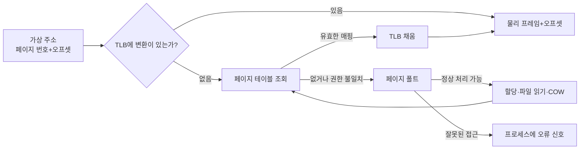
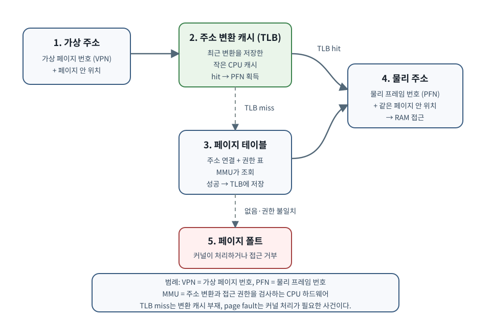
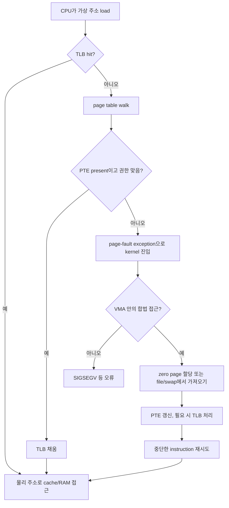

# 04. 가상 메모리와 reclaim: 주소, page, cache, 압박

이전: [스케줄링과 동시성](03-scheduling-and-concurrency.md) · 다음: [VFS·장치·I/O](05-vfs-devices-and-io.md)

보강·근거 확인일: **2026-09-22**. 이 장은 “프로세스가 메모리를 쓴다”는 말을 가상 주소, 페이지 테이블, 물리 페이지, 파일 페이지 캐시, 메모리 회수, cgroup별 자원 압박으로 나누어 설명한다. 각 영어 명칭과 역할은 바로 아래에서 함께 푼다.

### 왜 배우며, 어떤 단어부터 잡아야 하는가

메모리 문제는 “RAM이 몇 GB인가”만 봐서는 풀리지 않는다. 프로그램이 보는 주소, 실제 RAM, 파일 내용의 캐시, 회수 가능한 메모리를 서로 나눠 봐야 한다.

- **가상 주소(virtual address)**: 프로세스가 사용하는 주소다. 같은 숫자라도 프로세스가 다르면 보통 다른 메모리를 가리킨다.
- **페이지(page)**: 가상 주소 공간을 일정 크기로 나눈 관리 단위다. 많은 시스템에서 기본 크기는 4 KiB지만 항상 그런 것은 아니다.
- **페이지 프레임(page frame)**: 실제 RAM을 페이지 크기로 나눈 칸이다. 가상 페이지와 물리 프레임은 서로 다른 대상이다.
- **페이지 테이블(page table)**: 어느 가상 페이지가 어느 물리 프레임에 연결되는지와 읽기·쓰기·실행 권한을 기록한 표다.
- **TLB(Translation Lookaside Buffer, 주소 변환 캐시)**: 최근 페이지 변환 결과를 CPU 안에 보관해 페이지 테이블 조회를 줄이는 작은 캐시다.
- **페이지 폴트(page fault)**: 현재 메모리 접근을 즉시 끝낼 수 없어 CPU가 커널에 처리를 요청하는 사건이다. 정상적인 첫 접근도 포함하므로 항상 오류는 아니다.
- **익명 메모리(anonymous memory)**: 실행 중 heap·stack처럼 파일 내용을 직접 뒤에 두지 않는 메모리다.
- **회수(reclaim)**: RAM 공간을 다시 쓰기 위해 덜 필요한 페이지를 버리거나 저장소로 내보내는 과정이다.
- **스왑(swap)**: 익명 페이지 내용을 저장장치의 swap 영역에 보관했다가 필요할 때 되가져오는 메커니즘이다.





*그림 1. ① 가상 주소를 ② TLB에서 먼저 찾고, 없으면 ③ 페이지 테이블을 조회한다. 유효한 매핑은 ④ 물리 주소가 되며, 매핑이 없거나 권한이 맞지 않으면 ⑤ page fault로 커널이 처리한다. TLB miss와 page fault는 같은 말이 아니다.*

## 1. 가상 주소는 프로그램이 보는 주소다

프로그램 안에서 pointer 값 `0x7f...`를 본다고 해서 그것이 DRAM 칩의 물리 주소라는 뜻은 아니다. 대부분의 user process는 **virtual address**를 사용한다. CPU의 MMU와 kernel이 관리하는 page table이 virtual address를 physical page frame으로 변환한다.

왜 이렇게 할까?

| 목적 | 설명 |
| --- | --- |
| 격리 | 프로세스마다 자기 주소 공간을 가진 것처럼 보임 |
| 보호 | page마다 read/write/execute/user 권한을 둘 수 있음 |
| 지연 할당 | 실제 RAM은 처음 접근할 때 줄 수 있음 |
| 공유 | 같은 file page나 shared library text를 여러 process가 매핑 |
| 편의 | 큰 연속 virtual range가 물리적으로 연속일 필요 없음 |

비유하면 virtual address는 도서관 좌석 번호표와 비슷하다. 사용자는 “내 100번 자리”라고 생각하지만, 관리자는 실제 방과 책상 배치를 바꿀 수 있다. 비유의 한계는 CPU가 매 memory access마다 매우 빠른 하드웨어 변환을 수행한다는 점이다.

## 2. page와 page table: 큰 주소 공간을 작은 칸으로 나눈다

**page**는 virtual memory 관리의 기본 단위다. 많은 Linux 시스템에서 base page size는 4 KiB지만 architecture와 설정에 따라 다를 수 있다. **page table**은 virtual page number를 physical frame과 권한으로 매핑하는 자료구조다.

4 KiB page라면 offset bit는 12개다.

~~~text
page size = 4096 bytes = 2^12
virtual address = [virtual page number][12-bit offset]

예: virtual address 0x12345
page offset = 0x345
virtual page number = 0x12
~~~

64-bit 주소 공간을 단일 배열 page table로 만들면 너무 크다. 그래서 현대 시스템은 **multi-level page table**을 사용한다. 주소의 여러 bit를 단계별 index로 나눠 필요한 부분만 만든다.

교육용 4단계 예:

~~~text
virtual address bits:
  [level4 index][level3 index][level2 index][level1 index][offset]

변환:
  root page table
    → level4 entry
      → level3 table
        → level2 table
          → level1 table
            → physical frame + offset
~~~

실제 단계 수와 bit 배치는 architecture, page size, 5-level paging 여부에 따라 다르다. 원리는 “큰 sparse 주소 공간을 계층형 표로 압축한다”이다.

### 주소 하나가 TLB miss와 page fault를 거쳐 RAM에 닿는 과정

가상 주소 `0x12345`를 읽는다고 하자. 4KiB page에서 virtual page number는 `0x12`, page offset은 `0x345`다. offset은 page 안의 위치이므로 주소 변환 뒤에도 그대로 붙는다.

먼저 page가 이미 RAM에 있고 page table entry(PTE)도 present인 경우다.

```text
1. CPU가 TLB에서 virtual page 0x12를 찾는다.
2. miss이면 page-table root부터 entry를 단계별로 읽는다.
3. leaf PTE가 physical frame 0x9ab, present/readable이라고 알려 준다.
4. CPU가 TLB에 0x12 → 0x9ab 변환을 cache한다.
5. physical address = frame base 0x9ab000 + offset 0x345 = 0x9ab345
6. CPU cache/RAM 계층에서 실제 data를 읽는다.
```

이 경로의 TLB miss는 page fault가 아니다. hardware page-table walk가 성공하면 현재 process의 kernel fault handler에 들어가지 않고 instruction을 계속할 수 있다. 다만 page-table entry 자체를 읽는 동안 cache miss가 나면 여러 번의 memory access가 필요해져 느려질 수 있다.

이번에는 PTE가 non-present이고 해당 주소가 합법적인 anonymous mapping 안에 있다고 하자.



여기서 같은 load instruction이 fault 처리 뒤 재시도될 수 있다. 사용자 코드는 “load를 두 번 호출”하지 않았지만 CPU 실행 관점에서는 처음 시도가 완료되지 못했고 kernel이 조건을 만든 뒤 다시 수행한다.

작은 계산으로 page-table walk 비용을 감각화하자. 교육용 4단계 walk에서 각 단계 entry가 모두 cache miss이고 memory 접근이 각각 80ns, 마지막 data 접근도 80ns라고 단순화하면 `4 × 80ns + 80ns = 400ns`다. 실제 CPU는 page-walk cache, 여러 cache level, 병렬 실행을 사용하므로 이 수치를 성능 예측값으로 쓰면 안 된다. 목적은 TLB가 최근 변환을 보관하는 이유를 보는 것이다.

page fault도 비용이 하나가 아니다. demand-zero minor fault는 새 frame과 page table을 준비하면 되지만, file data나 swap을 storage에서 기다리는 major fault는 훨씬 오래 걸릴 수 있다. Linux 통계에서 minor/major의 정확한 분류와 storage I/O 관계는 kernel 버전과 경로를 함께 해석한다.

조건이 바뀌는 반례도 있다. huge page를 쓰면 offset bit가 늘고 같은 주소 범위를 덮는 TLB entry 수가 줄 수 있다. 반대로 권한 위반은 PTE가 존재해도 page fault를 일으킨다. Copy-on-write write fault는 “page가 RAM에 없음”이 아니라 공유 read-only mapping을 private writable page로 바꾸기 위한 정상 fault다.

## 3. TLB miss와 page fault는 다르다

**TLB(Translation Lookaside Buffer)**는 최근 virtual→physical 변환을 cache하는 CPU 내부 구조다. TLB hit이면 page table walk 없이 빠르게 주소 변환을 한다.

| 사건 | 뜻 | 커널 개입 |
| --- | --- | --- |
| TLB hit | 변환 cache에 있음 | 없음 |
| TLB miss | 변환 cache에 없음 | hardware page table walk 또는 architecture별 miss 처리 |
| page fault | page table entry가 없거나 권한이 맞지 않음 | kernel fault handler 실행 |

TLB miss는 “변환 정보를 다시 찾는 일”이고, page fault는 “현재 page table 상태로는 접근을 완료할 수 없는 일”이다. page fault가 정상 demand paging일 수도 있고, segmentation fault로 끝나는 불법 접근일 수도 있다.

## 4. demand-zero, copy-on-write, mmap

**demand-zero page**는 프로그램이 anonymous memory를 요청했지만 아직 쓰지 않은 상태에서 실제 physical page를 늦게 할당하는 방식이다. 처음 write하면 page fault가 나고 kernel이 0으로 채운 page를 붙인다.

**copy-on-write(COW)**는 fork에서 중요하다. parent와 child가 처음에는 같은 physical page를 read-only로 공유한다. 둘 중 하나가 write하면 fault가 발생하고, kernel이 page를 복사해 각자 다른 physical page를 갖게 한다.

~~~text
fork 직후:
  parent VA X ─┐
               ├─ physical page P (read-only COW)
  child  VA X ─┘

child가 write:
  parent VA X ─ physical page P
  child  VA X ─ physical page Q (P를 복사한 뒤 수정)
~~~

**mmap**은 file이나 anonymous memory를 process address space에 매핑하는 syscall이다. file-backed mmap은 파일 내용을 memory처럼 읽고 쓸 수 있게 한다. anonymous mmap은 heap과 비슷하게 file 없는 memory range를 만든다. 다만 `mmap()`의 의미는 protection과 flag에 따라 달라진다. `PROT_READ`, `PROT_WRITE`, `PROT_EXEC`는 mapping에서 허용되는 접근을 정하고, `MAP_PRIVATE`와 `MAP_SHARED`는 변경이 원본 파일과 다른 process에 어떻게 보이는지를 가른다. `MAP_PRIVATE` file mapping에 쓴 변경은 copy-on-write로 private page에 생기며 원본 파일 변경을 뜻하지 않는다. `MAP_SHARED`는 변경을 같은 mapping을 보는 다른 process와 파일에 반영할 수 있지만, 영구 저장 시점은 `msync()`, `fsync()`, filesystem, storage 계층까지 따져야 한다. man-pages `mmap(2)`는 mapping이 `fork()` 후에도 유지되고, protection과 flag로 동작이 달라짐을 설명한다.

## 5. VSS, RSS, PSS는 서로 다른 질문에 답한다

| 지표 | 질문 | 함정 |
| --- | --- | --- |
| VSS/VSZ | process가 가진 virtual address range 총량 | 실제 RAM 사용량이 아님 |
| RSS | 현재 RAM에 resident한 page 총량 | 공유 page를 각 process에 중복 계산 |
| PSS | 공유 page를 공유한 process 수로 나눠 계산 | `/proc/PID/smaps` 비용과 권한 고려 |
| USS | 혼자만 쓰는 resident page | 도구마다 계산 방식 확인 필요 |

예를 들어 100 MiB shared library text를 10개 process가 같이 쓰면 각 process RSS에는 100 MiB가 들어갈 수 있지만, PSS로는 각자 10 MiB씩 잡힌다. 그래서 “RSS 합계가 RAM보다 크다”는 말은 이상한 일이 아니다.

## 6. page cache는 파일 내용을 RAM에 보관하는 커널 cache다

Linux는 남는 RAM을 비워 두기보다 cache로 쓴다. **page cache**는 파일 내용을 page 단위로 RAM에 보관한다. 같은 파일 범위를 다시 읽으면 disk를 가지 않고 page cache에서 줄 수 있다.

쓰기에서도 page cache가 중요하다.

~~~text
write(fd, data)
  → VFS/filesystem 경로
  → page cache page에 data 복사
  → page를 dirty로 표시
  → 나중에 writeback이 storage로 밀어냄
~~~

`write()`가 성공했다고 항상 storage platter/NAND에 영구 반영되었다는 뜻은 아니다. durability는 filesystem, mount option, journal, device cache, `fsync()`, flush/FUA 같은 더 아래 계층까지 봐야 한다. 이 주제는 [VFS·장치·I/O](05-vfs-devices-and-io.md)와 데이터 시스템 기초 [Linux 읽기·쓰기](../../../kubernetes/storage/data-systems-foundations/01-linux-read-write.md)에서 이어진다.

## 7. reclaim은 RAM을 다시 쓰기 위해 page를 비우는 일이다

RAM 압박이 생기면 kernel은 page를 회수하려 한다. **reclaimable page**는 버리거나 writeback/swap 후 비울 수 있는 page다.

| page 종류 | 회수 방식 |
| --- | --- |
| clean file cache | 디스크에 원본이 있으므로 버릴 수 있음 |
| dirty file cache | 먼저 writeback 후 버릴 수 있음 |
| anonymous page | swap이 있으면 swap out 가능, 없으면 더 어려움 |
| mlocked/unevictable | 일반 reclaim 대상이 아님 |
| kernel slab 일부 | shrinker로 회수 가능 |

kernel.org memory allocation guide는 allocation이 direct reclaim 또는 kswapd 같은 background reclaim을 유발할 수 있음을 설명한다. 즉 메모리 할당이 단순히 “빈 page 하나 가져오기”가 아니라, 다른 cache를 줄이고 writeback을 기다리는 비싼 경로가 될 수 있다.

### direct reclaim과 background reclaim을 시간축으로 나누기

reclaim을 “메모리를 비운다”로만 설명하면 어떤 application이 지연을 직접 맞는지 알기 어렵다. 새 64KiB buffer를 할당하려는 task T가 있는데 적합한 free page가 부족하다고 하자.

```text
t0: T가 allocation 요청
t1: allocator가 즉시 쓸 free page를 찾지 못함
t2: watermark와 allocation 조건에 따라 kswapd를 깨우거나 T가 direct reclaim 진입
t3: reclaim이 후보 page를 검사
    - clean file page: 버리고 free 가능
    - dirty file page: writeback 필요
    - anonymous page: swap 가능 여부 확인
    - unevictable page: 건너뜀
t4: 필요한 수의 page를 확보하면 T의 allocation 재시도
t5: 계속 실패하면 compaction, 재시도, OOM 판단 같은 다른 경로가 이어질 수 있음
```

**kswapd**는 zone의 free memory가 낮아질 때 미리 움직이는 background kernel thread다. **direct reclaim**은 allocation을 요청한 task가 자기 실행 시간으로 reclaim 일을 하는 경로다. 따라서 CPU 사용률이 낮아 보여도 request latency가 튈 수 있다. 요청 thread가 dirty writeback이나 swap I/O 진행을 기다리면 응답 시간이 storage 상태와 연결된다.

4KiB base page에서 64KiB를 위해 단순히 16개 page가 필요하다고 계산할 수 있다. 하지만 물리적으로 연속된 고차(order) allocation이면 “free page 총합이 16개 이상”만으로 충분하지 않을 수 있다. fragmentation과 compaction이 추가된다. 일반 user-space 64KiB anonymous allocation이 반드시 연속 16 page를 요구한다는 뜻은 아니다. 이 반례는 allocation order를 함께 봐야 하는 이유다.

reclaim과 swap의 관계도 조건문으로 읽는다.

| 압박 상황 | 먼저 가능한 선택 | 선택이 막히는 조건 |
|---|---|---|
| clean file cache가 많음 | 원본이 storage에 있으므로 drop | 다시 읽을 때 cache miss/I/O 발생 |
| dirty file cache가 많음 | writeback 뒤 회수 | storage가 느리거나 writeback 제한에 걸림 |
| cold anonymous가 많고 swap 있음 | swap out 뒤 frame 회수 | swap 공간·I/O가 병목 |
| anonymous가 많고 swap 없음 | file cache/slab 등 다른 대상에 더 의존 | reclaim 가능한 대상이 부족해 OOM 위험 증가 |
| cgroup limit 도달 | 해당 cgroup 범위에서 reclaim | host 전체 free memory가 남아도 cgroup OOM 가능 |

예상 결과는 swap 사용량이 0이라고 해서 reclaim이 없었다는 뜻이 아니라는 것이다. clean page cache만 버렸을 수도 있다. 반대로 swap 사용량이 남아 있어도 지금 계속 swap I/O 중이라는 뜻은 아니다. 오래전에 밀려난 cold page가 swap slot에 머물 수 있다.

`MemAvailable`이 남는데 지연이 생기는 반례도 있다. 특정 NUMA node나 memory cgroup에서만 압박이 있거나, 필요한 allocation order를 만족하는 연속 공간이 없거나, dirty page 비율 때문에 task가 throttle될 수 있다. 그래서 “free MB 한 숫자”보다 allocation 주체, cgroup, NUMA node, page 종류, PSI와 I/O를 같은 시간축에서 본다.

## 8. swap은 느린 RAM이 아니라 anonymous page의 대피소다

**swap**은 anonymous memory page를 RAM 밖 저장장치에 임시로 내보내는 공간이다. swap이 있으면 kernel은 메모리 압박에서 더 많은 선택지를 갖는다. 하지만 swap I/O가 많아지면 latency가 크게 나빠질 수 있다.

오개념 두 가지:

| 오개념 | 바로잡기 |
| --- | --- |
| swap은 항상 나쁘다 | 적은 cold anonymous page를 밀어내 page cache를 유지하는 데 도움이 될 수 있다. |
| swap만 있으면 OOM은 없다 | swap도 한계가 있고, memory cgroup limit, unreclaimable page, allocation order 문제로 OOM이 날 수 있다. |

## 9. huge page와 THP는 TLB 비용을 줄이는 도구다

4 KiB page가 많으면 page table entry와 TLB entry가 많이 필요하다. **huge page**는 더 큰 page size로 많은 memory를 한 번에 매핑해 TLB miss를 줄일 수 있다.

**THP(Transparent Huge Pages)**는 application이 hugetlbfs를 명시적으로 쓰지 않아도 kernel이 자동으로 큰 page 매핑을 시도하는 기능이다. kernel.org THP 문서는 THP가 page size promotion/demotion을 지원하며, page가 pinned 되어 있으면 split이 실패할 수 있는 등 관리 비용이 있음을 설명한다.

tradeoff는 분명하다.

| 장점 | 대가 |
| --- | --- |
| TLB miss 감소 | 큰 연속 physical memory 필요 |
| page table overhead 감소 | compaction, split, reclaim 비용 |
| sequential large working set에 유리 | 작은 random allocation에는 낭비 가능 |

## 10. NUMA는 메모리 접근 거리가 같지 않다는 뜻이다

**NUMA(Non-Uniform Memory Access)** 시스템에서는 CPU socket 또는 NUMA node에 가까운 memory와 먼 memory의 latency/bandwidth가 다르다. “RAM은 하나의 큰 수영장”이라는 모델이 깨진다.

운영 관점에서 중요한 질문:

| 질문 | 이유 |
| --- | --- |
| task가 어느 CPU에서 실행되는가? | remote memory 접근을 만들 수 있음 |
| memory가 어느 node에 할당되었는가? | locality가 성능에 영향 |
| irq와 queue가 어느 CPU/node에 붙었는가? | NIC/NVMe I/O locality |
| cgroup/cpuset이 memory node를 제한하는가? | local OOM과 reclaim 차이 |

NUMA 튜닝은 workload마다 다르다. 무조건 bind하는 것도 위험하다. 작은 서비스는 자동 균형이 충분할 수 있고, 대형 DB나 NFV/AI serving은 CPU, memory, device locality를 함께 설계해야 한다.

## 11. OOM과 PSI는 “메모리 부족”을 서로 다른 방식으로 말한다

**OOM(Out Of Memory)**은 kernel이 필요한 memory를 확보하지 못해 process를 죽이는 극단적 조치다. system-wide OOM과 memory cgroup OOM은 범위가 다르다. Kubernetes pod limit에 걸린 OOMKilled는 host 전체 RAM이 남아 있어도 발생할 수 있다.

**PSI(Pressure Stall Information)**는 CPU, memory, I/O 자원 압박 때문에 task가 얼마나 멈췄는지 보여 주는 Linux 메커니즘이다. memory PSI는 단순 사용량이 아니라 “메모리 때문에 실행이 지연된 시간”을 관측하게 해 준다. 사용량 그래프가 낮아도 reclaim과 refault로 서비스가 느려질 수 있으므로 pressure 지표가 중요하다.

## 12. 손으로 보는 locality 예제

배열 64 MiB를 순서대로 읽는 경우와 큰 stride로 읽는 경우를 비교해 보자.

~~~text
page size가 4 KiB라고 가정
64 MiB = 65536 KiB = 16384 pages

순차 접근:
  page 0, 1, 2, 3...
  readahead와 cache locality가 잘 맞을 수 있음

큰 stride 접근:
  page 0, 1024, 2048...
  cache line과 TLB locality가 나빠질 수 있음
~~~

실제 성능은 CPU prefetcher, THP, NUMA placement, page cache 상태, compiler 최적화, memory bandwidth에 따라 달라진다. 계산의 목적은 “같은 byte 수를 읽어도 접근 패턴이 비용을 바꾼다”는 감각이다.

## 13. 안전한 관찰 실습

아래 명령은 현재 Python process의 page size와 작은 anonymous allocation 후 resident 상태를 대략 관찰한다. `/proc/self/status`는 읽기 전용이다.

~~~bash
python3 - <<'PY'
import mmap
import os

print("page_size", os.sysconf("SC_PAGE_SIZE"))
with mmap.mmap(-1, 4 * 1024 * 1024) as buf:
    buf[0] = 1
    buf[-1] = 1

    with open("/proc/self/status", "r", encoding="utf-8") as f:
        for line in f:
            if line.startswith(("VmSize:", "VmRSS:")):
                print(line.strip())
PY
~~~

해석: 4 MiB를 mmap했더라도 처음과 끝만 만졌기 때문에 모든 page가 resident가 아닐 수 있다. demand allocation과 RSS 차이를 보는 작은 실험이다. `with mmap.mmap(...)`을 사용해 mapping을 명시적으로 닫는다. 이 문서는 Python 3.12.3이 설치된 Linux 환경에서 위 예제가 정상 종료되는 것을 확인했다.

## 14. 오개념 정리

| 오개념 | 바로잡기 |
| --- | --- |
| virtual memory는 swap이다 | virtual memory는 주소 변환과 격리 체계 전체이고, swap은 그 일부 기능이다. |
| VSZ가 크면 RAM을 많이 쓴다 | virtual range 예약일 수 있다. RSS/PSS와 구분해야 한다. |
| page cache는 낭비다 | 재사용 가능한 cache이며 memory pressure에서 회수될 수 있다. |
| page fault는 항상 장애다 | demand-zero, COW, mmap loading의 정상 경로일 수 있다. |
| swap을 끄면 항상 빨라진다 | workload에 따라 OOM 위험과 cache 압박이 커질 수 있다. |
| NUMA는 CPU 개수만 많으면 자동으로 해결된다 | placement와 locality가 중요하다. |

## 15. 해설 문제

1. `fork()` 직후 RSS가 두 배로 늘지 않을 수 있는 이유는?
   - COW로 parent와 child가 physical page를 공유하기 때문이다. write가 발생해야 복사된다.

2. clean file page는 왜 anonymous dirty page보다 reclaim이 쉬운가?
   - clean file page는 원본이 filesystem에 있으므로 버리면 된다. anonymous dirty page는 swap 같은 대피소가 필요하다.

3. PSS가 container memory 분석에 유용한 이유는?
   - shared library나 shared mapping 비용을 process 수로 나눠 중복 계산을 줄이기 때문이다.

4. TLB miss가 많으면 왜 huge page가 도움이 될 수 있는가?
   - 한 TLB entry가 더 큰 memory range를 덮어 변환 cache 효율을 높일 수 있기 때문이다.

## 16. 1차 참고 자료

- Linux Kernel Documentation: [Memory Management concepts](https://docs.kernel.org/admin-guide/mm/concepts.html), [Memory Allocation Guide](https://docs.kernel.org/core-api/memory-allocation.html), [proc filesystem](https://docs.kernel.org/filesystems/proc.html)
- Linux Kernel Documentation: [Transparent Hugepage Support](https://docs.kernel.org/admin-guide/mm/transhuge.html), [cgroup v2](https://docs.kernel.org/admin-guide/cgroup-v2.html)
- Linux man-pages: [mmap(2)](https://www.man7.org/linux/man-pages/man2/mmap.2.html), [proc_pid_smaps(5)](https://man7.org/linux/man-pages/man5/proc_pid_smaps.5.html), [proc(5)](https://www.man7.org/linux/man-pages/man5/proc.5.html)
